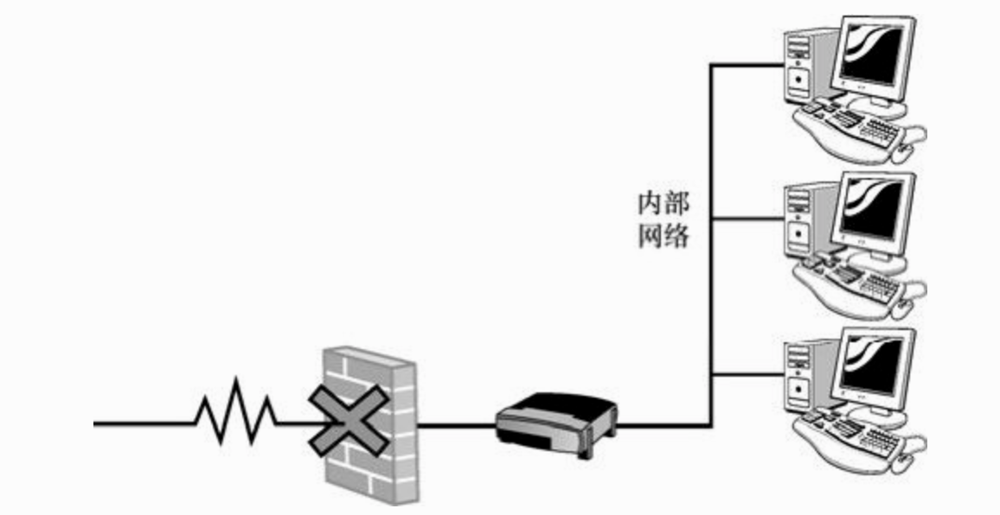
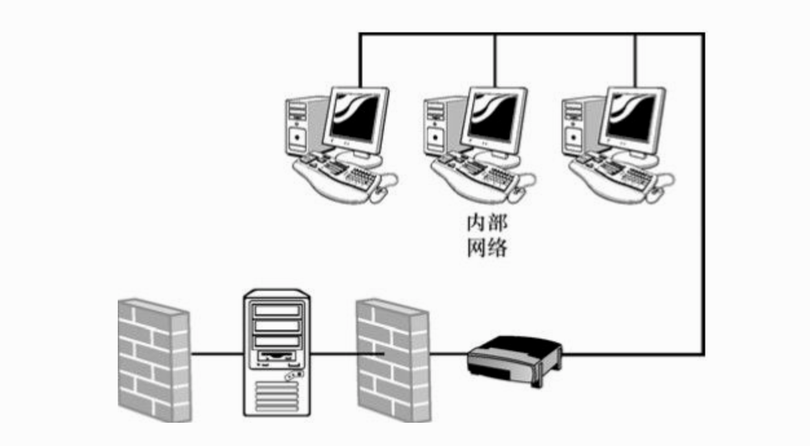
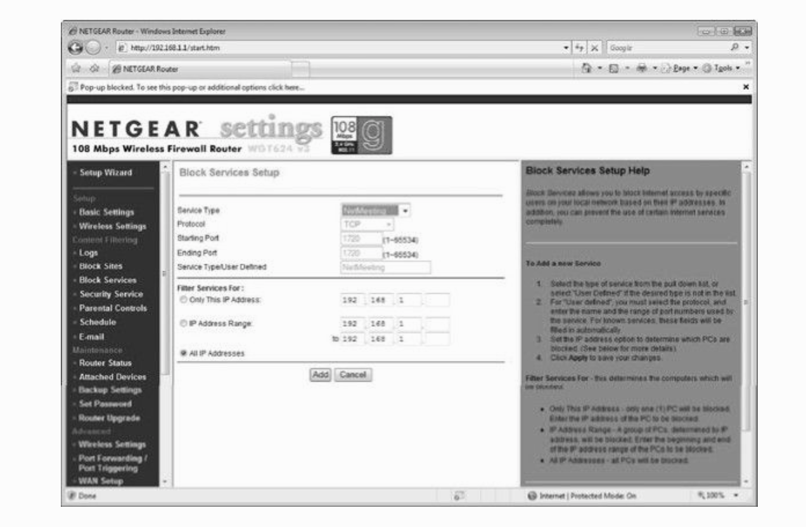
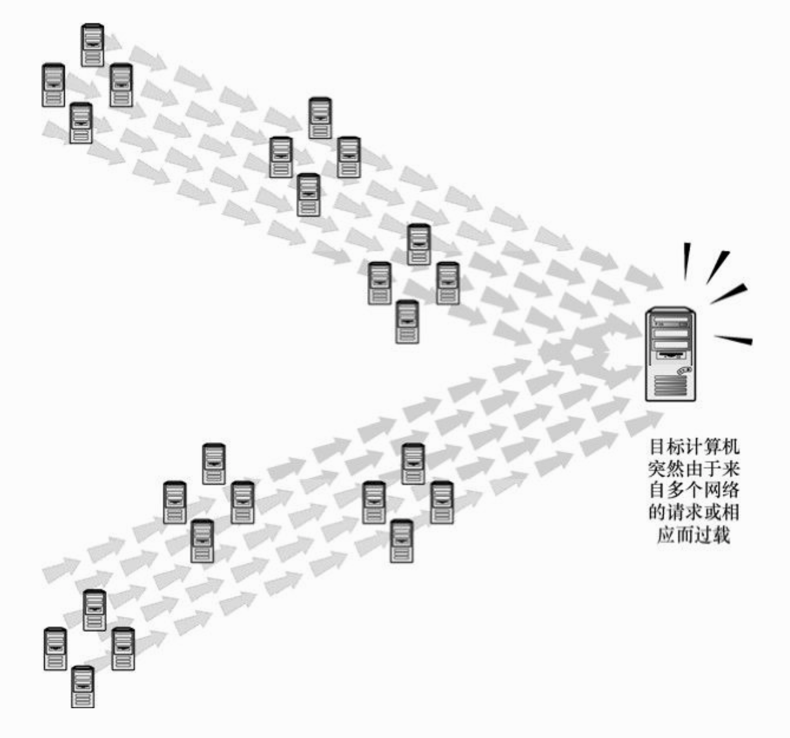
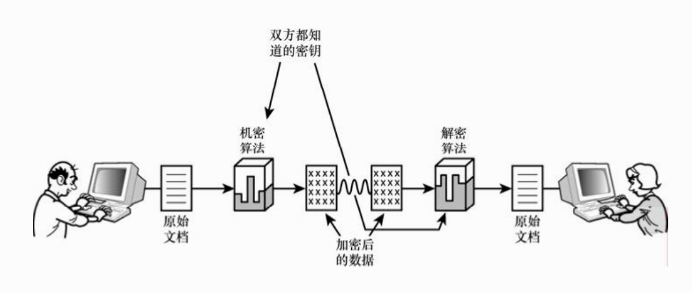
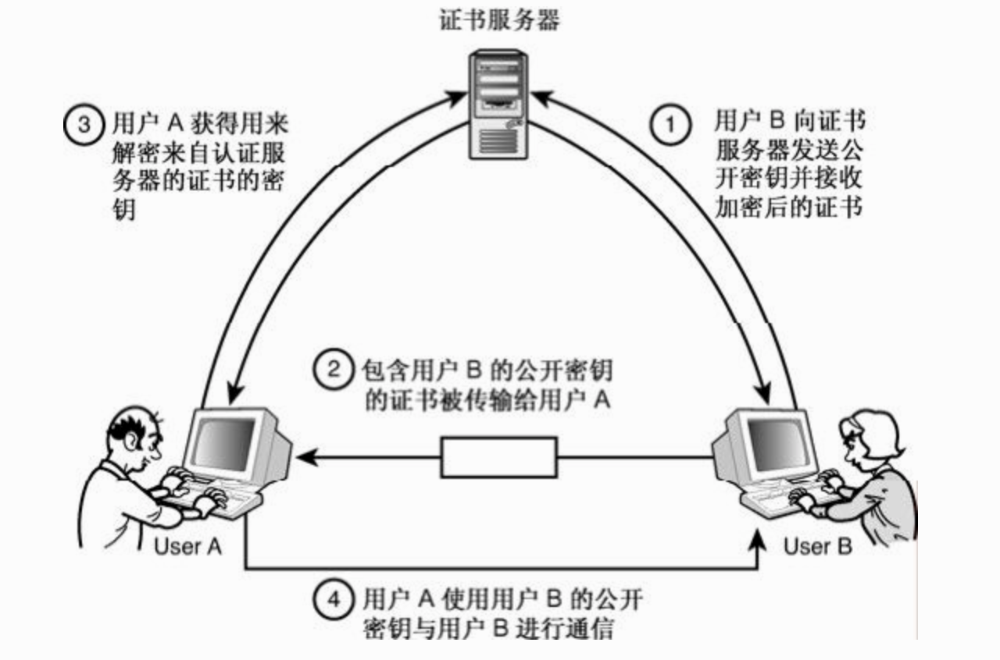
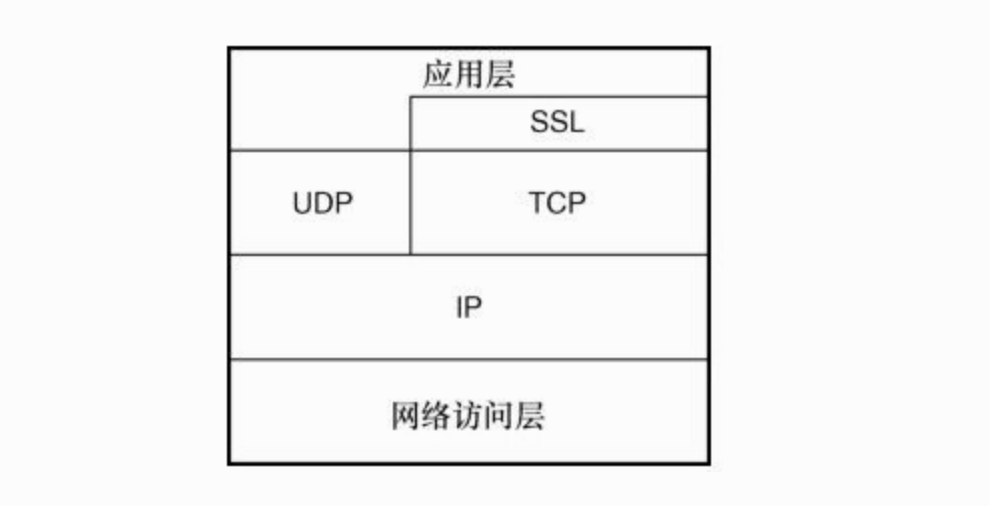
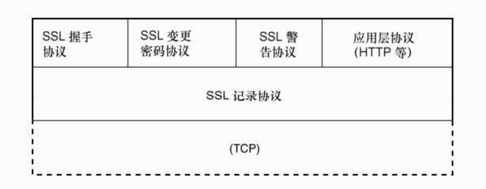
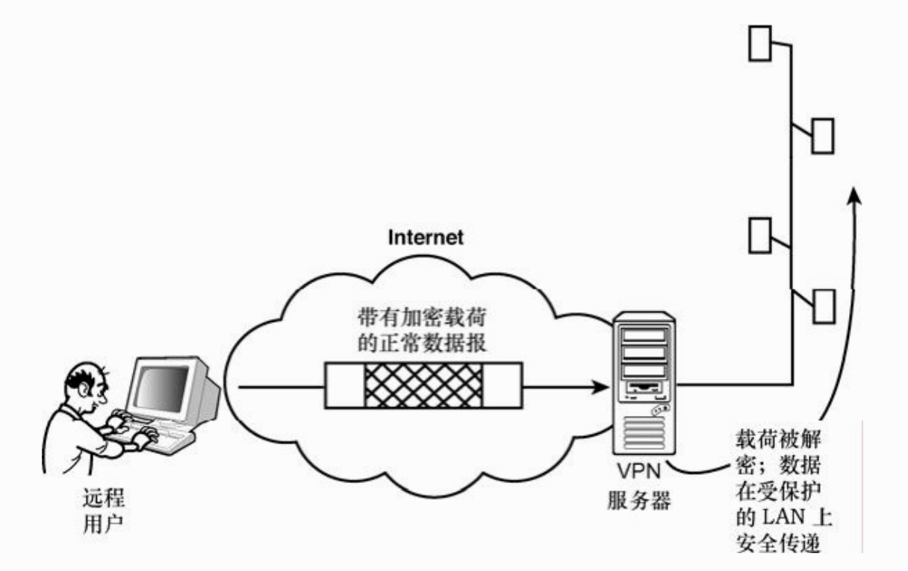
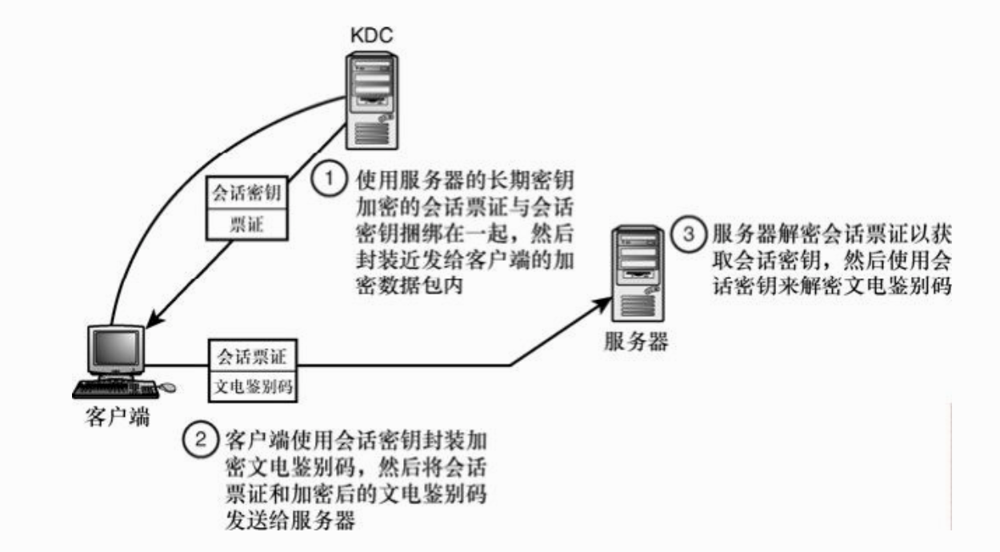

# 第十一章 TCP/IP安全

## 11.1 什么是防火墙

防火墙是一个放置在网络路径上的设备，这样，它可以检查，接受或者拒绝打算进入网络的数据包，这听起来有点像路由器，实际上，虽然防火墙并不一定是一个路由器，但是防火墙的功能通常会被继承到路由器上，防火墙与传统的路由器最重要的区别是传统路由器会尽可能转发数据包，而防火墙则只转发自己认可的数据包，对数据包的转发决定不再是仅基于地址，而是基于网络所有者配置的一组规则，这些规则可以确定哪些流量能被网络所允许

**防火墙可以阻止任何或者所有的流量进入本地网络** 

早期的防火墙是数据包过滤器，它通过检查数据包来找出该数据包的企图，第六章讲过，许多包过滤防火墙会查看封装在传输层报头中的TCP和UDP端口号，因为大多数的Internet服务都与端口号相关联，因此通过检查数据包的目的端口号可以确定数据包的企图，这种形式的数据包过滤可以让管理员声称“外部的客户端无法访问内部网络上的Telnet服务”，至少不能访问使用熟知端口号的Telnet服务

然而，包过滤技术仍然不是一个完美的解决方案，首先，打入内部网络的入侵者可以将网络服务所使用的端口号进行重新配置，如果将防火墙配置为检查TCP端口23上的Telnet会话，而入侵者建立了一个使用不同端口号的Telnet服务，那么，仅仅查看熟知的端口则不会发现问题

在防火墙的进化中，出现了另外一种称之为有状态防火墙的设备，有状态防火墙不仅仅是单独检查每一个数据包，还会检查数据包包含在哪个通信会话序列中，这种状态敏感性有助于有状态防火墙监视诸如无效数据包，会话劫持企图，以及某些拒绝服务攻击这样的攻击手段

应用层防火墙是最新一代防火墙，这种防火墙是在TCP/IP应用层工作的，在这里可以更全面地理解与协议和服务相关联的数据包，当代防火墙通常是包过技术，状态查看和应用层过滤层技术的组成，一些防火墙还可以作为DHCP服务器和网络地址转换工具

### 11.1.1 选择防火墙		

略

### 11.1.2 DMZ

通常拥有专业级别的IT管理和安全性的大型网络则会使用更具优点的方法，另外替代方案是使用两个防火墙——一个防火墙位于Internet服务器之前，另一个位于它们之后，前端防火墙可以提供第一个安全层，很明显，这层防火墙允许对服务器的连接，后端防火墙则提供了更严密的保护，确保本地网络资源的安全，两个防火墙之间的空间被称为DMZ（军事术语——Demiliarized Zone，非军事地带），与开放的Internet相比，DMZ可以提供更好的安全性，但是其安全性比内部网络低

**位于两个防火墙之间的DMZ** 

**一个防火墙还可以为多个网段提供防火墙规则，如果防火墙或路由器有3个或更多的接口，可以将内部网络和DMZ分别连接在这些接口上，同时为每个接口应用不同的过滤规则** 

### 11.1.3 防火墙规则

防火墙规则或语法，虽然不同的工具使用不同的命令和语法，但是通常允许网络管理员创建的内容包括：

* 资源地址或地址范围
* 目的地址范围
* 服务
* 行为

**大多数SOHO防火墙允许用户通过名称或端口号来阻断服务** 

这些参数提供了大量选项，用户可以关闭所有来自或去往特定地址范围的流量，可以关闭来自特定地址的特定服务，例如Telnet或FTP，还可以关闭来自于所有地址的某项服务，处理规则可以是“接受“，”拒绝“或其他任何选项，有时，防火墙规则甚至可以应用特定的扩展或脚本，规则也可以是在出现故障时，向防火墙管理员发出警告页面或电子邮件，与仅仅通过端口号关闭或打开服务相比，这些参数的组合能够提供更大的灵活性

### 11.1.4 代理服务

略

### 11.1.5 逆向代理

略

## 11.2 攻击技术

略

## 11.3 入侵者向要什么

攻击者有若干种方法来获得入口和取得足够的权限，尽管不可能描述全它们，但是可以把这些技术分为3个基本的类别

* 证书攻击：这些攻击集中在获得证书以正常进入系统，在本质上，这种攻击甚至发生在入侵者渗入安全系统之前，这一技术的一种变型是权限提升，即攻击者先获得低地别的访问权，然后再设法获得更高的权限级别
* 网络层攻击：攻击者通过找到一个开放的端口，无保护的服务或者是防火墙中的缺口偷偷进入，其他网络层攻击技术利用TCP/IP协议系统的细微差别，以获得信息或重新路由连接
* 应用层攻击：攻击者利用系统上运行的某个应用程序（例如web服务器）的代码中的已知缺陷，欺骗该应用程序执行任意命令，或者是以一种程序设计人员从未想到的方式运行

### 11.3.1 证书攻击

一些常见的密码攻击方法包括：

* 看看机箱外面
* 特洛伊木马
* 猜测
* 窃听

1. 看看机箱外面

   略

2. 特洛伊木马

   略

3. 猜测

   略

4. 窃听

   略

5. 如何防范证书攻击

   提供几个比较容易理解的准则

   * 为公司中的用户提供一个优秀且清晰的密码策略，警告他们将其木马告诉其他用户，写在办公桌旁边的记事贴上，乃至存储在某个文件中的危险性
   * 将所有计算机系统设置为支持强制性密码策略，为密码设置最短长度（通常是6-8个字符），不允许用户使用某个人或某样东西的名字作为密码，事实上，密码不应该包括任何标准的字词，短语或名称，所有密码都应该包含字母和数字的组合，以及至少一个非字母数字字符（不作为第一个或最后一个字符），为了防止密码猜测攻击，清确保计算机被配置为在登陆尝试失败预先规定的次数后，禁用相应的账户
   * 确保密码不以明文形式在公用线路上传输，如果可能的话，最好也不要在您的内部网络上传输明文密码，尤其是在大型网络上

### 11.3.2 网络层攻击

略

### 11.3.3 应用层攻击

应用层攻击技术的一个常见示例就是缓冲区溢出。当一台计算机通过网络连接接收数据时（或者就此而言，即使是在它从键盘接收数据时），该计算机必须保留足够的内存空间来接收完整的数据集，这个接收空间被称为缓冲区。如果用户的输入溢出该缓冲区，奇怪的事就会发生。如果输入没有被适当管理，那么溢出缓冲区的数据就可能变为驻留在CPU 的执行区域中，那意味着经由缓冲区溢出发送给计算机的命令，可能会被实际执行，这些命令以接收数据的应用程序的权限执行。其他缓冲区溢出攻击利用这样的一个事实：一些应用程序在安全性已经提高的环境中运行，该上下文在应用程序意外终止时仍可能是活动的

**缓冲区溢出攻击使为程序输入保留的内存空间不足，导致相应的程序崩溃，运行异常或执行任意代码** 

### 11.3.4 root访问

通常，在入侵者进入系统后，首要任务就是上传一个rootkit，rootkit是一组工具，用于在系统上建立一个更加稳固的立足点，一些这样的工具被用来危害新的系统和新的账户，其他工具则用来隐藏攻击者在系统上的行踪，这些困惑工具可能包括标准网络工具（如：netstat）的篡改版本，或者是从系统日志消除入侵者行踪的应用程序，rootkit中的其他工具可能会帮助入侵者探测相应的网络或截取更多密码，有些rootkit甚至能允许入侵者修改操作系统本身

### 11.3.5 网络钓鱼

略

### 11.3.6 拒绝服务攻击

典型案例dos攻击

### 11.3.7 防范措施

网络安全专家投入了毕生精力来研究防范网络攻击的措施，当然，他们所针对的都是具有几百个节点而且大多数都直接暴露在Internet下的复杂网络，在小型的网络中，下面一些最佳做法可以放来防范本章讨论的这些攻击技术

* 使用正确配置的防火墙
* 视同安全的密码，尽管具体策略不同，但是大多数专家都建议密码的长度为6-8个字符，而且密码中要包含字符、数字和标点符号
* 不要将密码透露给别人，不要将密码写在纸上，并放在很显眼的地方
* 不要点击可疑的链接
* 使用最低权限来操作
* 如果运行的是Windows，要装病毒防护软件
* 关闭不需要的所有服务
* 如果必须要访问内部网络，请使用vpn来进行加密通信
* 使用防火墙，关闭所有端口，关闭所有网络服务，除非你需要这些服务
* 在沙箱环境中运行网络服务，这样即使有入侵发生，也不会提升其操作权限
* 在无线网络中使用加密
* 经常安装安全更新

## 11.4 加密和保密

加密几乎是所有TCP/IP安全措施的重要基础，下面几个小节将讨论一些重要的加密概念，本节先讨论机密性的目的（保守数据的秘密），安全系统还必须满足如下需求：

身份验证：确保数据来自产生它的源头

完整性：确保数据在传输过程中未被篡改

加密技术被用来帮助确保身份验证和完整性，以及机密性

### 11.4.1 算法和密钥

加密就是使没有解锁加密代码秘诀的任何物体和任何人，均无法读取数据的过程，要使加密起作用，通信实体双方都必须有：

* 使数据无法读取的过程（加密）
* 将无法读取的数据恢复至可读取的原始格式的过程（解密）

在程序员刚开始编写加密软件时，他们就认识到自己必须对付下列问题：

* 如果每一台计算机均使用完全相同的过程来加密和解密数据，那么该程序就不够安全，因为任何窃听者都可以只获取该程序的一个副本，然后就可以开始解密信息
* 如果每一台计算机均使用完全不同且不相干的过程来加密和解密数据，那么每一台计算机都将需要一个完全不同且不相干的程序，每一对想要通信的计算机，都将需要使用单独的软件，这会花费很高，而且在不同的大型网络上无法进行管理

这些问题可能似乎很难对付，但开发加密技术的大脑们很快就想到一种解决方案，方案如下，加密或解密的过程，必须被分成一个标准的可重复，可复制的部分，和一个独一无二的部分（它在通信双方强加一个秘密关系）

加密过程的标准部分被称为加密算法。加密算法实质上是一组数学步骤，用来将数据转换为无法读取的格式。加密过程独一无二的秘密部分，被称为加密密钥，加密学非常复杂，但是为了便于讨论，可以把密钥看做是一个比较大的数字，它在加密算法内当做一个变量使用。加密过程的结果，取决于密钥的值，因此，只要保守住密钥值的秘密，未经授权的用户便将无法读取被加密的数据，即使他们拥有必需的解密软件

### 11.4.2 对称（常规）加密

对称加密之所以称为对称，是因为加密和解密过程使用的是相同的密钥（或者至少是密钥可以用某些可预测的方式来推出），下图描述了一个对称/解密过程，具体步骤如下所示：

**对称加密过程** 

1. 创建一个发送方计算机和接收方计算机都知道的密钥
2. 发送方计算机使用一个个预定的加密算法和上述密钥，加密要发送的数据
3. 加密（不可读的）文本被转交给目的计算机
4. 计算方计算机使用的相对应的解密算法（以及密钥）来解密数据

如果小心执行，对称加密非常安全，对于任何加密方案（对称或者非对称）的安全性，最重要的考虑因素如下：

* 加密算法的强度
* 密钥的强度
* 密钥的保密能力

就对称加密来说，密钥就是整个秘密，如果捕获了相应的密钥，就拥有了一切，因此，绝大多数系统要求定期更新密钥，一对相互通信的计算机所使用的独一无二的密钥，可能会重新创建每一个会话，也可能在指定时间间隔之后重新创建，密钥更新增加了网络上的密钥数量，可以缓解对有效保护密钥的需求

有一些常见的加密算法都充分利用了对称加密，数据加密标准（DES）算法曾经很流行，但是其56位的密钥现在看来太短了，现代加密技术通常允许可变的密钥长度，DES的一种派生算法被称为高级加密标准（AES），它支持128，192或256位密钥，Blowfish对称算法可听过高达448位的密钥长度

### 11.4.3 非对称（公开密钥）加密

非对称加密通常与一种被称为公开密钥加密的加密方法相关，在公开密钥加密中，两个密钥中的一个（被称为私有密钥）安全地保留在一台计算机上，另一个密钥（公开密钥）对于所有想要给私有密钥持有者发送数据的算计均可用，具体步骤如下所示：

1. 计算机A设法与计算机B建立一个连接
2. 计算机B上的加密软件生成一个私有密钥和一个公开密钥，私有密钥不与任何人分享，公开密钥被提供给计算机A使用
3. 计算机A使用从计算机B接收到的公开密钥加密数据并传输数据，来自计算机B的公开密钥被存储在计算机A上，以供将来引用
4. 计算机B接收计算机A发送来的数据，并使用相应的私有密钥进行解密

**注意：** 保密性和真实性

尽管截获公开密钥的窃听者无法读取发送自计算机A的数据，但是该窃听者仍然可以通过加密新的数据并将其发送给计算机B来伪装成计算机A，因此，虽然公开密钥加密提供机密性，但是它未必提供真实性，不过，有几种方法可以在加密数据内装入鉴别信息，从而使得数据被解密时，计算机B将有一定的把握该数据实际砂锅来自计算机A

公开密钥的一个重要方面是，通过公开密钥执行的加密是单向函数，公开密钥可以用来加密数据，但是只有相应的私有密钥才能解密加密后的数据，截获公开密钥的窃听者仍然不能读取使用该公开密钥加密的信息

### 11.4.4 数字签名

数字签名方法用于确保数据来自其所属的数据源，并且该数据在其交付路径中没有被更改过

数字签名就是与报文包括在一起的一块加密数据，这块加密数据有时被称为鉴别吗（authenticator）数字签名通常逆向使用公开密钥加密过程

**数字签名过程** 

1. 计算机B想要发送一个具有数字签名的文档给计算机A，计算机B根据验证文档内容所需的信息，创建一小段数据，换句话说，就是对文档中的一些位执行某种数学计算，以得到一个值，鉴别吗可能还包含其他可用来验证消息真实性的消息，例如一个时间戳值，或其他将把鉴别码与其附着的消息关联起来的参数
2. 计算机B使用一个私有密钥加密鉴别吗（注意，这是上一小节中描述的公开密钥加密过程的逆向，在上一小节中，私有密钥解密数据），鉴别码然后被附于钥传输的文档，该文档再被发送给计算机A
3. 计算机A接收数据，并使用计算机B的公开密钥解密相应的鉴别码，鉴别码中的信息使得计算机A可以验证该数据是否在传输过程中被更改过，实际上数据可以使用计算机B的公开密钥进行解密，即证实该数据是使用计算机B的私有密钥加密的，这就确保数据来自计算机B

数字签名以这种方式确保数据没有被更改过，而且它来自其推定的数据源。作为一项基本的安全措施，整个消息都可以使用计算机B的私有密钥进行加密，而不仅仅是鉴别码，然而，使用私有密钥加密，再使用公开密钥解密，实际上并不可靠，因为用来解密的公开密钥是通过 Internet 发送的，因此可能并不保密，一个获得公开密钥的窃听者可以解密加密后的鉴别码，不过该窃听者将无法再加密一个新的鉴别码，因此也就无法伪装成计算机B

### 11.4.5 数字证书

数字证书实质上就是公开密钥的一个加密副本，相应的认证过程如图所示，这个过程需要一台第三方的证书服务器，它与想要通信的双方都有一个安全的练习，证书服务器也被称为认证中心（Certificate Authority，CA）

**利用数字签名进行身份验证** 

一些大型公司也提供它们自己的证书服务，不同厂商的认证过程有所不同，下面概述一下该过程

1. 用户B通过一个安全系统，将其公开密钥的一个副本发送给证书服务器
2. 证书服务器使用另一个密钥加密用户B的公开密钥（以及其他用户参数）。这个新加密的数据包被称为证书，与该证书包含在一起的是证书服务器的数字签名
3. 证书服务器将证书返回给用户B
4. 用户A需要获得用户B的公开密钥，计算机A向计算机B请求B的一个证书副本
5. 计算机A通过与证书服务器的安全通信，获得同来加密证书的密钥副本
6. 计算机A使用从证书服务器来获得的密钥解密证书，并提取用户B的公开密钥，计算机A同时检查证书服务器的数字签名（见步骤2），以确保该证书是可信的

这种认证过程最著名的标准是X.590标准，它在多个RFC中均有描述，X.590v3在RFC 2459和后续的RFC中就有描述，最新的RFC版本是5280

### 11.4.6 保护TCP/IP

1. SSL和TLS

   安全套接层（Secure Sockets Layer，SSL），SSL的目的是，在传输层上的套接字和提供那些套接字访问网络的应用程序之间提供一层安全，下图显示了SSL在TCP/IP协议栈中的位置，这里的理念是，在SSL被激活时，网络服务（例如http和发图片）便将收到安全的SSL协议的保护，以免遭攻击，传输层安全（Transport Layer Security，TLS）最初是RFC2246中描述的一种协议标准，其最新的更新在RFC5246中有讲述，它以SSL3.0位基础，所以通常被认为是SSL的一个后续产品，现在它已经成为业界标准，但是，在产品名称和真实的软件中，仍然将其称为SSL，下面简要描述一下SSL，TLS协议与此类似

   **TCP/IP栈和SSL** 

   

   仔细查看SSL层，可以发现它包含两个子层，SSL记录协议（Record Protocol）是访问TCP的一个标准库，在这个记录协议之上，是一组执行特定服务的SSL相关协议

   **SSL协议** 

   

   * SSL握手协议（Handshake Protocol）：用来访问TCP的基础协议
   * SSL更改密文规范协议（Change Cipher Spec Protocol）：支持对加密套件设置的更改
   * SSL告警协议（Alert Protocol）：发出告警

   支持SSL的服务直接通过SSL记录协议运行，在连接建立之后，SSL记录协议提供确保会话机密性和完整性所需的加密和验证

   如同其他协议安全技术一样，这里的技巧是要检验参与者的身份和安全地交换将用来加解密数据传输的密钥，SSL采用公开密钥加密，并提供对数字证书的支持

   SSL握手协议建立相应的连接，并协商所有连接设置（包括加密设置）

   许多网络利用SSL建立一个安全的连接，用于交换财务信息以及其他敏感数据，带有SSL加密的一个HTTPWeb协议版本被称为HTTPS，绝大多数主流浏览器很少或根本不需要用户输入，就能够建立SSL连接，SSL的一个问题是，由于SSL在传输层之上运行，因此使用相应连接的应用程序必须能够感知SSL（除非它们可以通过感知SSL的兼容软件来运行），下一小节将描述另一种TCP/IP安全系统（IPSec），它运行在一个较低的层，因此会对应用程序应仓安全系统的具体细节

   **注意：** SSL和TLS都是用于面向连接的TCP连接，称之为数据报传输协议安全（Datagram Transport Protocol Security ，DTLS）的另外一种协议提供了类似于TLS的安全，它可以支持使用UDP的无连接通信

2. IPSec

   IP安全（IPSec）是TCP/IP网络上使用的另一种安全协议系统，IPSec在TCP/IP协议栈中运行，位于传输层之下，由于安全系统在传输层之下实现，因此在传出层之上运行的应用程序就不需要安全系统的相关知识，IPSec提供对机密性，访问控制，身份验证和数据完整性的支持，IPSec还可防护重放攻击，在其中，攻击者会从数据流中提取一个数据报，然后稍后重新使用它

   IPSec实质上是对IP协议的一组扩展，它在多个RFC中均有描述，包括RFC2401，4301，4302，和4303，这些RFC描述了针对IPv4和IPv6的IP安全扩展，IPv6协议系统结构内置有IPSec在IPv4中，IPv4被当作是一个扩展，但是许多IPv4实现中仍然内置了对IPSec的支持

   IPSec可向任何网络应用程序提供基于加密的安全的好处，不管该应用程序是否可以感知到安全，不过，相互通信的两台计算机的协议栈都必须支持IPSec，由于这种安全措施对于高层应用程序来说是不可见的，因此，IPSec非常适于为像路由器和防火墙之类的网络设备提供安全，IPSec可以以下面两种模式之一运行

   * 传送模式为IP数据报的载荷提供加密，该载荷然后被封装进一个正常的IP数据报中进行传送
   * 隧道模式加密整个IP数据包，加密后的数据报，然后被作为载荷封装到另一个外部数据包

   隧道模式可以用来构建一个安全的通信隧道，在其中，网络的所有细节都被隐藏起来，窃听者甚至无法读取报头以获取数据源IP地址，IPSec隧道模式通常用于虚拟专用网络（VPN）产品，它们用来在公用网络中创建一个完全专用的通信隧道

   IPSec使用许多加密算法和密钥分发技术，数据使用像AES，RC5或Blowfish这样的常规加密算法进行加密，身份验证和密钥分发可能会使用公开密钥技术

3. 虚拟专用网络（VPN）

   远程访问的问题已经在本书中出现很多次的，这个问题实际上已经是贯穿TCP/IP发展的一个重要问题，您如何连接距离不是很近，不够采用LAN样式电缆连接的计算机呢？系统管理员总是依靠以下两种重要的方法jin能够远程连接

   * 拨号：远程用户通过调制解调器连接到某个拨号服务器，后者充当到网络的一个网关
   * 广域网（WAN）：两个网络通过租用电话公司或者Internet服务提供商的专用线路连接在一起

   这两种方法都有缺点，拨号连接速度慢，而广域网速度快但是没有便携性，因此无法携带，这些问题的一种解决办法是，通过开放式的Internet直接连接到远程网络，这个解决方案快速，方便，但是Internet上充满敌意和不安全因素，如果不提供某种防止窃听的方式，那么这样的选择安全是不可行的，专家开始考虑，是否有某种方式可以利用加密工具来创建一个穿过公用网络的专用通道，这个问题的解决方案后来便形成了我们现在所致的的虚拟专用网络（Virtual Private Network，VPN）VPN建立一个横穿网络的点对点“隧道”，通过它，普通的TCP/IP流量即可安全地进行传递

   **注意：** VPN协议

   本章前面所讲解的IPSec是一种支持网络连接的协议，而VPN就是连接本身，VPN应用程序就是创建和维持这些专用远程连接程序，有些VPN工具利用IPSrc进行加密，有些则依赖于其他SSL或其他加密技术，Microsoft的系统通过“点对点隧道协议”（源自PPP调制解调器协议）提供VPN隧道功能，比较新的Microsoft系统为VPN会话采用“第二层隧道协议”（L2TP）

   如果传送链上的每一台路由器都需要知道加密密钥，那么本章前面所描述的加密技术将无法很好得发挥作用，加密是针对点对点连接的，这里的理念是，远程服务器上的VPN客户端软件与一台充当所在网络网关的VPN服务器建立连接，VPN客户端和服务器交换通过Internet正常传递的，可路由的明文TCP/IP数据报，不过，通过VPN连接发送的载荷（即数据），实际上就是加密后的数据报，加密后的数据报（在开放的Internet上是不可读的）被封装入可读的明文数据报中，再转发给VPN服务器，VPN服务器软件接着提取加密后的数据报，利用加密密钥解密该数据报，然后将封装数据转发至受保护网络上的目的地址

   **VPN通过公共网络提供专用隧道** 

   

   尽管VPN客户端和服务器之间发送的未加密数据包邮可能被截获，但是有用信息都在加密后的载荷中，没有必要的密钥，那个窃贼将无法解密它

   随着VPN的出现，现在用户可以轻易地越过Internet，与远程网络建立安全的，类似LAN的连接，在大多数系统上，有关建立和维护VPN连接的细节，均在相应的软件中处理，用户只需要启动VPN应用程序，然后输入身份验证信息，在连接建立之后，用户就可以像连接在本地一样与远程网络交互了

4. Kerberos

   Kerberos是一种基于网络的身份验证和访问控制系统，用来支持跨敌意网络的安全访问，它是美国麻省理工学院（MIT）作为“雅典娜”计划中的一部分而开发的，Kerberos系统最初计划用于基于Unix的系统，但是后来被移植到其他环境，Microsoft就为Windows网络提供了一个Kerberos版本

   现在你可能也知道，对于敌意网络上的安全通信问题，较简洁的回答就是加密，较长的回答则是提供一种手段，来保护加密密钥的安全，Kerberos提供一种系统的方法，用于像通信主机分发密钥，并检验请求访问某一服务的客户端证书

   Kerberos系统shying被称为密钥分发中心（Key Distribution Center，KDC）的服务器来管理密钥分发过程，Kerberos身份验证过程涉及以下3个实体的关系

   * 客户端：请求访问服务器的计算机
   * 服务器：在网络提供服务的计算机
   * KDC：指定为网络通信提供密钥的计算机

   **Kerberos身份验证过程** 

   

   Kerberos身份验证过程如图所示，注意，这个过程嘉定KDC已经有一个共享的密钥可以用来与这里的客户端进行通信，还有一个共享的密钥可以用来与这里的服务器进行通信，这些密钥用来加密一个新的会话密钥，客户端和服务器将使用它进行相互通信，KDC用来为客户端和服务器加密数据的那两个单独密钥被称为长期密钥，长期密钥通常产生于KDC和另一台计算机共享的一个秘密，一般而言，客户端长期密钥产生于客户端和KDC都知道的用户登陆密码的一个哈希

   具体过程如下，请记住，Kerberos一般使用常规的（对称）加密技术，而不是公开密钥（非对称）加密技术，换句话说，每次交换的双方均使用相同的密钥

   1. 客户端想要访问服务器A上的某个服务，它向KDC发送一个请求来访问服务器A上的服务（在某些情况下，客户端已经经过身份验证，并接收到一个单独的会话密钥，用于加密与KDC上票证授予服务的通信）
   2. 这里的KDC执行以下步骤
      * KDC生成一个会话密钥，该密钥将用来加密客户端和服务器A之间的通信
      * KDC创建一个会话票证（session ticket），它包括步骤2a中所生成的会话密钥的一个副本，该票证还包含时间戳信息以及有关正在请求访问的客户端的信息，例如客户端安全设置
      * KDC使用服务器A的长期密钥加密刚创建的会话票证
      * KDC为客户端捆绑加密后的会话票证，会话密钥的一个副本以及其他响应参数，并使用客户端的密钥加密整个数据包，该响应然后被发送给客户端
   3. 客户端接收来自KDC的响应并解密，客户端将获得与服务器A通信所需的会话密钥，它所接收到的数据包中，还包括KDC创建的会话票证，那是使用所请求的服务器长期密钥加密的，客户端无法读取该会话票证，但是它知道必须将次票证发送给相应的服务器，才能通过身份验证，客户端创建一个鉴别码（一串身份验证参数），并使用这里的会话票证对它进行加密
   4. 客户端向服务器A发送一个访问请求，该请求包括上述会话票证（已使用所请求服务器的长期密钥进行加密）和鉴别码（已使用会话密钥进行加密），这里的鉴别码包括用户的名称，网络地址和时间戳信息等
   5. 服务器A接收上述请求，服务器A使用其长期密钥解密上述会话票证（见步骤2c），服务器A从会话票证中提取会话密钥，并使用该会话密钥解密鉴别码，服务器A检验鉴别码中的信息是否与包括在会话票证中的信息相匹配，如果是，则授予对所请求服务的访问权
   6. 作为可选的最后一步，如果客户端想要检验服务器A的证书，服务器A将会用会话密钥加密一个鉴别码，并将这个鉴别码返回给客户端

   作为一种为网络提供统一标准登陆系统的手段，Kerberos系统正越来越流行，Kerberos4中使用的DES加密技术，本章前面已经讲到，许多加密鲸鱼的专家认为该技术不够安全，Kerberos5（在RFC41201510中定义）则支持AES和其他加密类型

## 11.5 小结

Internet上有几百万的用户，其中相当数据的用户都在身体力行的搞一些恶作剧，如果你想保护隐私和资源，则在进行网络保护时需要发挥主观能动性，本章讲解了一些重要的安全概念，还讲解了防火墙和入侵技术等知识，此外，加密技术以及加密技术相关的某些安全特性（比如数字签名，TLS，IPSec和VPN），也在本章中得以体现

## 11.6 问与答

问：有状态的防火墙的好处是什么？

**答：** 通过见识连接的状态，有状态防火墙可以注意某些DoS攻击，以及无效的数据包和拦截陷阱或被操作的会话

问：MDZ的用途是什么？

**答：** DMZ的用途是提供一个较为安全的地带，使之比内部网络更容易访问，但又比提供开放的Internet更多的保护

## 11.7 测验

### 11.7.1 问题

1. 代理服务器如何提升Web服务器的响应时间

   **答：** 代理服务器会缓存之前访问过的页面，并且你可以设置保留缓存的时间等等

2. 为什么要安装更新？

   **答：** 减少系统漏洞，降低攻击面

3. Ellen需要找到一个方法来让几个传统的网络应用程序在Windows XP计算机上运行，而且她已经知道，在使用这些应用程序进行通信时，需要提供机密性，那么，她应该使用TLS/SSL还IPSec呢？

   **答：** SSL在传输层之上运行，因此使用SSL的应用程序能够感知到SSL接口，而IPSec则运行在协议栈的低层，应用程序没必要了解IPSec，Ellecn应该使用IPsec

4. 如果入侵者哄骗Kerberos客户端把一个会话票证发送到错误的服务器，则会发生什么？

   **答：** 什么都不会发生，会话票证使用服务器的长期密钥进行加密，只要入侵者不能访问服务器的长期密钥，就不会破解票证，偶尔发现服务器长期密钥的入侵者，可以解密票证，提取会话密钥，然后才有可能冒充服务器

### 11.7.2 练习

略

## 11.8 关键术语

复习下列关键术语：

* 高级加密标准（Advanced Encryption Standard，AES）：一种对称加密算法，支持128，192.和256密钥长度
* 非对称加密：使用不同密钥进行加密和解密的加密方法
* 后门：可以进入计算机系统的一条隐藏的路径
* Blowfish：一种对称加密算法，支持最多448位密钥长度
* 缓冲区溢出：一种攻击方法，攻击者向系统发送恶意的命令，从而导致应用程序的缓冲区超出限度
* 认证中心（Certificate Authority，CA）：监视证书创建和递送过程的中央权威
* 数据加密标准（Data Encryption Standard，DES）：一种曾经很流行的对称加密算法，但是现在，因为其较短的56位密钥长度，而被认为不够安全
* 拒绝服务攻击（Denial of service，Dos）：通过消耗系统资源来使受害者的系统无法提供正常服务的一种攻击手段
* 数字证书：一种加密的数据结构，用来分发公开密钥
* 数字签名：用来检验发送方身份和数据完整性的加密字符串
* DMZ：安置Internet服务器的一个中间地带，位于前端防火墙之后，但是在具有更严格的后端防火墙（用于保护内部网）之前
* 加密：系统地修改数据的过程，使得未授权的用户无法读取它们
* 加密密钥：和加密算法一起用来加密或解密数据的一个值（通常秘密保管）
* 防火墙：一种用于限制网络访问内部网的设备或应用程序
* IPSec（IP安全）：一种由多个IP协议扩展组成的安全协议系统
* KDC（密钥分发中心）：在Kerberos网络上管理密钥分发过程的服务器
* Kerberos：一种网络身份验证系统，用来保证通过敌意网络访问服务的安全性
* 包过滤器：一种防火墙，可以通过端口号或其他能够标明包目的的协议信息过滤数据包
* 网络钓鱼：利用某个伪造的链接，消息或网页来诱使用户主动连接到某个欺诈网站
* 私有密钥：非对称加密中使用的一种密钥，它被秘密保管，并且不在网络上分发
* 代理服务器：用于代表客户端对服务发出请求的计算机或应用程序
* 公开密钥：非对称加密中使用的一种密钥，它在网络上分发
* 逆向代理：用于接收来自与Internet的入站请求并将这些请求转发给内部网服务器的计算机或应用程序
* root访问：计算机系统的最高访问权，root访问提供对相应的系统几乎没有限制的控制
* Rootkit：入侵者用来扩展和伪装其对某一系统的控制的一组工具
* 脚本小子：年轻且通常处于青春期的Internet入侵者，主要使用Internet上可以得到的现成脚本和工具进行攻击
* 会话劫持：一种攻击方法，允许攻击者在现有TCP会话中插入恶意数据包
* SSL（安全套接层）：一种最初由Netscape公司开发的安全协议系统，它在TCP协议的上方运行，SSL已经被TLS正式取代
* 有状态防火墙：能够感知连接状态的防火墙
* 对称加密：加密密钥和解密密钥完全相同或相关的加密方法
* TLS（传输层安全）：基于SSL的一种安全的传输层协议  
* 特洛伊木马：一种号称做某一件事，但实际上在后台进行其他看不见的恶意活动的程序
* X.509：一种描述数字证书过程和格式的标准