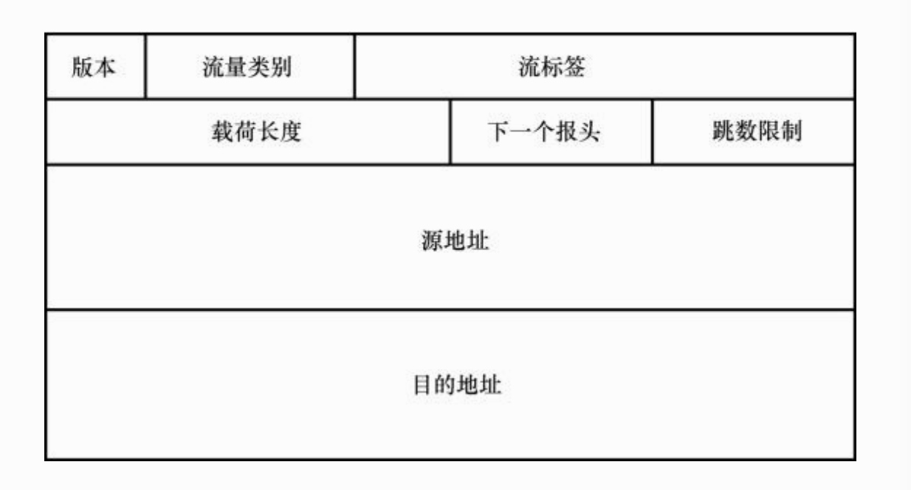

# 第十三章 IPv6：下一代协议

## 13.1 为什么需要新的IP

因为IPv4地址已经用尽了，虽然有NAT地址转换降低了对Internet地址的网络需求，但是很明显不够用，所以应运而生就出现了IPv6——IPv6中的IP地址是一个128位的地址，这么大的地址空间能够支持10亿个网络，下面列出了IPv6的目标：

* 扩展寻址的能力：IPv6不仅仅是可以提供更多的地址，还能够提升IP寻址的能力，例如，IPv6支持更多层次的寻址级别，IPv6还可以提升地址的自动配置能力，并且提供更好的任播寻址支持，使得入站的数据包可以到达”最近“或”最佳“的目的地
* 更简单的报头格式：有些IPv4报头字段被移除，其他的字段则是可选的
* 提升了对扩展和选项的支持：IPv6可以在可选的扩展报头中加入一些报头信息，这种方法能够在不浪费主报头空间的情况下增加信息字段的范围，在大多数情况下，路由器并不处理扩展报头，使得数据包的传递过程更加流畅
* 流标签：可以用特定的流级别标记IPv6数据报，流级别就是一类需要特别处理的数据报，例如，应用于实时服务的流级别与邮件信息的流级别有所不同，设置流级别对确保传递的最低服务质量是很有用的
* 提升身份认证和隐私保护的能力：IPv6扩展可以支持身份认证，机密性和数据完整性技术

## 13.2 IPv6 报头格式

基本的IPv6的报头实际上比相应的IPv4报头更简单，报头被简化的部分原因是在IPv6中，其他的细节信息被放在了主报头之后的扩展报头中

**IPv6报头** 

IPv6的报头字段如下所示：

* 版本（4位）：识别IP版本号（在这里应该是版本6）

* 流量类别（8位）：识别数据报中封装的数据类型

* 流标签（20位）：指流派级别

* 载荷长度（16位）：确定数据（报头之后的数据报部分）的长度

* 下一个报头（8位）：定义紧跟在当前报头之后的报头的类型，稍后讲解扩展报头

* 跳数限制（8位）：指示该数据报还有多少剩余的跳数，每经过一个节点，这个值就减1，如果跳数限制到0，数据报将被丢弃
* 源地址（128位）：识别发送数据报的计算机的IP地址
* 目的地址（128位）：识别接收数据报的计算机IP地址

IPv6规范中定义了如下的扩展报头：

* 逐跳选项
* 目的选项
* 路由
* 分段
* 身份认证
* 有效载荷安全封装

每一个报头类型都与一个8位的识别符相关联，通过主报头和扩展报头中的下一个报头字段定义了报头链中的下一个报头的识别符

**下一个报头字段** 

上面描述的这些扩展头中，只有跳跃选项报头和路由报头需要在传输路径中被中间节点处理，路由器不处理其他的扩展报头，只放行即可

### 13.2.1 逐跳选项报头

逐跳选项报头的作用是将传输路径上路由器的可选信息关联起来，逐跳选项报头与目的选项报头很相似，规范中包括这个报头的作用是为未来开发出的选项提供一种格式和机制

规范包括了一个可选的分配类型以及一些用于对其数据的填充选项，规范中明确定义的一个选项是巨型载荷（jumbo payload）选项，可用于传递载荷大雨65535字节的数据

### 13.2.2 目的选项报头

目的选徐昂报头的目的是将可选的信息与目的节点关联起来，与逐跳选项报头类似，目的选项报头主要是作为开发未来选项的框架

### 13.2.3 路由报头

路由报头用来指定数据报在传递路径上的一个或多个路由器，路由报头的格式如图所示

**路由报头** 

路由报头的数据字段如下所示：

* 下一个报头：识别紧跟在该报头之后的下一个报头的类型
* 报头长度（8位）：定义报头的长度，单位是字节，但其中不包括下一个报头字段
* 路由类型（8位）：识别路由报头的类型，不同的路由报头类型应用于不同的特定场景
* 剩余分段：指示到达目的之前，被显式定义的路由段的数量
* 特定类型的数据：表示路由类型字段中定义的特定路由类型的数据字段

### 13.2.4 分段报头

消息路径上灭一个路由器都有一个最大传输单元（Maximum Transmission Unit，MTU）的设置，MTU设置表示路由器可以传输的最大数据单元，在IPv6中，源节点可以发现路径MTU，即传输路径上所有设备的最小MTU设置，路径MTU表示的是可以在路径上传递的最大数据单元，如果数据报的尺寸大于路径MTU，数据报必须被分成更小的部分，这样才能将数据报跨越网络传递，分段报头包含的是充足分段数据报所需的信息

### 13.2.5 身份认证报头

身份认证报头用于提供安全性和身份认证信息，身份认证字段提供了一种可以决定数据报是否在传递过程中已经被更改的方法

### 13.2.6 有效载荷安全封装报头

有效载荷安全封装（Encrypted Security Payload，ESP）报头提供了保密性和机密性，通过IPv6的ESP功能，部分或所有被传递的数据都能都被加密，使用隧道模式的ESP时（用于VPN隧道），整个IP数据报都会被加密并放置在一个为加密的外部数据报中，在传输模式中，只有载荷和ESP报头信息都是被加密的

## 13.3 IPv6 寻址

与IPv4地址类似，IPv6地址是由internet授权中心分配的，并且通过ISP和其他宽带提供商的系统分发，如下表所示，有些特定的地址范围被保留，以用作特殊的活动，例如多播和俩节本地寻址（与第十二章中介绍的IPv4零配置系统相似），还有一部分地址范围被用作IPv4地址到IPv6地址空间的映射

**RFC4291中的IPv6地址范围** 

要想记住128位的IPv6地址是几乎不可能的，在第四章讲到，32位的IPv4地址通常可以用点分十进制来表示，即每个字节的数据可以用最多3位十进制数来表示，记住用12个十进制数表示的字符串比记住用32个二进制数表示的二进制地址要容易一些，不过，这种应用于32位地址的方法对记忆128位的地址是没有效果的，实际上，也很少有用来简化IPv6地址记忆的方法

IPv6地址通常是由用冒号隔开8个4位十六进制数组成的（显示时每一组数据都会省略掉前面的0字符）：

**（书上写的太麻烦了——我自己总结了一下，字段全0则等于0（全0也可以不写直接用冒号代替），其余的按照正常的写法进行编写即可，例如：2001:0DB8:0000:CD30:0000:0000:0000:0000/60** 

**编写后的IP地址是：2001:0DB8::CD30::/60** 

IPv6网络配置软件允许用户定义一个默认的网络前缀，以便在客户端的手动配置只需要参考地址的主机部分，IPv6页提供了复杂的自动配置特性，可以避免用户输入冗长的地址

## 13.4 子网划分

在第五章讲到，IPv4地址的某些位可以用来表示网络或子网，有些位则表示主机ID，在最近几年，旧有的地址分类系统已经被CIDR取代，在CIDR表示法中，地址后面的斜线后跟有一个数字，用来表示32位地址中，与网络和子网相关联的位数：205.123.196.183/25 在上一节讲到，IPv6页使用这种CIDR风格的表示法，来标记与地址的网络部分相关联的位数，IPv6更大的地址空间和高级的技术，使得我们需要一种全新的子网划分技术，128位的IPv6地址为地址的网络和主机部分留下了很大的空间，在IPv6中，假定子网划分发生在地址的第一个64位，这样剩余的64位（或更多）可以用于子网中的主机ID，这样，这个几十亿数量级的主机对任何网络而言都足够了，这也意味着对地址空间进行细分，以充分利用地址空间的概念称为过去时，在同一个子网中，可以共存几千个网络节点

然而，出于性能和流量管理的原因，管理员仍然希望使用路由器来分隔大型网络，并使用子网划分技术将数据包发送到不同网段，此时，地址空间的前64位可以为地址中的网络和子网部分提供大量的空间，例如，如果有一个网络被分派了一个/48的地址范围，它将有16位用于子网划分，剩余的64位可以用于主机ID

## 13.5 多播

IPv4是围绕着网络广播的理念设计的。发送到广播地址（比如255.255.255.255，也即全1）的消息将会被子网中的所有主机读取。这个概念相当不错，但是自从设计出IPv4以来，更为有效的解决方案也开发了出来，一个名为多播的新方法在发送给个体（单播）和发送给全体（广播）之间提供了一个中间选项，尽管多播是在IPv4的时代引入的，但是在IPv6中，它引起了更多的兴趣和大量的关注，事实上，多播是内置在IPv6中的，在多播中，主机参与到共享同一个多播地址的多播组中，不是该组成员的主机不能读取消息，这就使得多播的效率高于广播

IPv6 中定义了几种不同类型的 IPv6 多播地址，例如，链路本地多播的多播地址前缀是ff02::/16

多播在IPv6网络中具有很重要的作用，应用开发人员也使用多播技术，将数据更为高效得传递给IPv6网络上的多播主机

## 13.6 链路本地

前缀为fe80::/10的IPv6地址是链路本地地址，链路本地地址不会穿越路由器，仅用于本地网段的通信，这使得链路本地地址与IPv4网络中使用的私有地址范围具有异曲同工之妙

本章后面将降到，这些链路本地本地地址在IPv6的自动配置系统中具有重要的作用，链路本地地址允许计算机在不需要进行手动配置（也不需要DHCP服务器的自动配置）的情况下，就能在本地网段进行通信，当然，由于这些链路本地地址是不可路由的，因此无法为更大网络（在本地网络之上）提供连通性，为了与世界其他地方进行连接，主机需要一个可路由的IP地址，或者是通过访问一个现成的IPv6 DHCP设备来接收一个动态地址

## 13.7 邻居发现

在第四章讲到，ARP提供了将IPv4地址映射为与网卡相关联的物理地址的方法，ARP在网际层的逻辑寻址和网络访问层基于硬件的地址之间提供了链路，在IPv6网络中，IP地址到物理地址的映射是通过邻居发现的过程实现的

Internet控制消息协议版本6（ICMP6）提供了邻居发现服务，本地网络中需要解析IPv6地址的主机首先计算与该地址相关联的一个请求节点多播地址（请求节点多播地方的格式在IPv6文档中有定义，它包含一个多播范围中的前缀，以及IPv6单播地址像对应的主机位），主机随后将邻居请求数据包自动发送到多播地址（该地址包含发送者希望解析的IPv6地址），要求地址的拥有者进行响应，发送者还将其物理地址作为响应的目的地址发送给IPv6地址的所有者，IPv6地址的所有者使用一个邻居通告数据报进行响应，该数据包中包含它自己的物理地址和链路本地地址

通过该过程，网络中的主机建立了邻居缓存，该缓存类似于IPv4网络中使用的ARP表

## 13.8 自动配置

169.254.0.0/16地址范围内的自动配置地址近年来在IPv4网络中出现，自动配置技术用于在计算机无法找到DHCP无服务器并且也没有手动配置地址的情况时，为其指派一个IP地址，这个不可路由的“零配置”地址足以让计算机连接到打印机或本地网络中的其他对等体，也可以让计算机通过DNS服务发现找到本地服务

IPv6无状态自动配置特性以一种更简单的方式提供了相类似的功能，IPv6自动配置基于物理地址的一个哈希为计算机指派一个链路本地地址，由于物理地址都是独一无二的，因此链路本地地址很大情况下也是唯一的，这也就避免了IPv4零配置网络中出现的地址冲突问题，通过使用一个标准的转换将48位的物理地址转换为一个64为的字符串，然后再将其附加到fe80::/10链路本地前缀的后面（在必要时使用二进制0进行填充），从而形成了一个完整的链路本地地址

通过名为重复地址检测（Duplicate Address Detection，DAD）的另外一个过程，主机将检测该地址是否已经在本地网络使用了，如果没有的话，主机将采用这个自动配置的地址

## 13.9 IPv6和服务质量

IPv6可以通过区分服务级别来进行优先级划分，IPv6报头中的流量类别字段和流标签字段能够指定数据报中数据的类型和优先级（查看本章第一张图片）

**注意：** 区分服务

一些厂商和工程师已经尝试了使用IPv4的服务类型字段来区分服务信息，IPv6流量类型字段旨在使用区分服务来支持不断持续的实验

## 13.10 IPv6和IPv4

目前Internet仍然没有被安全更新，因此，工程师对IPv6进行了设计，使得在IPv4向IPv6的长期过渡中，两者能够共存

一种方法是通过多协议配置，使得IPv6协议栈能够与IPv4协议栈同时运行，就像IPv4曾经和IPX/SPX/NetBEUI以及其他协议栈同时共存那样

IPv6寻址系统提供了将现有的IPv4地址包括在自己的地址空间中的方法，最初的计算是将每一个有效的IPv4地址映射成一个128位的IPv6地址（通过在原地址前添加96个0位），这种形式被称为与IPv4兼容的IPv6地址，不过，在RFC 4291中对这种形式提出了强烈的反对，RFC4291更倾向于另一种技术——映射IPv4的IPv6地址，这种地址包含80个0位和16个1位（十六进制FFFF），后面再加上原来的32位的IPv4地址

**例如：169.219.13.133可以映射成IPv6地址0000:0000:0000:0000:0000:FFFF:A9DB:0D85或简写的：::FFFF:A9DB:0D85，因为这个前缀清楚的表明了这个地址是被映射的IPv4地址，所以IPv4部分有时候可以写成点分十进制形式：::FFFF:169.219.13.133** 

## 13.11 IPv6隧道

鉴于目前Internet始终没有完全从IPv4迁移到IPv6，因此无法无缝访问整个Internet，工程师因此开发了几种技术，用于将IPv6与更大的IPv4的Internet连接起来

实现远程IPv6连接的常见方法是使用IPv6隧道代理，IPv6隧道的代理理念是将IPv6流量封装在IPv4之内，位于隧道末端的隧道服务器接收IPv6数据报，并将其封装到IPv4报头中，然后将它发送到另外一个末端，最初的IPv6数据报在这个末端被提取出来，然后转发到目的IPv6网络，这种类型的隧道可以让IPv6网络与其他IPv6网络通信，管理员可以在家乡网络和分支网络上实现和测试完整的IPv6配置，并使用隧道代理将其连接起来

**隧道代理操作隧道服务器，使得IPv6网络在IPv4网络中连接起来** 

有时，网络直接与隧道代理签订协议，以支持IPv6流量，有时候与ISP幕后的代理签订协议，然后将数据报发送给提供IPv6支持的终端用户网络

### 13.11.1 6to4

6to4映射技术提供了将IPv4自动映射IPv6地址的一种方法，6头4与本章前面讲解的地址映射策略相似，但是它保留了IPv6地址空间的以个特定部分，从而创造了可以被自动识别位6to4地址的IPv6地址

6to4提供了一种方式，使得即使当IPv6网络没有与支持IPv6的隧道提供者或ISP进行协商时，仍然也可以通过IPv4网络来线性化（threading）得发送IPv6数据包，在有些情况下，隧道代理可能会使用6to4作为隧道技术

6to4的理念是，将IPv4目的地址嵌入到IPv6地址内，前缀位2002::/16的IPv6地址供6to4使用，32位的IPv4地址附加到这个前缀后面，这意味着IPv6地址的前48位表示该地址是一个6to4地址，而且还指明了IPv4目的地址

一个6to4中继服务器接收这个篡改后的IPv6地址，然后提取出IPv4地址，并将IPv6数据包封装到IPv4数据包之内，然后再发送到目的地址，在数据包的目的地址，该数据包被发送到运行在任播地址192.88.89.1上的6to4中继，并在该中继上提取出最初的IPv6数据包，然后再进行发送

**一台6to4中继服务器接收带有前缀2002::/16的IPv6数据包，提取出里面的IPv4地址，然后创建一个IPv4数据包，以在IPv4网络中传输** 

### 13.11.2 Teredo

6to4隧道技术是一种可以为IPv4网络中的IPv6节点提供连通性的方法，该方法比较有效而且也很流行，但是它还有一个很大的问题，IPv4目的地址必须是一个可路由的Internet地址，如果目的地址是一个不可路由的私有网络地址，则无法使用该方法，不幸的是，大量的Internet用户限制都是在NAT设备之后的私有网络中运行，而Teredo作为6to4的替代技术应运而生，它可以解决NAT设备的问题

Teredo在RFC 4380中定义，它使用UDP传输协议，因此与面向连接的TCP相比，它能更好的通过NAT设备，Teredo使用的IPv6前缀是3FFF:831F::/32，使用UDP端口是3544

充当Teredo客户端的计算机在IPv4 NAT后面运行，它可以使用Teredo通过IPv6进行通信，Teredo服务器维护者NAT后面的客户端计算机的信息，服务器并不参与数据包的转发，但是它可以感知到客户端和Teredo中继，并参与连接的建立

指派给客户端的IPv6地址包含了各种相关的信息，这些信息在发送数据时会用到，跟随在Teredo前缀（3FFF：831F::/32）后面的是Teredo服务器的32位IPv4地址，NAT设备的IPv4地址也嵌入在该IPv6地址中，这台NAT设备充当私有网络和UDP端口号之间的公共接口，其中UDP端口号已经映射到NAT设备背后的Teredo客户端

## 13.12 小结

IPv6是下一代的IP协议，它正在慢慢的进入到真实的世界中，IPv6寻址系统与第四章介绍的系统是完全不同的，128位的地址空间能够提供近乎无限制的地址数量，IPv6还提供了一个简单的报头，更大的负载以及安全性和服务质量相关的增强，IPv4向IPv6的迁移已经开始，现在有多种隧道服务在现有的IPv4网络中提供了连通性服务

## 13.13 问与答

问：为什么许多IP地址没有被使用？

**答：** 负责分配者一个Internet地址空间的组织通常无法使用这个地址空间中的所有主机ID

问：将报头信息放在扩展报头而不是主报头的好处是什么？

**答：** 只有当报头信息的信息是必要的时候，才会使用扩展报头，另外，路由器并不处理大部分的扩展报头，所以也不会降低路由器的流量

问：IPv6如何协助实时应用程序（例如视频会议）进行工作？

**答：** IPv6报头中的流量类别字段和流标签字段提供了一种指明数据类和优先级的方法

## 13.14 测验

### 13.14.1 问题

1. 多播为什么要比广播更有效？

   **答：** 因为多播只将数据发送到网段中的一组用户，而广播则是所有主机都可以读取信息，即使是垃圾数据

2. 为什么IPv6自动配置要比IPv4的zeroconf（零配置）自动配置更为可靠？

   **答：** IPv6自动配置可以根据唯一的MAC地址生成一个地址，在自动配置地址之前会进行反复地址检测，降低地址冲突的可能

3. IPv6的哪个地址前缀供6to4使用？

   **答：** IPv6的潜水时2002::/16

4. 我想要连接到一个远程的IPv6网络中，但是我的计算机位于IPv4 NAT设备的后面，我应该使用那种的隧道呢？

   **答：** Teredo时一个用于NAT设备的IPv6隧道技术

### 13.14.2 练习

略

## 13.15 关键术语

复习下列关键术语：

* 6to4：一种流行的IPv6隧道技术
* 任播：将数据包发送到最近或最佳的目的的一种寻址技术
* 流级别：指派给IPv6数据报，以表明需要对其进行特殊的处理，或者表示吞吐量的一个特殊级别（比如“实时”）
* IPv6：带有128位IP地址的新IP寻址标准，IPv6设计者们希望IPv6可以在未来几年中被逐步采用
* 巨型载荷：长度大于传统的65535字节限制的数据报载荷，IPv6能够让巨型载荷数据报通过网络传递
* 最大传输单元（MTU）：路由器可以传输的最大数据单元
* 多播：将数据发送到网段中一组用户的一种技术
* 邻居发现：在IPv6网络中，将IPv6地址映射到物理地址的过程
* 路径MTU：传输路径上的任何设备都可以处理的最小MTU设置，路径MTU表示传输路径可以传输的最大数据单元
* Teredo：用于应对NAT设备的一种IPv6隧道技术