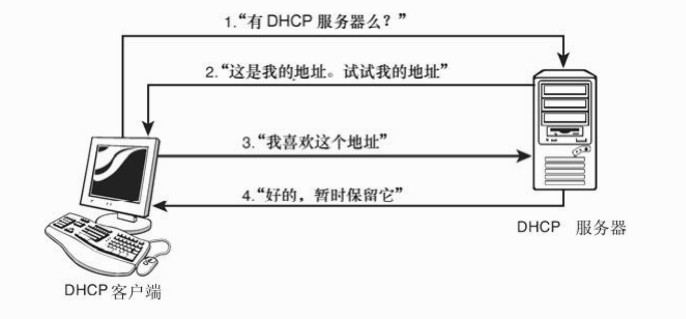
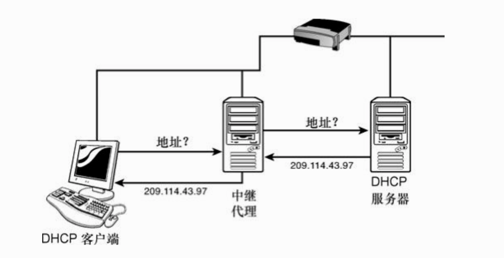
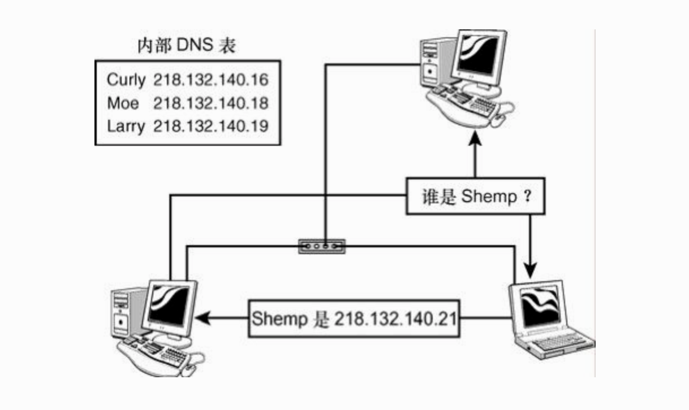

# 第十二章 配置

## 12.1 连接网络

尽管不同的系统所采用的具体方式不同，但是我们经常采用的最基本的选择如下所示：

* 配置静态IP地址
* 配置计算机，使其通过DHCP来接收动态IP地址

## 12.2 服务器提供IP地址的情况

静态IP有如下一些缺点需要注意：

* 更多的配置工作：每一个客户端都必须单独配置，更改IP地址孔盖或者其他一些参数（例如DNS服务器地址）就意味着每一个客户端都必须分别重新配置
* 更多的自己：每一台计算机都会使用一个IP地址，如论其当时是否连接在网络上
* 减少了灵活性：如果一台计算机需要分配不同的子网，就必须手动重配这台机器

为了应对这些限制，出现了另一种IP寻址系统，在这个系统中，会通过基于DHCP协议的请求来分配IP地址，DHCP是源自于早期的BOOTP协议，该协议主要用于启动无盘计算机（无盘计算机在启动时才从网络上接收整个操作系统）由于IP地址的供应日益减少，大型的动态网络日益增长，DHCP最近应用得越来越广泛

实际上，绝大多数计算机在访问Internet时，都是通过DHCP接收配置的，将家庭网络连接到Internet上的小型路由器/防火墙实际上都是一个DHCP服务器

## 12.3 什么是DHCP

DHCP是一个用来向计算机分配TCP/IP配置参数的协议，DHCP服务器可以为DHCP客户端提供一组TCP/IP设置，比如IP地址，子网掩码和DNS服务器地址

因为DHCP是用来分配IP地址的，所以必须使用静态IP地址信息来配置DHCP服务器，需要在客户端进行配置的唯一一个网络参数是将客户端设置为从DHCP服务器接收IP地址，其他的TCP/IP配置都会发生通过服务传送过来，如果网络上的一些TCP/IP配置发生了变化，网络管理员只需要更新DHCP服务器，而不需要手动更新每一台客户端

另外，每台客户端的自己的欧是有租期限制的，在租用到期时，如果客户端不再使用这个地址，此地址将会被分配给其他客户端，DHCP的这种租用特性，使得网络不必拥有与客户端相同数量的IP地址

## 12.4 DHCP如何工作

当DHCP客户端计算机启动时，TCP/IP软件被载入到内存中并开始执行相应的操作，然而，因为这时TCP/IP栈中还没有IP地址，所以无法直接发送或者接收数据包，计算机只能发送和监听广播数据，这种通过广播进行通信的功能正是DHCP进行工作的基础，从DHCP服务器中租用的IP地址的过程需要经过4个步骤

**DHCP服务器向网络客户端提供一个IP地址** 

1. DHCPDISCOVER：DHCP客户端首先会向UDP端口687（BOOTP和DHCP服务器使用的端口）广播发送一个数据包，这个数据包被称为DHCP DISCOVER消息，任何收到请求配置信息的数据包的DHCP服务器都可以响应这个请求，DHCP DISCOVER数据包中包含了很多字段，但是其中重要的一个是DHCP客户端的物理地址

2. DHCPOFFER：DHCP服务器会向网络上的客户端提供可租用的地址，DHCP服务的相应数据包被称为DHCP OFFER，此数据包会通过广播发送给发出了DHCP DISCOVER的计算机，这个广播会发送到UDP端口68，并切包含了DHCP客户端的物理地址，此外，DHCP OFFER中还包含了DHCP服务器的物理地址和IP地址，以及提供给DHCP客户端的IP地址和子网掩码

   此时，如果有多个DHCP服务器可以向DHCP客户端提供IP地址，那么DHCP客户端就可能收到多个DHCP OFFER，在大多数情况下，DHCP客户端会接收第一个达到的DHCP OFFER

3. DHCPREQUEST：客户端选择了一个OFFER数据包后，会构建并广播一个请求数据报，DHCP请求数据报中包含了发送OFFER的服务器的IP地址以及DHCP客户端的物理地址，DHCP请求会执行两个基本任务，第一个是通知被选中的DHCP服务器，客户端请求服务器向它分配一个IP地址（以及其他配置设置），第二个任务是通知其他的DHCP服务器它们的OFFER没有被接收

4. DHCPACK：对于发出的OFFER被客户端选中的DHCP服务器，在接收到DHCP请求数据报时，会构造整个租用过程中的最后一个数据报，这个数据报被称为DHCP ACK（acknowledge的简写），DHCP ACK中包含了一个租用给DHCP客户端的IP地址和子网掩码，另外，还可以选择发送DHCP客户端需要配置的默认网关地址，多个DNS服务器地址以及一，两个WINS服务器地址，除了IP地址之外，DHCP客户端还可能接收其他配置信息，例如NetBIOS节点类型（可以改变NetBIOS名称解析的次序）

   DHCP ACK中包含的另外3个关键字段都是用来表示时间间隔的：一个字段表示租期的长度，另外两个时间字段被称为T1和T2，在客户端更新期租期时使用

### 12.4.1 中继代理

如果DHCP客户端和DHCP服务器都位于同一网段内，客户端获取IP地址的过程与前面描述的基本相同，但是，如果DHCP客户端和DHCP服务器位于被一个或多个路由器分隔在不同的网段上，整个过程就会变得更复杂一些，路由器通常是不能将广播发送到其他网络上的，为了使DHCP可以工作，需要有一个中间人来协助完成DHCP的处理过程，这个中间人就是与DHCP客户端在相同网络中的另一台主机（通常就是路由器），在任何情况下，执行这个中间人功能的过程称为BOOTP中继代理或者DHCP中继代理

中继代理必须具有固定的IP地址，同时还保存有DHCP服务器的IP地址，因为中继代理已经拥有了IP地址，所以可以直接向DHCP服务器发送数据报，或者接收来自于DHCP服务器的数据报，由于中继代理与DHCP客户端位于相同的网络上，也就意味着它可以通过广播与DHCP进行通信

**中继代理帮助客户端到达本地网段之外的DHCP服务器**

中继代理会监听去往UDP端口68的广播，当中继代理检测到DHCP请求时，就将这个请求转发给DHCP服务器，当代理收到DHCP服务器的响应时，就将响应在本地网段上广播，这个解释虽然省略了一些细节，但是很好得概括了中继代理的基本工作过程

将DHCP服务器安放在路由器上的这种流行做法，已经减少了大多数网络上DHCP中继服务的要求，有关中继代理的细节，请参与RFC1542

### 12.4.2 DHCP时间字段

DHCP客户端从DHCP服务器租用IP地址时会有一个固定的租期，租期的实际长度通常是在DHCP服务器配置的，通过DHCP ACK消息发送的T1和T2两个时间值被用于租期更新的处理过程，T1的值表示客户端应该在这歌时刻进行租期的更新，T1通常会被设置成实际租期的一半

租期请求方式：当实际租期到一半时请求第一次，如果服务器不可用，则在租期到达的75%时再次进行尝试，不可用时候等到87.5%再次尝试，如果服务器端还是不可用，则等待租期全部结束时启动t2，重新发送DHCP广播获取IP地址

## 12.5 配置DHCP服务器

略

## 12.6 网络地址转换（NAT）

NAT设备能够屏蔽本地网络的所有细节，事实上，也能够隐蔽本地网络，下图所示为一个NAT设备，NAT设备可用作为本地计算机访问Internet的网关，在NAT设备之后，本地网络可以使用任何网络地址空间，当本地计算机需要连接Internet资源时，NAT设备会替这台计算机进行连接，所有从Internet资源发来的数据包都会被转换成本地网络的地址格式，接着被发送给发起连接的本地计算机

由于本地NAT设备可以阻止外部的攻击者发现本地网络，所以它能够提升网络的安全性，对外部世界而言，NAT设备看上去就好像是一台单独连接在Internet上的主机，即使攻击者知道本地网络上计算机的地址，也不能够打开与本地网络的连接，这是因为本地网络的寻址模式与Internet地址空间是不相关的，在第四章讲到，少量的IP地址范围被留给了“私有”网络：

10.0.0. ～ 10.255.255.255

169.254.0.0 ～ 169.254.255.255

172.168.0.0 ～ 172.31.255.255

192.168.0.0 ～ 192.168.255.255

在本章后面会讲到，169.254.0.0～169.254.255.255地址范围是一个不可路由的地址块，它主要用于自动配置的链路本地地址，NAT不能使用它

## 12.7 零配置

一种最新的技术——Zeroconf（零配置），能够提供更强大的和完整的无配置环境，Zeroconf扩展了IPv4LL的体系，为小型本地网络提供了更完整的网络连接环境，这种新的零配置环境有3个重要的部分

* 链路本地寻址：计算机为自己配置私有的IP地址，地址范围是169.254.0.0 ～ 169.254.255.255
* 多播DNS：无需服务器或预先配置的主机文件进行DNS名称解析，将名称解析成IP地址（或者将IP地址解析成名称）是通过查询特定IP地址和端口号完成的，其他设备监听发向这个地址的请求，进而做出相应的响应
* DNS服务发现：客户端用来找到网络上可用服务的一种方法

这些组件之间的互相影响创造了一种环境，使计算机可以无需预算配置TCP/IP就能够启动，接收本地兼容的不可路由的IP地址，将它的主机名注册到本地网络中的其他计算机上，通过类似于网络邻居而且具有点选类型的文件浏览器来浏览可用的服务（例如文件和打印服务器）

**注意：对大型网络而言，这些技术的扩展性并不好，它们只能用于单个LAN网络中的小型网络** 

支持多播DNS（mDNS）的计算机存储着它自己的DNS资源记录的内部表，并使用该表格将名称解析为IP地址，在下图中，如果计算机遇到了一个不术语上述表中的名称，它发送一条消息到多播地址224.0.0.251，支持多播DNS的其他计算机被配置为在该地址上监听DNS查询，能够完成该查询的计算机返回响应，并显示正确的名称到IP地址的映射

**在多播DNS中，每一台计算机都存储着它自己的DNS表（在真实环境中，除了基本的名称到IP地址的映射之外，计算机还传递和保存其他DNS信息）** 

DNS服务发现（DNS-SD）提供了一种方法，可以让计算机和设备通过DNS来通告它们的服务，许多新出现的小玩意儿对 DNS 服务发现有很强的依赖性，而且许多其他类似的技术也可以使得在不需要对设备进行预先配置的情况下，就能让设备迅速上线使用，并发现诸如打印机、音乐播放器等这样的服务

DNS-SD依赖于对SRV资源记录的查询，后者可以识别域内提供的服务，例如，在传统的DNS网络中，某一个域SRV记录可能存放着FTP服务器或活动域控制器的主机名和端口号，DNS-SD 将该新性能进行了扩展，使其可以应用到更小的范围，并使用其他记录类型来完成该过程，首先，DNS PTR指针记录的一个变体（variation）（用于逆向查询）指向网络中运行的一个可用服务实例，该查询可能会返回如下信息

* 实例：服务的一个特定实例（可能存在同一个网络中的多台服务器提供相同服务的情况）
* 服务：服务的名称
* 域：服务所在的域

通过组合对这个查询的响应信息，DNS-SD客户端创建了一个网络上可用服务和服务实例的浏览列表

当用户或客户端应用程序在这个浏览列表中选择一个特定的服务实例，对相关SRV记录的一个DNS查询将返回主机名和端口号，以用于访问网络中的服务，DNS-SD还是用TXT资源记录来返回服务相关的其他信息

DNS服务发现用于多播DNS协同工作，以提供一个完整的零配置DNS环境，但是DNS-SD也可以与传统的DNS服务（仅有最少的初步配置）一起工作

Microsoft 定义了另外一种多播 DNS 协议，名为链路本地多播名称解析（Link-Local Multicast Name Resolution，LLNR），Microsoft的简单服务发现协议（Simple Service Discovery Protocol，SSDP）提供了服务发现功能，SSDP基于HTTP而不是传统的DNS，这与人们日渐重视基于 URL 的服务相吻合，但是却与传统的 DNS 基础设施形成了间断，提供了与DNS-SD相似的服务浏览基础设施的通用即插即用（uPnP）协议系统就是依赖于SSDP的

## 12.8 配置TCP/IP

略

## 12.9 小结

本章首先讨论了DHCP协议，它为配置IP地址和其他设置提供了一种比较容易的方法，DHCP服务器为DHCP客户端提供了一个IP地址（有时还会提供其他配置信息），DHCP现在相当常见，以至于它成为大多数TCP/IP网络的正常操作模式，当配置计算机时，使其接收动态IP地址时，可以将其配置为DHCP客户端

本章还讲解了NAT和零配置协议，最后通过几个例子讲解了如何在典型的Windows，Mac os和linux系统中配置TCP/IP

## 12.10 问与答

问：在DHCP客户端首次启动时，是如何与DHCP服务器进行通信的？

**答：** 通过广播数据包和接收广播数据包

问：NAT是如何提高安全性的？

**答：** 因为NAT地址是不连续和不可路由的，外部攻击者无法与本地网络通信，注意，这个重要的特性并不能保证网络的安全性，攻击者还可以通过其他技术对NAT网络进行访问

## 12.11 测验

## 12.11.1 问题

1. 为了让某个网络上的DHCP客户端租用另外一个网络上DHCP服务器提供的IP地址，需要做些什么？

   **答：** DHCP中继代理

2. DNS-SD主要依赖于哪个DNS记录？

   **答：** DNS发现服务，使用PTR记录来装配服务实例的一个浏览列表，并使用SRV记录来获得用于服务的DNS主机号和端口号，TXT记录提供了与服务有关的附加信息

### 12.11.2 练习

略

## 12.12 关键术语

复习下列关键术语：

* 自动私有IP寻址（Automatic Private Addressing，APIPA）：Microsoft一些系统中使用的一种链路本地寻址技术
* BOOTP：主要用来为无盘客户端分配地址的一种协议
* DHCP：动态主机配置协议，用于提供动态IP地址分配的协议
* DHCP客户端：通过DHCP来接收动态IP地址的计算机
* DHCP服务器：通过DHCP将TCP/IP配置参数传输给客户端计算机的一台计算机
* DNS-SD：DNS服务发现，客户端在零配置网络上获悉服务的一种方式
* 链路本地寻址：一种用于零配置IP地址分配的技术
* LINR：链路本地多播名称解析，由Microsoft开发的另外一种零配置名称解析技术
* 多播DNS：不需要服务器或预先配置的主机文件的一种DNS名称解析技术
* SSDP：简单服务发现协议，由Microsoft发起的一种服务发现技术，它使用的HTTP而不是DNS，SSDP一种与通用即插即用（upnp）相关联的服务发现协议
* Zeroconf：一个协议集合，用于配置零配置TCP/IP服务