# 第十章 名称解析

## 基本概念：

名称解析的过程是首先接受一个计算机的名称，接着再将这个名称解析成相应的IP地址

## 10.1 什么是名称解析

主机名系统是在TCP/IP早期开发的一种简单的名称解析系统，在这个系统中，每台计算机都有一个用字母数字表示的名称，这个名称被称为主机名，如果操作系统需要从字母名称中得到IP地址，会查询主机文件，主机文件中包含了主机名和相关IP地址的列表，如果名称在主机名列表中，就读取与之关联的IP地址，接着，将命令中的主机名替换成相应的IP地址，最后才执行命令

**主机名解析** 

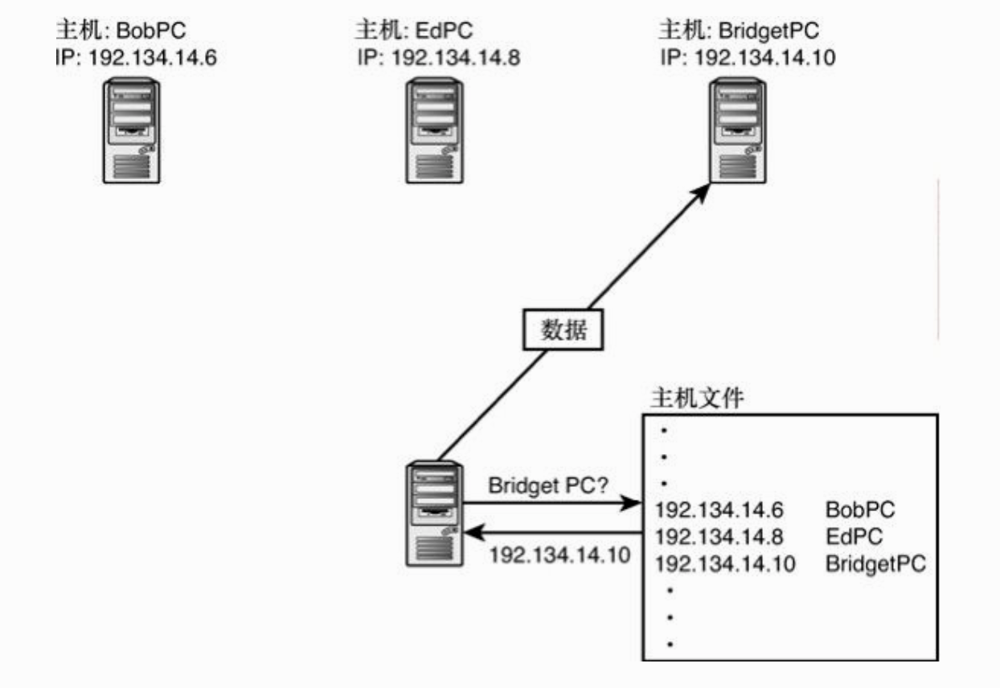

在ARPAnet时期，是通过一个名为hosts.txt的文件来保存名称与地址关联的，本地网络管理员必须不断更新这个文件，另外，主机名称空间从本质上来讲是扁平的，由于所有的节点都是平等的，因此名称解析系统无法利用IP地址空间高效率的层次结构

即使ARPAnet的工程师们能够解决这些问题，在拥有几百万个节点的巨型网络（例如Internet）中，主机文件系统也不可能很好的工作，工程师们知道它们需要一种有层次的名称解析系统，这种系统必须能够完成以下工作

* 将名称解析的工作分配给一组专用的名称解析服务器，名称解析服务器维护定义了名称以及关联IP地址的列表
* 将本地名称解析的权利授予本地管理员，换句话说，就是不用再有一个掌握了所有名称（地址对），而是让网络A中的管理员负责网络A的名称解析，网络B的管理员管理网络B的名称解析，通过这种方法，对某个网络的变化负有管理责任的人员同时也就能够使得这些变化及时反映到名称解析体系结构中

根据这些要求，开发出了域名系统（Domain Name System，DNS）dns是internet上使用的名称解析方法，是internet名称的通用命名根据，后面部分会介绍，dns将名称空间分隔成了具有层次的实体，这些实体称为域名，域名可以包含主机名，这种域名被称为完全限定域名（FQDN）例如，在域whitehouse.gov中主机名为maybe的计算机，其FQDN就是maybe.whitehouse.gov

DNS系统持续的发展，DNS现在可以提供更好的安全、动态地址映射和自动发现等功能选项，本章将会描述主机名解析和DNS名称解析，还会介绍另一种在Microsoft网络上常用的名称解析系统——NetBIOS

## 10.2 使用主机文件进行名称解析

在小型网络上配置主机名解析通常很简单，支持TCP/IP的操作系统都能识别主机文件，并可以将它用于名称解析，而且期间几乎不需要用户干预，根据实现的不同，配置铸就名称解析的细节也有所不同，大概的步骤如下

1. 为每台计算机分配IP地址和主机名
2. 创建映射了IP地址和所有计算机主机名的主机文件，这些文件的名称一般是hosts，有些则使用hosts.txt作为文件名
3. 将主机文件放置每台计算机的制定位置上，对于具体位置，每种操作系统都有自己的规定

主机文件中保存了需要与本季通信的主机信息，在这个文件中可以输入IP地址以及与之相关的主机名、FQDN或其他静态别名，另外，主机文件中还保存了一个环回地址条目127.0.0.1 这个环回地址主要用于TCP/IP诊断并表示“本机”

当计算机上的应用程序需要将名称解析为IP地址时，系统会首先将这个名称与本机的名称比较，如果不匹配，系统会查看主机文件（如果存在），寻找其中是否列有这个计算机的名称，如果找到了匹配的名称，就将IP地址发向本地计算机，然后使用arp来获得其他系统的硬件地址，接下来两台计算机就可以进行通信了

如果将主机文件用于名称解析，那么每当网络变化时，都必须编辑或替代每一台计算机上的主机文件，在创建或者编辑主机文件时，需要记住下面几个关键点

* IP地址必须在最左边，并且必须用一个或多个空格将其与主机名隔开
* 一行中的其他名称是第一个名称的别名
* 文件的解析（即计算机的读取顺序）是从头到尾进行读取，只有第一个与名称匹配的IP地址才会被使用，当有匹配的名称出现时，解析就会停止
* 因为解析是从头至尾进行的，所以应该将最常用的名称放在列表的前面，这样可以加快名称解析的过程
* #富豪的右侧可以放置注释
* 记住，主机文件是静态的，当IP地址改变时，必须手动修改这个文件
* 尽管在主机文件中允许出现FQDN，但是在主机文件中使用它们可能导致一些管理员难以诊断的问题，控制主机文件的本地管理员无法控制远程网络上的IP地址和主机名的分配，因此，如果远程网络上的服务器被分配了一个新的IP地址，而本地主机文件中的FQDN又没有更新，主机文件会继续指向旧的IP地址

**对小型的，独立的TCP/IP网络来说，主机文件是一种高效且简单的名称解析方法，当然，现在所谓独立的网络已经越来越少了，由于Windows，MAC和其他操作系统为小规模的网络提供了更多自动化技术，因此使用主机文件并不是必须的，大型网络则依靠DNS来完成名称解析** 

## 10.3 DNS名称解析

防止在每台计算机上不断更新名称解析文件这种情况，dns将名称解析数据防止在一个或多个专用的服务器上，由dns服务器为网络提供解析服务，如果网络上的计算机需要将某个主机名解析成IP地址，则会像服务器发送一个查询，询问与这个地址关联的主机名，如果dns服务器保存了相应的地址，就将这个地址返回给发送请求的计算机，接下来，这台计算机会用IP地址来代替主机名，进而再执行命令，当网络出现变化时（例如有一台新计算机或者更改了一个主机名），网络管理员只需要修改一次dns配置（在dns服务器上）这些新的信息对任何向服务器发送dns请求的计算机都是可用的，另外，dns服务器还可以优化搜索的速度，因此，相对于在每台计算机都分别搜索笨重的主机文件，dns服务器可以支持更大规模的数据库

**DNS服务器可以为网络提供名称解析服务** 

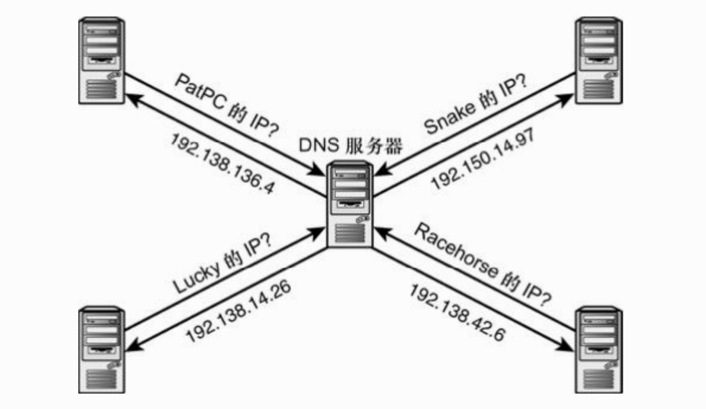

图示中的dns服务器有多个有点，它为本地网络提供了一个单一的dns配置点，使得网络资源的利用更加有效，然而，该配置仍然无法提供非中心化的管理巨型网络的能力，与主机文件类似，该服务器也无法高效的保存internet上所有主机名的数据库，即使可以，从后勤支持的角度来说，维护所有internet信息的数据库也是不允许的，配置这种服务器的人员必须知道世界上任何个一个地方的internet主机所发生的变化

一个更好的解决方案是允许每个办公室或机构可以配置一个本地名称服务器，并使所有的名称服务器都可以彼此通信，在这种情况下，当dns客户端向名称服务器发送名称解析请求时，名称服务器会按下面一种情况进行处理

**大型网络中，DNS服务器通过与其他服务器进行通信，以提供名称解析服务** 

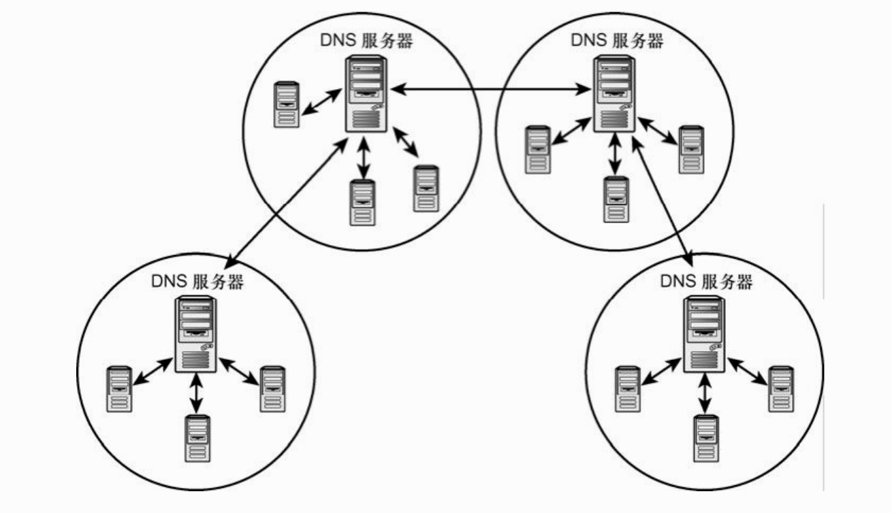

* 如果名称服务器在自己保存的地址数据库中发现了被请求地址，则将这个地址发回给客户端
* 如果没有找到这个地址，回要求其他的名称服务器查找这个地址，接着将这个地址发回客户端

那么在查询IP地址的过程开始后，第一个服务器是如何知道需要与哪个服务器联系呢？实际上，这个查询的过程与DNS名称空间的设计是紧密相关的，记住，DNS并不是只使用主机名的，之前讲到，DNS使用的是完全限定域名（FQDN），FQDN是由主机名和特定的域名组成的

**DNS名称空间是一个多层排列的域名，一个域名就是一组计算机，这些计算机位于同一个授权环境中，共享着名称空间的同一部分（也就是具有相同的域名），在DNS树的顶端是名称为root的根节点，root有时候会显示为‘.’，但root实际的符号为null字符，在root之下是一组顶级域名*（Top Level Domain，TLD）下图所示的TLD是世界上最著名的DNS名称空间：Internet，TLD包括了常见的.com、.org和.edu域名，以及国家政府的域名，例如.us（美国） uk（英国） .fr（法国） .jp（日本）**

**DNS名称空间** 

在这些顶级域名下是另一个域名层，这个域名层（在internet中）是由企业，或组织控制的，这些机构名称会作为TLD的前缀，例如，google的域名是google.com，被授予域名的组织可以创建一个或多个其他的子域名层，例如：谷歌地图的域名就是map.google.com，总的来说，dns系统支持多达127层的域名，不过很长的域名也会使人感到非常头疼

**一个适当的DNS场景** 

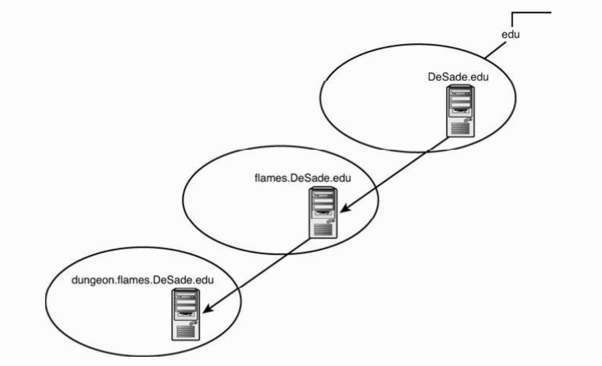

**注意：** 域名层

如果经常使用internet就需要注意，带有几个级别的扩展域名，（上图所示）并不常见，在.comTLD中的网络，一般会用www前缀做标记：www.ibm.com 然而，请记住，网站可能是位于一台服务器上，也可能位于某个地方的一组服务器上，由于多层域名在网络管理中的使用，人们就能够访问分布在大型企业网络上的资源，而这些资源则可以保存在不同的地方，公共的TLD（例如.gov)更倾向于利用多层域名

域名显示的是从树的顶端开始的名称链，google.com的域名服务器中保存了google.com下的所有主机的名称解析信息，在本域中被授权的名称服务器可以将关于子域名的名称解析委派给其他的服务器，例如，google.com的授权名称服务器可以将子域map.google.com授权给其他的名称服务器进行解析，子域名map.google.com的名称解析记录位于委派子域名解析授权的名称服务器上，对名称解析的授权可以通过一个树状结构委派，指定域的管理员可以控制本域中所有主机的名称与地址的映射

当网络上的主机需要IP地址时，通常会发送一个递归的查询给附近的名称服务器，这个查询要求名称服务器“要么返回与此相关的IP地址，要么告诉我无法找到当前这个地址“，如果名称服务器在自己的记录中没有找到被请求的地址，可以启动一个查询过程，询问其他的名称服务器是否获得这个地址，名称服务器A使用了一个迭代的查询过程来查找地址，这个迭代的查询过程会通知下一个名称服务器，”要么返回IP地址，要么告诉我在哪里可能会找到这个地址”。这个过程可以总结为，客户端发送一个递归查询给名称服务器，接下来，这个名称服务器会发送一系列的迭代查询给其他的名称服务器来解析这个名称，当名称服务器获得了与名称相关的地址时，就使用这个地址来回复客户端的查询

**域名解析过程** 

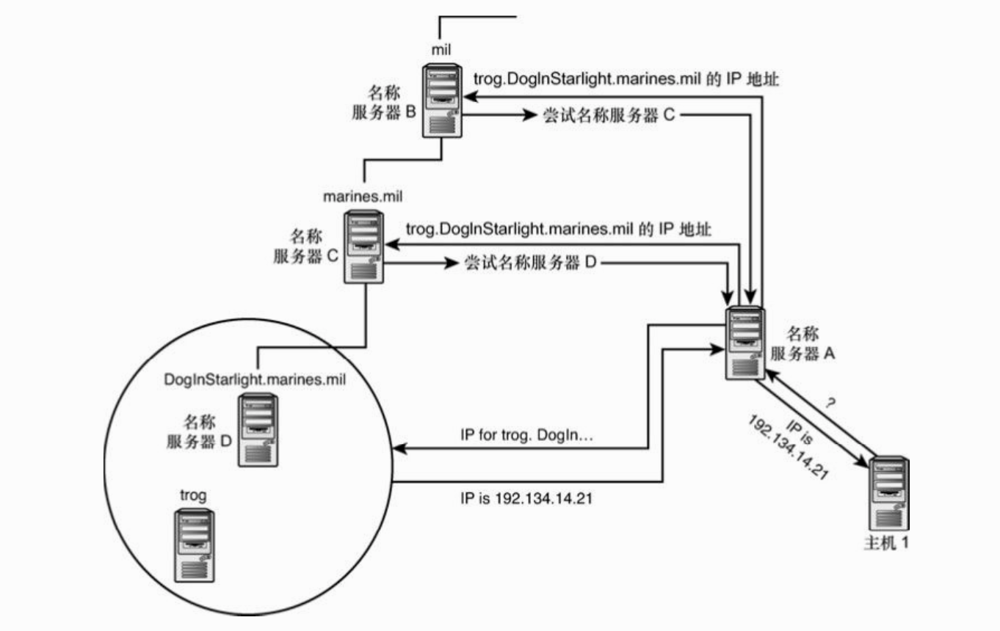

DNS名称解析的过程如下所示：

1. 主机1向名称服务器A发送了一个查询，请求查找trog.DogInStarlight.marines.mil的IP地址
2. 名称服务器查找自己保存的记录，看是否找到这个被请求的IP地址，如果服务器A中有这个地址，将此地址返回给主机1
3. 如果服务器A没有这个地址，则发起查找地址的过程，名称服务器A发送迭代请求给.mil域的顶级名称服务器B，询问trog.DogInStarlight.marines.mil的相关地址
4. 名称服务器B无法提供这个地址，但是会将域marines.mil的名称服务器（服务器C）地址发给服务器A
5. 服务器 A 向服务器 C 发送查询地址请求，服务器 C 无法提供这个地址，就将DogInStarlight.marines.com的名称服务器（服务器D）地址发给服务器A
6. 服务器A向服务器D发送查询地址请求，名称服务器D找到了DogInStarlight. marines.com的地址，就将这个地址发给名称服务器A，名称服务器A接着会将这个地址发给主机1
7. 主机1发起与主机DogInStarlight.marines.com的连接

该过程每天在internet上会出现上千上万次，由于当今网络的其他一些特定（例如地址缓存，dhcp和动态dns）这个过程也变得不再那么纯洁，然而，大多数tcp/ip网络的功能仍然会依赖这种形式的dns名称解析

另外一个需要注意的重点是，并不是每个域树中的节点都必须单独拥有名称服务器，一个名称服务器可以控制多个域，当然，一个域中也常常会使用多个域名服务器

## 10.4 注册域

略

## 10.5 名称服务器类型

在网络上实现dns时，至少需要选择一个服务器来负责维护域的信息，这个服务器就是首选名称服务器，它可以从本地文件中获得其负责区域的所有信息，在域中的任何修改都应该反映到这个服务器上

许多网络通常还会有一个或多个服务器作为备份或备用域名服务器，如果主服务器遇到了问题，可以用这台服务器继续提供服务，备用域名服务器从首选服务器的区域文件中获得需要的信息，这种信息交互的方式称为区域传送（Zone Transfer）

第三种类型的服务器被称为只缓存（caching-only）服务器，缓存是计算机内存的一部分，用来保存被频繁请求的数据，以便于更好访问服务，只缓存服务器会相应来自于本地网络客户端对名称解析的查询请求，向其他的dns服务器查询域和提供服务（例如Web和FTP）计算机的信息，当从其他dns服务器收到这些信息后，将信息保存在缓存中以便于响应再次对这些信息的查询请求

只缓存服务器通常会被本地网络的客户端计算机用来进行名称解析，位于internet上的其他dns服务器并不知道这些服务器的存在，因此也就不会查询它们，这种服务器很适合分担服务器上的负载，此外，只缓存服务器的维护也很简单

**注意：DNS实现** 

在运行dns服务器的机器上，dns必须被现实为服务或后台程序，windows服务器自带一个dns服务，当然，有些管理员会倾向于使用第三方的dns实现，当unix/linux上则有很多dns的实现，其中最常见的是Berkeley Internet Name Domain（BIND）

### 10.5.1 域和区域

在一组公共DNS服务器上配置的DNS主机的集合呗称为”区域（zone）“，在简单网络上，一个区域可能会表示一个完整的dns域，例如，域punyisp.com可能作为单独的区域进行DNS配置，在复杂的网络上，对子域的DNS配置有时会被委派给其他的区域，区域委派使得负责子网管理的管理员能够直接管理子网的DNS配置，例如，域cocacola.com的管理员会将子域 dallas.cocacola.com的DNS配置委派给一个区域，而这个区域是由Dallas办公室中的管理员控制的，这样就能够近距离的对域dallas.cocacola.com上的主机进行监视

那么区域与域有什么不同呢？除了细微的语义差别外（域是名称空间的一部分，而区域则表示一个主机的集合），区域和域的概念并不是并行的，在阅读本节内容时候，请记住以下内容

* 作为子域的成员自然也就是父域的成员，例如：map.google.com中的主机也是google.com域的一部分，与之反响，如果域map.google.com被委派给一个区域，则map.google.com上的主机并不是google.com区域的一部分

* 如果子域没有被专门委派，就不需要单独的区域，只用将它包含在父域的区域文件中

  如何委派dns区域则取决于dns服务器应用程序，当前，最重要的事情是记住，区域用于表示一组dns服务器和主机上的一个配置集合，dns管理员可以将名称空间的组成委派其他区域，以便提高管理效率

1. 区域文件

   上一节讲到，一个dns区域就是一个可管理的单元，这个单元表示的是，位于dns名称空间中某个部分上的计算机的集合，区域的dns配置存储在一个区域文件中，当需要响应查询和发起查询时，dns服务器会饮用区域文件中的信息，区域文件时一个带有标准架构的文本文件，区域文件的内容有多个资源记录构成，一个资源记录就时一行文本，提供了一组有用的dns配置信息，下面是一些常用的资源记录类型

   * SOA：SOA表示权利的起始点（start of authority），SOA记录为区域指定了权威名称服务器
   * NS：NS表示名称服务器（Name Server），NS记录为区域指定了一个名称服务器，虽然区域中可以有多个名称服务器（因此，也就会有多条NS记录），但是智能有一条指定权威名称服务器的SOA记录
   * A：A记录用于将DNS名称映射到IP地址
   * AAAA：AAAA记录将DNS名称映射到IPv6地址
   * PTR：PTR记录用于将IP地址映射到dns名称
   * CNAME：CNAME是规范名称（canonical name）的缩写，CNAME记录用于将一个别名映射到一个由A记录表示的实际主机名

   因此，区域文件可以告知DNS服务器如下内容：

   * 区域的权威DNS服务器
   * 区域中的DNS服务器（权威和非权威的）
   * 区域中主机别名所代表的主机DNS名称到IP地址的映射，主机别名是主机的另外一个名称

   其他的资源记录类型提供相关主体的信息，例如邮件服务器（MX记录），IP和DNS名称的映射（PTR记录）以及熟知的服务（WKS记录）

   **示例：** 

   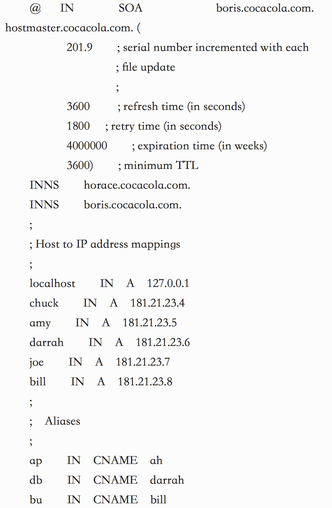

   注意：SOA记录包含了几个参数，这些参数用于控制如何使用首选服务器上的区域数据副本来更新备用的DNS服务器，除了表示区域文件版本的序列号外，其他参数用于指定下面的内容

   * Refresh time：表示备用DNS服务请求首选服务器更新其区域信息的时间间隔
   * Retry time：指定在区域更新未成功时，需要等待多长时间，才应再此进行尝试
   * Expiration time：指定备用名称服务器保留未刷新记录的上限时间
   * Minimum Time-to-Live（TTL）：指定被输出区域记录的默认TTL

   SOA记录的最右侧是负责区域管理的管理员邮件地址，用@符号替代第一个符号“.”，就是实际的邮件地址

   区域文件的名称以及格式根据DNS服务器软件的不同也有所不同，这个例子是根据流行的BIND（Berkeley Internet Name Domain）生成的，BIND是Internet上最常见的名称服务器

   此外，还需要记住的是，通过操作文本文件来配置服务已经越来越不受环境了，很多dns服务器应用程序都提供了用户界面来隐藏区域文件的细节，动态dns还提供了用于一个专门用来隐藏配置细节的分层

2. 逆向查找区域文件

   dns文件解析中需要的另一种区域文件类型是逆向查找文件，当客户端提供了IP地址，要求查找相应的主机名时时会使用这个文件，在IP地址中，最左边的是通用的部分，最右边的部分是特定的部分，而域名则正相反：左边的是特定的部分，右边的部分（例如com或者udn）是通用的部分，要想创建逆向查找区域文件，必须将网络地址进行翻转，以便于通用和特定部分的顺序与域名的样式相同，例如，应用于192.59.66.0网络的区域的名称应该是66.59.182.in-addr.arpa

   in-addr表示逆向地址，而arpa部分是另一个TLD，即来源于Internet的前身ARPAnet

   该文件作为一个普通的区域文件开始（看之前的例子）具有一条SOA记录和NS记录，其中后者定义了区域的名称服务器，但是它没有将域名映射为地址的A记录，而是包含一条将地址映射为主机的PTR记录，在地址映射中，只包含了地址的主机部分，网络部分来自于文件名

   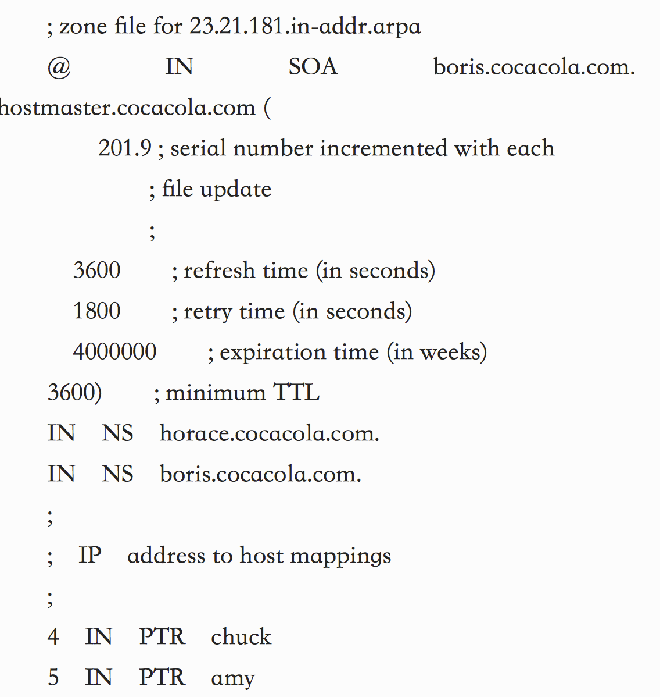

   第十三章会讲到，下一代IPv6包含一个128位的地址空间，尽管逆向查找区域文件在IPv6子网上的作用仍然相同，但是文件名将发生变化，而且其中的条目也变得更长

   IPv6逆向查找区域文件的最初计划是使用ip6.int结尾，但是Internet如今正在转换为ipv6.arpa结尾，我们可能还会遇到其他形式，对IPv4而言，地址的网络部分在文件名中得到反映（以逆序），而主机ID则是作为文件中的一个条目给出的（也是逆序）它映射到一个主机名称，有关IPv6的想起，请见13章

### 10.5.2 DNS安全扩展（DNSSEC）

最初的DNS安全系统于1999年在RFC 2535中定义，但是这个初始系统在实现时难度很大，而且也不能很好的扩展到Internet上，所以很少使用，在2005年，随着TFC 4033，4034，4035的出现，保证DNS安全的新一轮倡议再次兴起，这个新的DNSSEC被几个重要的TLD采纳，比如.com .org 以及其他国家级的域名，在2010年发生的国际化域名入根事件讲会缓解公众认知并接受域名的障碍

DNSSEC使用加密密钥和数字签名来提供安全，DNSSEC需要支持DNS扩展支持（ENDS）后者在RFC 2671中定义，ENDS的报头位表示一个DNSSEC查询，DNSSEC添加了一个验证过程来DNS查询的结果是可信的，与基本的DNS名称解析过程相似，DNSSEC从一系列步骤达到与给定查询中的名字相关联区域，但是DNSSEC增加了一个信任链（chain-of-trust）类型的验证，其理念是从一个受信任的开始，将请求沿着一系列已知的和验证过的步骤向下传输，直到到达这样一个服务器：该服务器拥有一个用来验证DNS数据来源的签名

为了实现该目标，DNSSEC添加了4个新的DNS资源记录类型

* DNSKEY：用来签名和验证DNS资源记录集的公共密钥
* DS：指向（并验证）子区域DNSKEY的资源记录
* RRSIG：与区域数据相关联的数字签名
* NSEC：包含权威数据（authoritative data）的下一个持有者的名称

拥有安全DNS数据的服务器形成了一个信任链，解析器（resolver）必须能够独立访问与顶级区域的DNSKEY记录相关联的公共密钥，该密钥匙分别获得的，它可以验证存储在信任锚（trust anchor）上的数据，其中包含一条DS记录，该记录在查询过程中的下一步对与子区域相关联的DNSKEY进行验证

解析起遍历信任链，并使用父区域中的DS密钥对低级子区域中的DNSKEY进行遍历式验证，在最后一步，DNSKEY将存储在RRSIG资源记录中的数字签名进行解密，然后将其与政策的DNS查询过程返回的签名相比较，如果两者相匹配，也就对发送DNS查询的源进行了核实，从而数据是可信的

DNSSEC的处理过程如图所示，信任锚预配置的密钥将信任链解锁（在理想情况下，TLD充当信任锚，但是还是可能存在其他选项）

**DNSSEC的处理过程** 

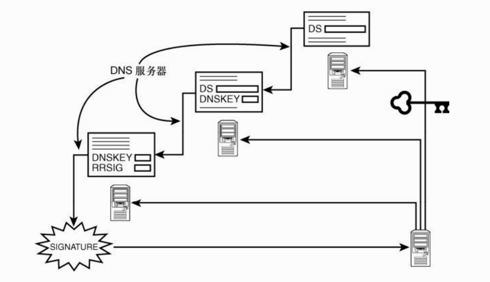

存储在初始入口点（initial entry point）的DNS数据包括所有子区域的DS记录，例如，用于.com区域的权威域名服务器包含famousIT.com的DS记录，这条DS记录识别和认证子区域的DNSKEY

如果名称中包含一系列额外的子区域，解析器将处理信任链，依次获得DS记录来验证低级的DNSKEY，当该处理过程到达最低级的子区域时，DNSKEY解密存储在RRSIG记录中的区域数据器纳米，该签名验证返回的DNS数据，以响应最初的查询

可以看到，DNSSEC取决于DNSKEY和DS资源记录之间的交互链（chain of interaction）DNSKEY和DS资源记录是紧密相关的，它们都以相似的信息为基础，RFC 4034中提到，“DS RR通过存储密钥标记，算法数值，以及DNSKEY RR的摘要来引用DNSKEY RR ，DS RR以及与其相迎的DNSKEY RR有同一个持有者名称，但是两者的存储位置不同，DR RR只出现在为台的上（父）面，在父区域中是权威数据，例如，exaple.com的DS RR是存储在.com区域，而不是example.com区域

父区域可能包含多个子区域的DS记录，每一个DS记录提供了必要的信息来验证与子区域相对应的DNSKEY记录是否正确，而且在信任链内表示一台服务器，RRSIG记录的另外一个重要组成部分包含区域数据的签名，RFC 4035中提到“为了对一个区域进行签名，区域管理员要生成一个或多个公共/私有密钥对，并使用私有密钥对区域中的RR set进行签名，对每一个用来在区域中创建RRSIG记录的私有密钥来说，区域应该包含一个区域的DNSKEY，而且这个区域DNSKEY要包含响应的公共密钥”

RRSIG记录包含像持有者名称、类值（class，value）、TTL值，包含数据的区域名字，以及识别记录的其他数据这样的信息，当名称错误或者是在查询名称的过程中，无法使用精确匹配时，将会用到NSEC记录

### 10.5.3 DNS工具

如果可以使用IP地址连接一个资源，而不能使用主机名或FQDN来连接资源，问题很可能会出现在名称解析上，如果计算机使用了主机文件，同时也使用了DNS，请记住，必须在测试DNS时临时禁用，或重命名主机文件，否则，就无法确定名称是通过主机文件还是通过DNS解析的，下面的内容将描述如何使用ping工具来测试DNS，之后还会介绍NSLookup工具，这个工具提供了很多DNS配置和排错特性

1. 使用ping检查名称解析

   ping工具虽然简单，但是很有用，它非常适合测试dns配置，ping会向其他计算机发送一个信号，并等待回复，如果接受到回复，就能够确定这两台计算机是连接到，如果知道远程计算机的IP地址，可以通过输入IP地址来ping这台计算机：ping 198.1.14.2 如果这个命令成功，表明本机可以与远程计算机通过IP地址连接，现在输入dns名称来ping 远程计算机：ping google.com，如果可以通过IP地址连通远程计算机，而无法通过dns名称连城，则表示名称解析存在问题，如果可以过dns名称连通，表示名称解析工作正常

2. 使用NSLookup检查名称解析

   用户可以使用NSLookup工具查询dns服务器，查看资源记录等信息，在需要对dns问题进行排错时这个工具也十分有用，NSlookup可以按下面两个模式进行操作

   * 批处理模式：在批处理模式中，用户可以启动NSlookup并提供一些输入参数，NSlookup会根据输入参数执行被请求的功能，显示结果，最后关闭自己

   * 交互式模式：在交互式模式中，用户启动NSlookup时不用提供输入参数，NSlookup会提示用户输入参数，在用户输入参数后，NSlookup将执行被请求的操作，显示结果并重新返回提示符状态，等待接下来被输入的参数，大多数管理员都会使用交互式模式，着是因为在需要执行一系列操作时，这种模式更方便NSlookup有一个丰富的选项列表，下面介绍一下基本的选项，以便于了解NSlookup的工作方式，直接在命令行输入nslookup,不同的操作系统提示信息也不尽相同，NSlookup有15项操作，下面列出一些常用的设置

     * ？；和help：这个命令用于查看所有的NSlookup命令
     * server：这个命令用于指定查询哪台DNS服务器
     * ls：用于列出域中的名称
     * ls -a ：这个命令用于列出域中的规范名称和别名
     * ls -d：这个命令用于列出所有的资源记录
     * set all：这个命令用于显示所有设置的当前值

     NSlookup除了能够访问本机使用的DNS服务器外，还可以使用它查看任何DNS服务器上的信息，如果拥有一个ISP，就会有至少两个服务器的IP地址，NSlookup既可以使用IP地址也可以使用域名，用户可以通过输入带有IP地址或FQDN的server命令切换到另一台DNS服务器上，例如：要想使NSLookup连接E根服务器，可以输入server 192.203.230.10 然后，你可以输入任何已有的域名，例如samspublshing.com，查看这个域名注册的IP地址

     **NSLookup的响应** 

     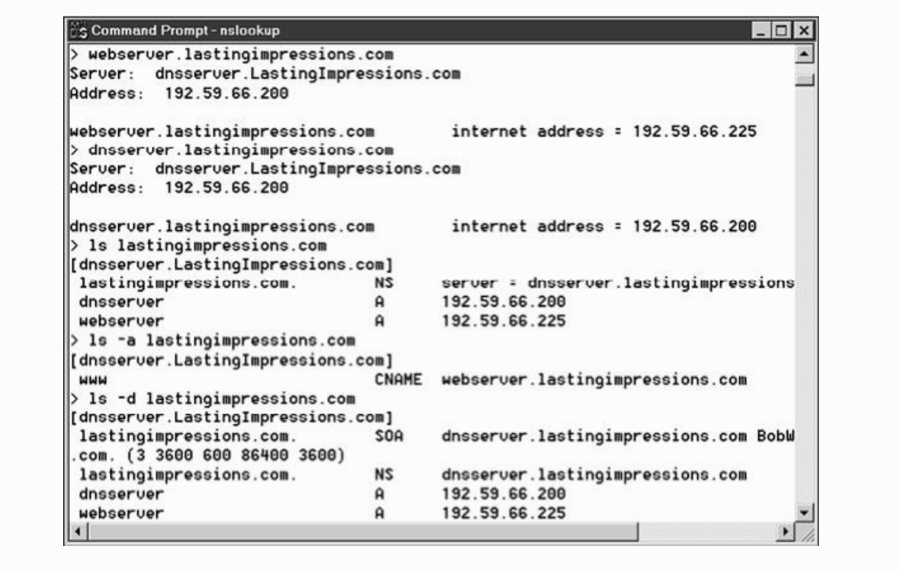

     大多数商业DNS服务器和根服务器都会拒绝ls命令，这是因为这些命令将产生很多的流量，并且可能造成安全上的漏洞

### 10.5.4 域名信息搜索（DIG）

linux上一个流行的DNS命令工具是域名信息搜索（Domain Information Groper，DIG）许多管理员认为DIG要比NSLookup更容易和灵活，在DIG最基本的形式中，如果输入主机名，则返回IP地址：dig google.com，在主机名的前面添加@server可以指定要查询的DNS服务器：dig @14.13.18.20 google.com 该命令将查询地址为14.13.18.20的DNS服务器，为了查询特定的资源记录类型，可以添加资源类型的名称：dig google.com NS ,该命令会显示与域名相关的NS记录，要查找邮件服务器，可以尝试如下命令：dig google.com MX，当指定IP地址时，选项-x 将执行逆向查找，选项-4将限定为对ipv4的查询，而-6则是对ipv6进行查询

## 10.6 动态DNS

**动态DNS更新** 

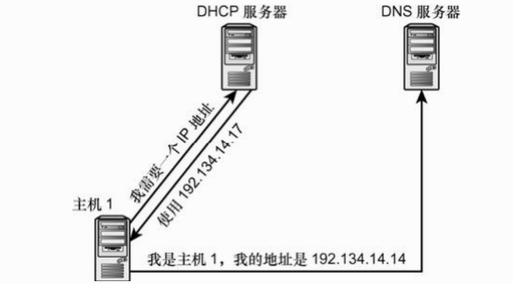

主机从dhcp服务器获取IP地址，然后使用这个新地址更新DNS服务器

## 10.7 NetBIOS名称解析

NetBIOS是一个API名称解析系统，最初由IBM开发，NetBIOS名称就是你分配给Windows计算机的名称，在资源管理器和我的电脑中，可以使用NetBIOS计算机名来识别计算机，NetBIOS被发开出来的目的是将其用于不使用TCP/IP的网络，NetBIOS名称系统在TCP/IP系统在TCP/IP网络上显得有点多余，因为NetBIOS名称扮演的角色与主机名很相似

从用户的角度看，在最近的windows版本中，NetBIOS和DNS名称解析之间的区别十分模糊，Windows同时提供对这两种系统的支持，根据用户的配置，Windows计算机名既可以作为DNS类型的主机名，又可以作为NetBIOS名称

### 10.7.1 NetBIOS名称解析的方法

在TCP/IP网络上，NetBIOS名称解析最红的目的是为了一个给定的NetBIOS名称提供IP地址

NetBIOS名称是由15个字符组成的，例如：Workstation1、HRServer和CorpServer，NetBIOS不允许网络上有重复的计算机名

**注意：NetBIOS名称** 

从技术角度讲，NetBIOS名称有16个字符，但是第16个字符是由底层应用程序使用的，通常不同用户直接配置

NetBIOS名称与主机名类似，都是在一个扁平的空间内（没有层次或者无法对名称进行限定），以下介绍几种NetBIOS名称解析为相应IP地址的方法

* 基于广播的名称解析
* LMHosts文件名称解析
* WINS名称解析

1. 基于广播的名称解析

   NetBIOS名称解析可以通过广播完成，计算机会使用广播与本网络中其他所有机器联系，要求返回特定计算机的地址，网段上的计算机监听到广播后，只有指定的计算机才会响应这个请求

   这种名称解析的办法呗称为B-Node名称解析，虽然，它可以在Lan环境中很好的工作，但如果网络不仅仅局限在Lan，这种方法就无法工作（由于路由器就阻止广播传递）

2. LMHosts文件名称解析

   windows系统还可以使用LMHosts文件讲NetBIOS名称解析成IP地址，LMHosts文件与主机文件很相似，会将NetBIOS名称与IP地址关联，IP地址列在文件的最左边一列，相应的计算机名列在其右侧，二者中间至少一个空格隔开，注释则放置在#符号之后，LMHosts要求IP地址到NetBIOS名称之间的映射是静态的，每台计算机上都分别保存一个单独的LMHosts文件，如果一台新计算机加入了网络，其他计算机就无法通过LMHosts发现它，除非为每个LMHosts文件添加相关的条目

   在只有一个网段的网络上，因为可以使用广播完成NetBIOS名称解析，所以通常不使用LMHosts文件，在犹多个望断组成的大型网络上，广播无法超越路由器完成名称解析，所以计算机必须使用LMHosts或Wins服务器进行NetBIOS名称解析，在一些情况下，LMHosts可以用于指出其他网段上的域控制器（在基于域的windows环境中，域控制器需要身份认证）

3. WINS名称解析

   建立WINS的目的是为了解决LMHosts的问题，当客户端需要获取一台计算机的IP地址时，会向WINS发送查询以获取信息，WINS在过去是microsoft网络的一个重要特性，但是随着dns和活动目录的出现，人们对耽误的WINS服务器的需求也随之降低，在某些网络中，如果NetBIOS名称解析被路由器阻止，则可以使用WINS服务器

   当客户端计算机启动时，由客户端将本机的名称和IP地址动态的的注册到WINS服务器上，WINS服务器接受并相应NetBIOS名称解析的请求

   **WINS NetBIOS名称解析** 

   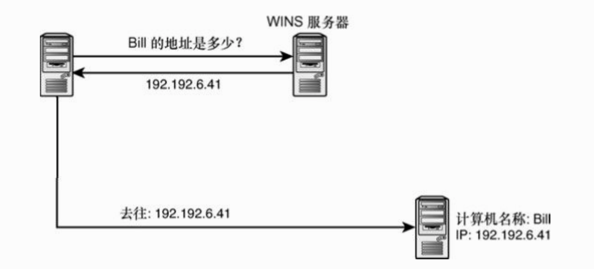

   **注意：** WINS到底是什么？

   WINS是分配给Microsoft的实现的一个名称，该实现通常被称为NetBIOS名称服务器或NBNS

   Windows提供了多种配置客户端使用WINS的方法，如果计算机通过DHCP接收到一个动态的TCP/IP配置，WINS配置可以通过DHCP自动提交给客户端，用户也可以通过TCP/IP配置对话框，手动输入WINS服务器的地址并管理与NetBIOS名称解析相关的其他设置

   根据windows的版本不同，配置WINS的步骤也有所差别，在Windows7中，用户可以通过高级TCP/IP设置对话框中的WINS选项卡来管理WINS配置，下面就是访问高级TCP/IP设置对话框的步骤

   1. 在开始菜单上选择网络

   2. 进入网络共享中心

   3. 选择管理网络连接

   4. 右键单击需要配置的网络连接，然后选择属性

   5. 选择Internet Protocool Version 4，单击属性

   6. 在TCP/IPv4属性对话框中，单击“高级”按钮

   7. 选择WINS选项卡

      **在Windows7中配置WINS** 

      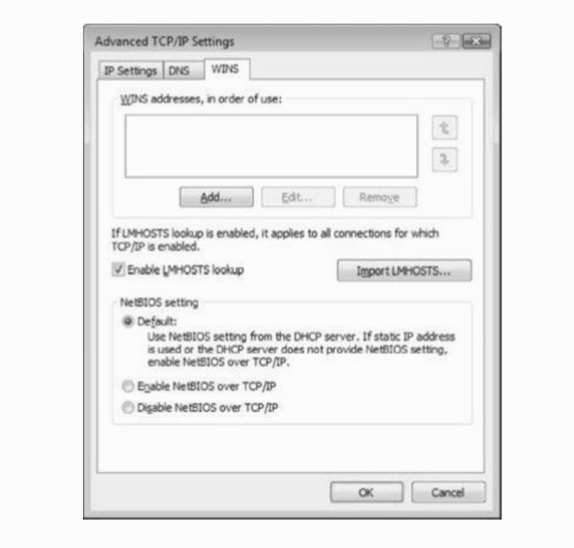

   正如上图所示，用户可以在WINS选徐昂卡中手动添加WINS服务器的地址，也可以启用LMHosts查找并倒入一个已有的LMHosts文件，在默认情况下，系统会接收来自DHCP服务器的NetBIOS设置，但是通过选择启用或禁用NetBIOS over TCP/IP可以覆盖DHCP的设置

当WINS客户端计算机启动时，会执行如下过程：

1. 服务启动，当计算机启动时，会启动很多服务，其中一些服务需要让其他计算机知道
2. 注册请求：要想让网络中的其他计算机能够知道服务已启动，必须注册服务，WINS客户端会将NetBIOS名称和计算机的IP地址打包到名称注册请求中，进而将这个请求发送到WINS服务器，在收到注册请求后，WINS将检查自己的数据库，查看名称是否已经被注册过，如果名称不存在，WINS将这个NetBIOS名称和IP地址对加入数据库，并发送注册响应数据，表明注册已经成功，如果WINS数据库总已经存在被请求的NetBIOS名称，WINS会发送一个信息给已注册的IP地址，如果当前已注册的计算机发回了响应，就向正在注册的计算机发送一个拒绝通知，如果已注册的计算机没有响应，WINS允许新的注册并覆盖掉之前的注册
3. 租期：假设计算机使用WINS成功注册了一个NetBIOS名称和服务，这些名称会有一个租期，本质上讲，计算机对一个NetBIOS名称的使用是会限制在一定时间内的，例如6天，但是，客户端可以在时限达到前更新这个租期，客户端通常会在租期到达50%更新这个租期，即如果租期是6天，那么每三天就进行一次更新

### 10.7.2 测试NetBIOS名称解析

用于可以使用基于NetBIOS的工具测试NetBIOS名称解析，在windows系统中，一种典型的名称测试方法是使用net view命令，该命令可以查看服务器上的共享点名称，要执行这个测试，可以选择一台拥有一个或多个共享点的主机，在命令提示符下输入：net view \\\ computername，如果net view可以讲计算机名解析成IP地址，用户就可以看到这个命令响应所列出的共享点名称，用户也可以使用ping工具测试NetBIOS名称解析，在大多数windows系统上，如果NetBIOS名称解析工作正常，就可以在ping工具中通过NetBIOS计算机名连接这台计算机

## 10.8 小结

名称解析使得用户能够用有意义的，容易记住的计算机名来替代分配给计算机的IP地址，本章介绍了通过主机名和DNS的名称解析，还学习了DNS配置文件和名称解析过程，以及最近的一些技术创新，比如动态DNS和DNSSEC，以及NetBIOS名称解析，后者仍然会在windows和其他基于SMB的网络中用到

## 10.9 问与答

问：什么是域名？

**答：** 域名是用来识别网络的名称，域名由一个权威的机构管理，以确保名称的唯一性

问：什么是主机名？

**答：** 主机名就是分配给特定主机并被映射给某个IP地址的一个唯一的名称

问：什么是FQDN？

**答：** 主机名和域名的组成（通过符号.）例如，主机名是map，域名是google.com，那么FQDN就是map.google.com

问：什么是DNS资源记录？

**答：** 资源记录就是包含在DNS区域文件中的条目，不同的资源记录可以识别不同类型的计算机或服务

## 10.10 测验

### 10.10.1 问题

1. 哪一种资源记录用作别名？

   **答：** CNAME

2. 为什么DS资源记录和DNSKEY资源记录存储在不同的服务器上？

   **答：** DNSSEC使用一个DS资源记录，来识别和认证存储在子区域中的DNSKEY资源记录，将DS记录存储在父区域中可以让查询遍历必要的信任链，以验证查询相应的真实性

3. 如何在LMHosts文件中集中管理条目？

   **答：** 通过在LMHosts文件中推荐加一个include语句，可以实现集中管理，以#INCLUDE打头，并提供LMHosts文件在服务器上的位置的那一行，也提供了指向中央文件的一个链接

4. 如何在NetBIOS名称缓存中创建静态的NetBIOS条目？

   **答：** 在一个LMHosts文件中，在所需条目的行首添加关键词#PRE

### 10.10.2 练习

略

## 10.11 关键术语

复习下列关键术语：

DNSSEC（DNS安全扩展）：对DNS查询响应的真实性进行验证的系统

域：DNS名称空间的层次划分

域名：分配给DNS名称空间特定层次中某个部分的名称

DNS（域名系统）：在TCP/IP网络中对资源进行命名的系统

动态DNS：将静态DNS名称与动态IP地址相关联的技术

FQDN（完全限定域名）：主机名和域名拼接后形成的名称

主机名：用于标识计算机（主机）的名称

主机文件：将IP地址与主机名相关联的文件

LMHosts：将IP地址与NetBIOS名称相关联的文件

NetBIOS：最初由IBM开发的一个API和名称解析系统，主要在Microsoft网络中使用

资源记录：添加到区域文件中的条目，资源记录的类型有多种，每种类型有不同的用处

WINS（Windows Internet命名服务）：WINS服务是Microsoft NetBIOS名称服务器的实现

区域文件：DNS服务器使用的配置文件，这个文本文件被用于配置DNS服务器