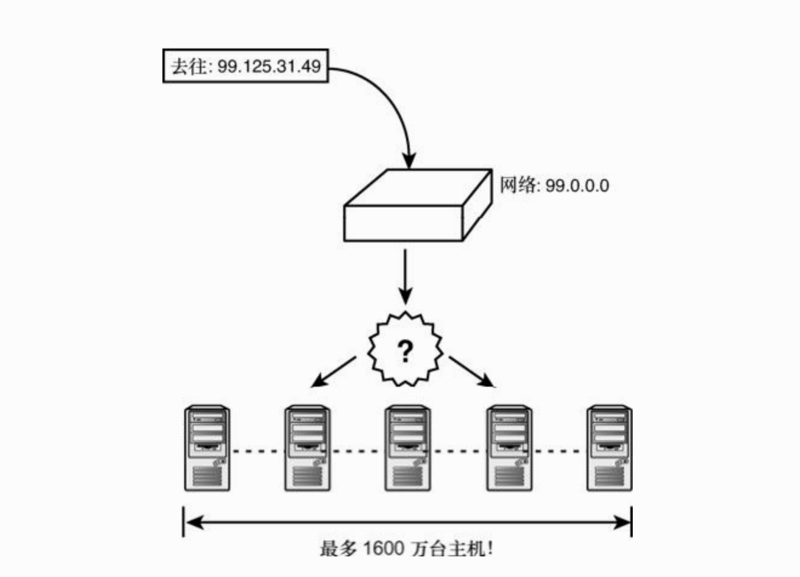
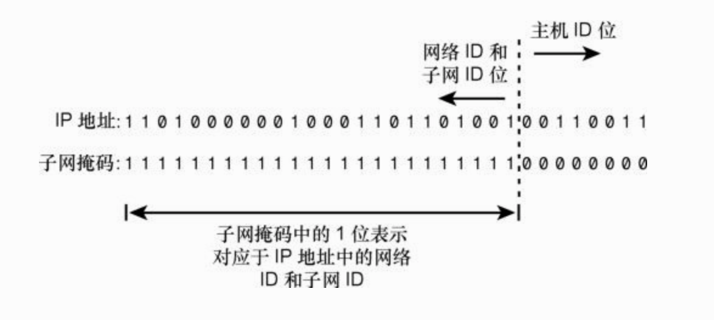
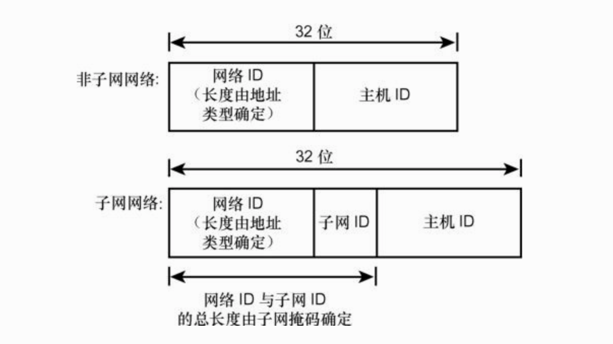
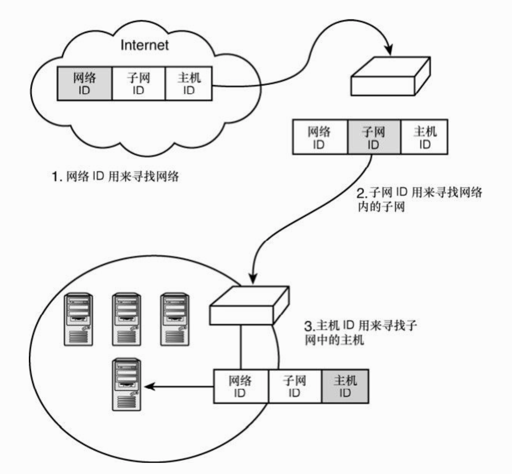
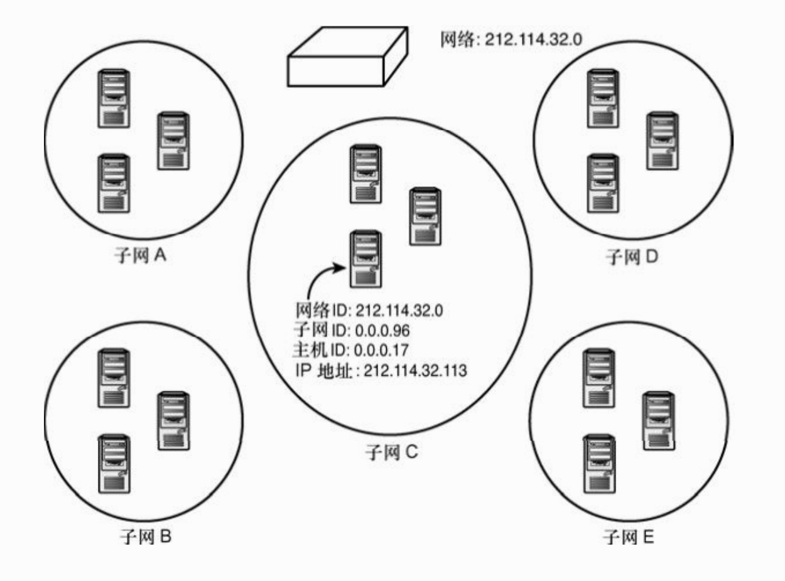
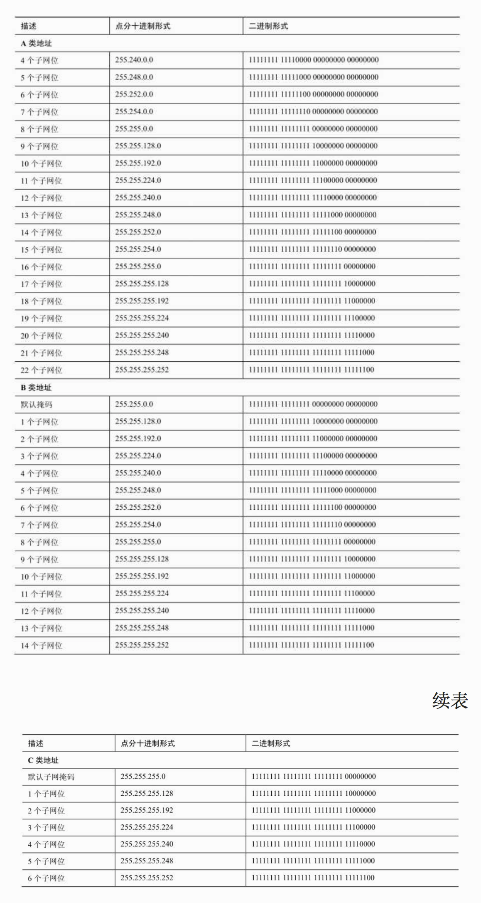

# 第五章 子网划分和CIDR

## 基本概念

子网划分可以利用IP地址系统把物理网络分解位更小的逻辑实体--子网，随着CIDR和IPv6的出现，这种划分网络的方法逐渐失去了市场，但CIDR和IPv6技术也是借用了基本的子网划分原理，本章将介绍子网划分的原因和优点，以及生成子网掩码的步骤与过程  

## 5.1 子网

IP地址必须同时表明主机以及主机所在的网络，IP地址分类系统可以让我们区分地址中的网络部分和主机部分，但是这种地址分类系统的灵活性不够，在现实世界中，网络具有各种规模，很多网络被划分为更小的单元，而且是真世界的网络并不是运行于这种分类级别上的，ISP（Internet服务供应商）和网络管理员需要更灵活的方式对网络进行划分，让数据报能够达到面向较小地址空间的路由器  

子网划分可以将网络分解为称为子网的较小单元，子网的概念最早是源自于地址分类系统的，而且在A类，B类和C类地址中能够得以很好的表现，然而硬件厂商和Internet社区建立了一种解析地址的信系统，名为无类别域间路由（CIDR）它不需要关心地址类别  

## 5.2 划分网络

之前介绍的地址分类系统让所有的主机都能够识别IP地址中的网络ID，从而把数据报发送给正确的网络，但是，根据A类，B类或C类网络ID来识别网段具有一些局限性，主要是在网络级别之下不能对地址空间进行任何逻辑细分  

第四章讲到，数据报达到网关，然后传输到99.0.0.0地址空间，但如果要考虑它在这个地址空间中是如何传递的，这个图式就会变得非常复杂，因为A类网络能够容纳超过1600万台主机，这个网络也许包含数百万主机，这大大超过了一个子网上容纳的数量  

为了在大型网络里实现更高效的数据传输，地址空间被划分为较小的网段，把网络划分为独立使用的物理网络能够增加网络的整体性能，也能够让网络使用更大的地址空间，在这种情况下，在地址空间里划分网络的路由器需要适当的指示来决定把数据传输到哪里，它们不能使用网络ID，因为传输到这个网络的数据报具有相同的网络ID（99.0.0.0）尽管可以利用主机ID来组织地址空间，但是对于能够容纳超过1600万台主机来说，将会很麻烦，非常不灵活，完全不实用，唯一可行的解决办法是在网络标ID下对地址空间进行某种细分，让主机和路由器能够根据IP地址判断应该把数据发送到哪个网段  

子网划分就是在网络ID之下提供了第二层逻辑组织，路由器能够把数据报发送给网络里的某个子网地址（一般对应于一个网段），而当数据报到达子网之后，就会被ARB解析为物理地址（PS：我不确定中这里是不是写错了）  

**注意：** ARB字段是无线基站302给CPE站294的无线基站302已经收到来自CPE站294的上行预留请求的确认。

那么子网地址从何而来呢，32位的IP地址不是被划分为网络ID和主机ID了吗？TCP/IP的设计者借用了主机ID里的一些位来形成子网地址，一个名为子网掩码的参数指明了地址中多少位用于子网ID，保留多少位作为实际的主机ID  

像IP地址一样，子网掩码也是一个32位的二进制值，它的形式能够说明与之相关的IP地址的子网ID，下图为一个IP地址/子网掩码对。子网掩码里的每一位代表IP地址中的一个位，用1表示IP地址中属于网络ID或子网ID的位，用0表示Ip地址里属于主机ID的位，我们可以把子网掩码看作阅读IP地址的映射  

* IP地址/子网掩码对

* 子网网络和非子网网络上地址位的对比  

在子网网络上，路由器和主机所使用的路由表包含了与每个IP地址相关的子网掩码信息，从下图可以看出，数据报根据网络ID被路由到目标网络，而这个网络ID是由地址类别决定的，当数据报到达目标网络之后，它根据子网ID路由到何时的网段，在到达这个网段之后，再根据主机ID传输到正确的计算机  

## 5.3 将子网掩码转换为点分十进制标记  

网络管理员通常把子网掩码作为TCP/IP配置的参数分配给每个主机，如果主机通过DHCP获得IP地址，DHCP服务器会同时分配一个子网掩码  

子网掩码必须仔细计算，并且要反应网络的内部组织，一个子网内的所有主机应该具有相同的子网ID和子网掩码，为了便于使用，子网掩码通常以点分十进制的形式表示，类似于IP地址  

子网掩码是个32位的十进制数值，利用第四章介绍的方法，可以把这种二进制转化为点分十进制，而且与IP地址相比，子网掩码的转化通常会更简单，对应于地址中网络ID和子网ID的掩码位是1，代表IP地址里主机ID的掩码位是0，这意味着1都在掩码的左侧，而0都在右侧（除了极少的例外）在子网掩码中，一组8位1对应于十进制的255（二进制11111111），8位0对应于十进制的0，下面这个常见的子网掩码：  

11111111111111111111111100000000  

以点分十进制的形式表示就是255.255.255.0，类似地，子网掩码：   

11111111111111110000000000000000  

以点分十进制的形式表示就是255.255.0.0  

可以看出，如果子网掩码在八位组的边界对地址进行划分，我们能够很容易转换为句点分隔的十进制形式，然而有些子网掩码并不是在八位组的边界对地址进行划分，这时我们只需要判断混合八位组（包含1和0的八位组）所对应的十进制数值  

在大多数情况下，对计算机的TCP/IP进行配置时，我们都需要输入点分十进制形式的子网掩码  

## 5.4 使用子网

子网掩码决定了网络ID之后有多少位是作为子网ID的，子网ID的长度不是固定的，取决于子网掩码的值，子网ID越长，留给主机ID的位数越少，换句话说，如果网络有很多子网，每个子网上的主机容量就会减少，如果子网数量减少，而且子网ID占据的位数也较少，每个子网的主机容量就会增加  

**注意：** 类和掩码

地址类别也决定了子网ID占用使用多少位，比如掩码：  

11111111111111111110000000000000  

指定了网络ID与子网ID一共占据了19位，如果这个掩码用于一个B类地址（网络ID位16位），那么子网ID就只有3位，如果它用于A类地址（网络ID位8位），子网ID就有11位  

子网ID的分配（以及子网掩码的分配）取决于网络的配置，最好的方案是先规划网络，确定全部网段的数量与为止，然后为每个网段分配一个子网ID，为了给每个子网分配唯一的子网ID，需要有足够的位数，在可能时要保留一些空间，以便在网络扩展时容纳更多的子网  

下面是一个简单的示例，这里是一个B类网络，它的第三个八位组（在点分十进制IP地址中是第三个数值）被用作子网ID，在下图中，网络129.100.0.0被划分为4个子网，分配的子网掩码是255.255.255.0，表示网络ID和子网掩码占据了IP地址中的三个八位组，由于这个地址是个B类地址，地址中的前两个八位组的网络ID，因此下图中的子网A具有如下参数：  

网络ID：129.100.0.0  

子网ID：0.0.128.0  

全0或全1的主机ID是不能分配的，因此当前图示的配置支持最多254个子网，每个子网最多容纳254台主机，在能够使用B类网络地址并且任何子网都不会超过254台主机时，这是一种相当明智的解决方案  

通常不能把一整个八位组都用于子网标识，比如在C类网络上，如果让子网ID占据一个完整的八位组，就没有如何位可以用于主机ID了，即使在B类网络上，在子网容量超过254台主机时，我们也不能让子网ID占据一个八位组，子网划分并不要求把子网ID放在八位组的边界，这种概念在二进制形势下很容易理解，但转化位点分十进制形式之后可能会让人觉得有些糊涂  

**注意：** 0和1  

尽管不建议使用全0和全1的子网，但有些路由器厂商不愿意放弃这个宝贵的地址空间，因此仍然会对其提供支持  

例如我们要把一个C类网络划分为五个较小的子网，这类地址给子网ID和主机ID只剩下8为，我们使用下面这样的子网掩码让子网ID占据了3位：  

11111111111111111111111111100000  

剩下的5位用于主机ID，子网ID的3位能够提供8种不同值，前面讲到，正式的子网规则排除了全1和全0的组合，无论何种情况，这种配置对于6个子网都够用了，主机ID占据的5位能够提供32种可能值，排除了全1和全0的组合之后，子网最多可以容纳30台主机  

为了以点分十进制形式来表示这个子网掩码，可以按照前面介绍的步骤进行  

1.插入句点来标记八位组的边界：  

11111111.11111111.11111111.11100000  

2.全1的八位组对应255，把混合八位组转化为十进制：  

128+64+32=224  

3.这个子网掩码的点分十进制形式是：255.255.255.224  

假定在这个子网网络中添加主机，由于这个网络是C类网络，前3个八位组对所有的主机而言都是相同的，为了得到IP地址的第四个八位组，只需在相应的位置写下二进制子网ID和主机ID，比如在下图中，子网C的子网ID是011，由于这个值位于八位组的最左侧，因此子网标识实际上是01100000，相应的十进制数值是96（如果主机是17（二进制10001），第四个八位组就是01110001，相应的十进制数值是113，那么这台主机的IP地址就是212.114.32.113  

**注意：** 子网的命名

在这个例子中，许多管理员仍然将子网称为子网3（二进制为011），并且在这二进制与十进制的转换中，它们仍然说子网3时由数值96（011100000或96）来表示的  

下图所示为子网掩码二进制形式与点分十进制形式的对应关系，其中包含了所有有效的掩码。“描述”一栏说明了地址类定义的默认掩码之外还有多少位掩码，它们是可以用于子网ID的，例如，默认的A类掩码具有8个1位，而现实2个掩码位的行表示在子网掩码中有8加2，即10位  

**注意：** 不实用的掩码  

上表中的一些掩码只是用于解释其用途，没有使用价值，比如C类网络如果使用了6位的子网ID就只剩下2位用于主机ID了，而在这两位中，全1地址（11）保留用于广播，全0地址（00）通常是不实用的，因此这个子网只能容纳两台主机  

## 5.5 无类别域间路由（CIDR）

本章前面提到，地址分类系统相对而言不够灵活，需要使用子网划分系统来更细致地控制地址空间，而无类别域间路由（CIDR）在路由表中定义地址块时更容易修改，更具有灵活性，这种技术不依赖于与定义的8位，16位或24位网络ID，而是使用一个名为CIDR前缀的值指定地址中作为网络ID的位数，这个前缀有时也被称为变长子网掩码（VLSM）这个前缀可以位于地址空间的任何位置，让管理者能够以更灵活的方式定义子网，以简便的形式指定地址中网络ID部分与主机ID部分，CIDR标记使用一个斜（/）分隔符，后面跟一个十进制数值来表示地址中网络部分所占的位数，例如：在CIDR地址205.123.196.183/25，/25表示地址中25位用于网络ID，相应的子网掩码就时255.255.255.128  

CIDR前缀就时表明了IP地址中前面的多少位对于网络里的全部主机来说是一样的，CIDR一个强大的特性就是，不仅能够对网络划分子网，还让ISP或管理员能够把多个连续C类聚合或组合位一个实体，这种特性极大地简化了网际路由表，从而延长了IPv4的生活，出租一系列连续C类网络的ISP只需要一个条目就可以定义全部网络，在这种情况下，CIDR前缀发挥了所谓超网掩码的作用  

## 5.6 小结

本章讲述了如何使用子网划分技术来划分TCP/IP地址空间，子网划分技术为IP地址体系添加了一个中间层，提供了在网络ID之下对地址空间中的IP地址进行分组的一种方式，对于使用路由器把网络分隔为多个物理网段的网络来说，子网划分是一个常见的特性  

无类别域间路由（CIDR）是一种比较新的技术，不需要使用地址分类系统就可以对地址空间进行灵活的划分  

## 5.7 问与答

问：B类网络在使用255.255.0.0作为掩码时，子网ID占据了多少位？  

**答：** 0位（不存在子网ID字段）掩码255.255.0.0时B类网络的默认设置（缺省值）全部16个掩码位都是用于网络ID，没有用于子网划分的  

问：一个网络管理员计算出他需要21位掩码，他应该使用什么子网掩码？  

**答：** 21位掩码 11111111111111111111100000000000，也就是两个全1八位组在加5位，全1的八位组对应于255，前5位为1的八位组等于128+64+32+16+8=248，所以这个掩码是255.255.248.0  

问：公司有一个C类地址，员工分布于10个位置，每个位置的员工不超过12个，使用什么子网掩码能够满足为每个用户提供一台电脑的需要？  

**答：** 子网掩码是255.255.255.240，主机使用4位，足够位每个用户提供不同的地址  

问：Billy想在一个A类网络上使用占据3位的子网ID，相应的子网掩码是什么？  

**答：** A类网络意味着IP地址中第一个八位组是属于网络ID的，它的掩码就是255，第二个八位组里的3位子网ID对应于128+64+32=224，所以子网掩码是255.224.0.0  

问：CIDR范围中212.100.192.0/20中，分配了什么IP地址？  

**答：** 超网参数/20表示当前IP地址的前20位是不变的，其余部分可变，这个初始地址的二进制形式是：11010100.01100100.11000000.00000000，地址的前20位必须与这个初始地址相同，其余部分只可以变化，下面是可变部分的另一个极限值（全1替换全0）：11010100.01100100.11001111。11111111，所以这个地址范围是212.100.192.0 ～ 212.100.207.255  

## 5.8 测验

### 5.8.1 问题  

1.子网ID的位来自哪里？  

**答：** 子网ID位是从主机ID中借的  

2.为什么子网划分技术如今没有过去那么重要？  

**答：** 因为子网划分技术已经被归纳到CIDR中了  

3.无类别域间路由中的“无类别“指的是什么？  

**答：** 不需要知道当前网段是A类或者其他类别  

4.在/26的网络中，可以有多少台主机？  

**答：** 64台，减去全0和全1之后还有62台  

5.在练习4中，确定表示主机的最大IP地址  

**答：** ？？？（PS：没读懂究竟要干啥）  

### 5.8.2 练习

1.如果把网络地址180.4.0.0～180.7.255.255合并为1个网络地址，请计算CIDR网络地址  

**答：** CIDR地址为180.4.0.0/14  

2.如果子网192.100.50.192的子网掩码为255.255.255.224，则该子网可以有多少台主机？  

**答：** 192从最后八位中借走了前三位，还余5位，2的五次方等于32减去广播地址和网络地址=32-2=30  

3.在练习2中，在子网掩码为255.255.255.224，则可以产生多少个子网？  

**答：** 子网ID是3位，因此有2的3次方也就是8个可以使用的子网，去掉全0和全1的子网，此时则可以使用6个子网  

4.在网络195.50.100.0/23中，确定表示主机的最小IP地址  

**答：** 195.50.100.1  

5.在练习4中，确定表示主机的最大IP地址  

**答：** 195.50.100.254（去掉广播地址255）

## 5.9 关键术语

复习下列关键术语：

* CIDR：无类别域间路由，这种技术可以让一个网络ID块被当作一个整体  
* 子网：对TCP/IP网络ID定义的地址空间进行逻辑划分  
* 子网掩码：一个32位的二进制值，用于指定IP地址中的一部分作为子网ID  
* 超网掩码：一个32位的二进制值，能够把多个连续网络ID聚合位一个整体  