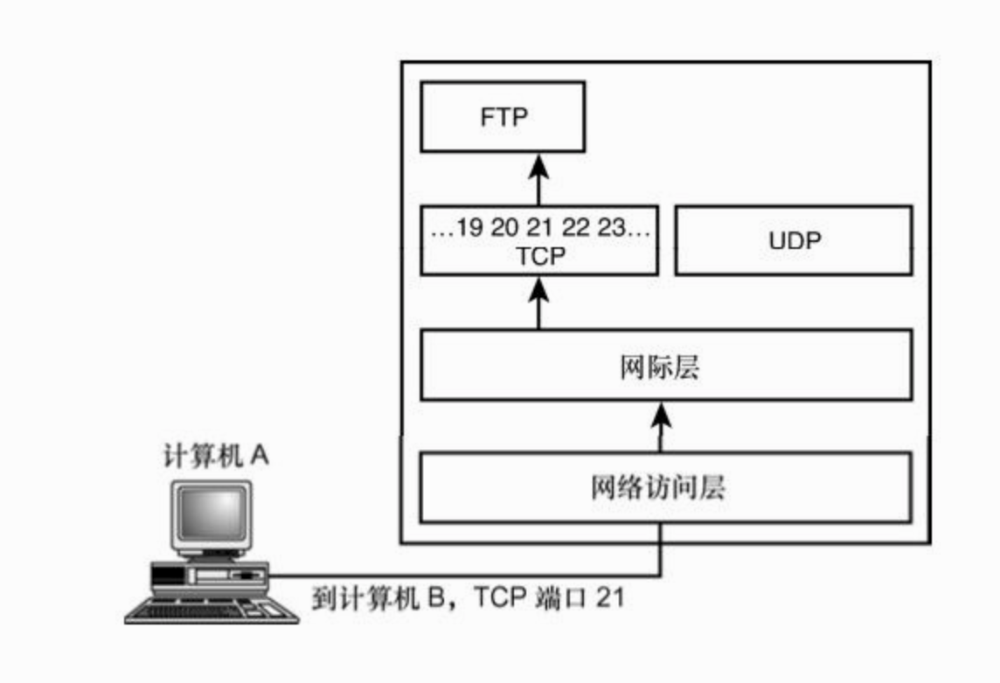
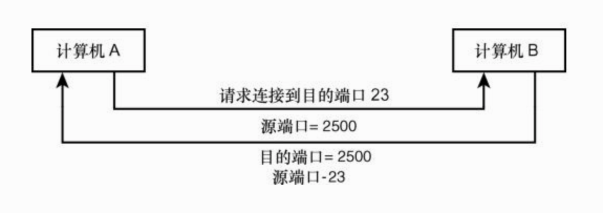
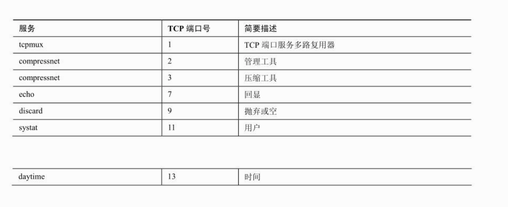
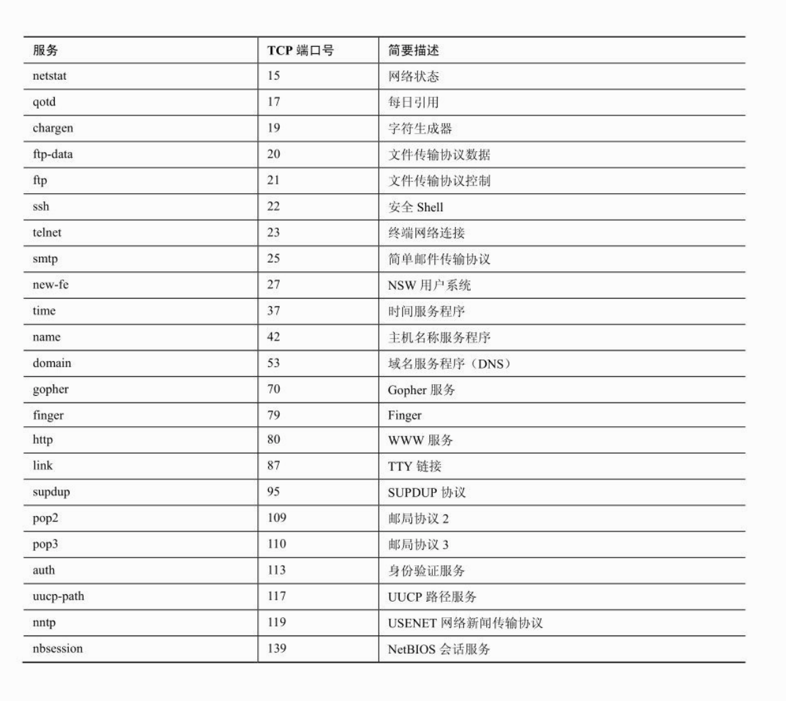
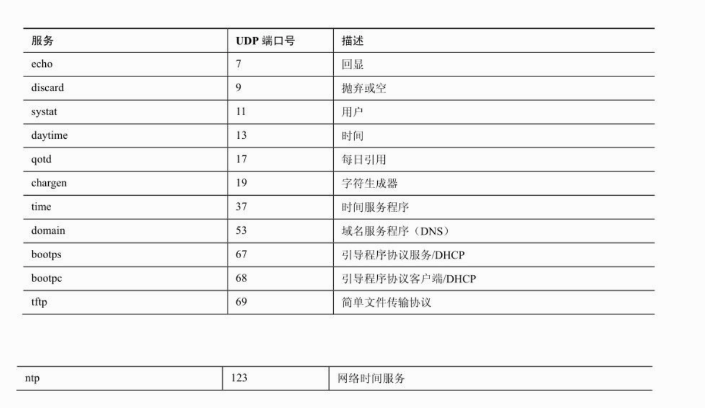
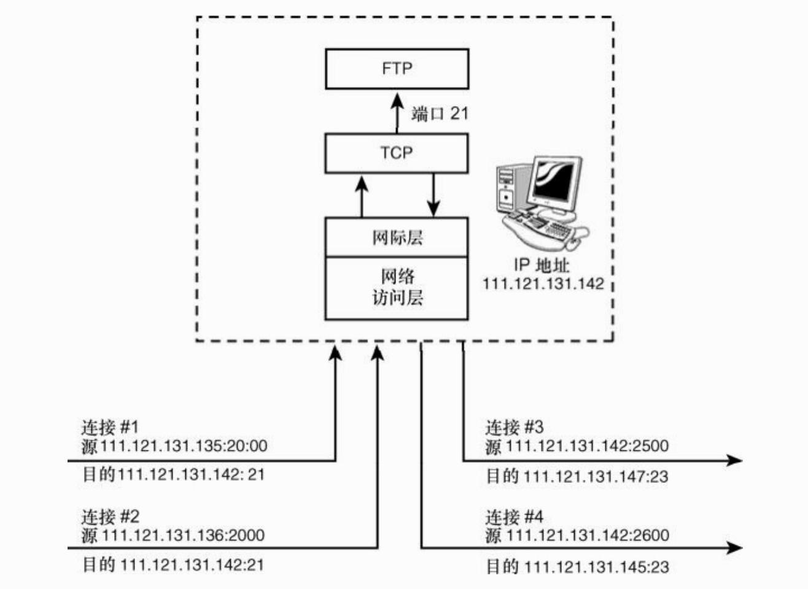
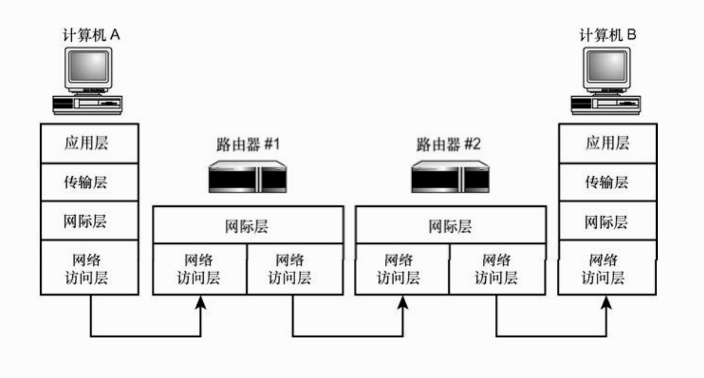
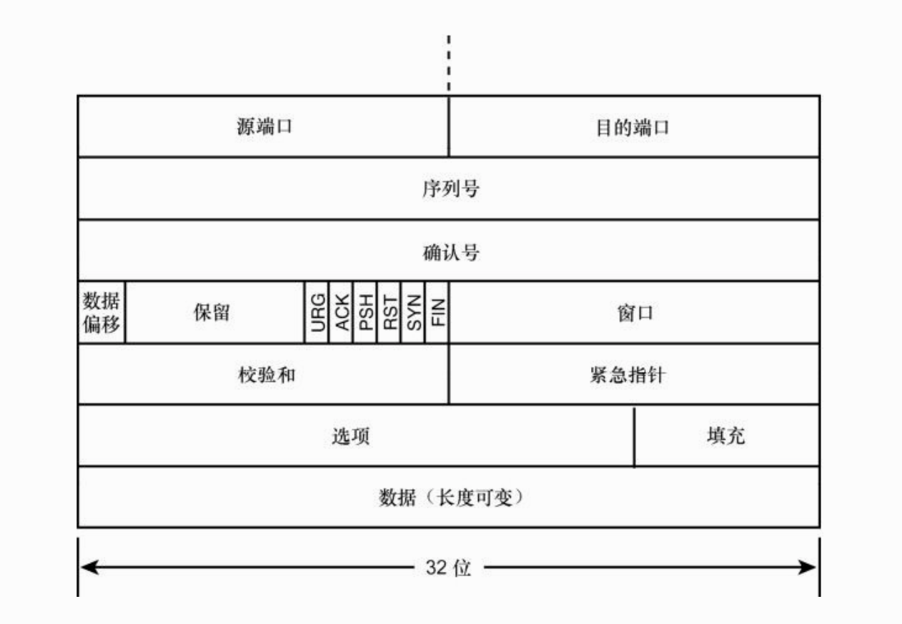
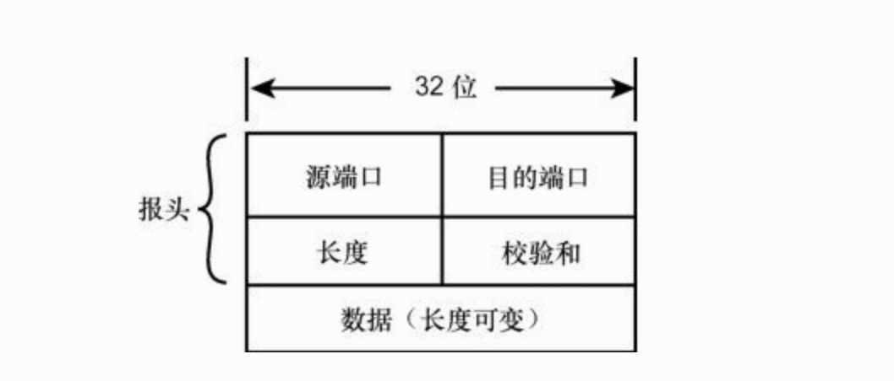
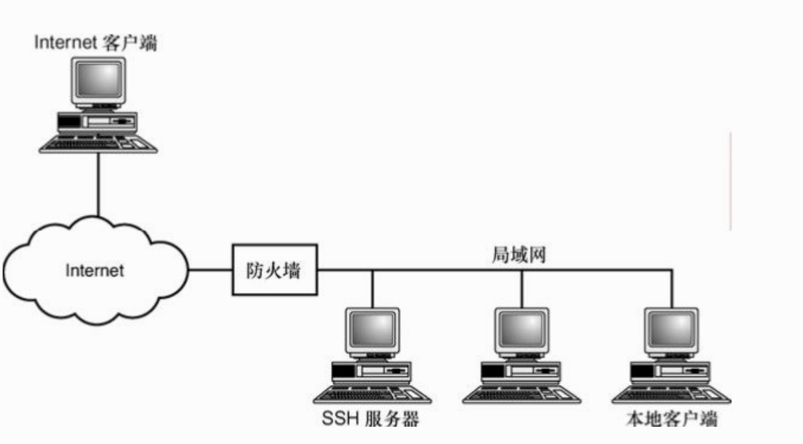

# 第六章 传输层

## 基本概念：

传输层位网络应用程序提供了一个接口，并且能够对网络传输提供了可选的错误检测，流量控制和验证功能  

## 6.1 传输层简介

TCP/IP传输层包含很多有用的协议，能够提供数据在网络传输所需的必要寻址信息，但寻址和路由只是传输层的部分功能，TCP/IP的开发者知道他们需要在网际层上添加另外一层，并通过这一层提供的额外必要特性来使用IP，传输层协议需要提供以下功能：  

* 为网络应用程序提供接口：为应用程序提供访问网络的途径，设计者希望不仅能向目的计算机传输数据，还能向目的计算机上的特定程序传输数据  

* 多路复用/多路分解机制：这里的多路复用表示从不同的应用程序和计算机接收数据，再把数据传递给对计算机上的接收程序，换句话说，传输层必须能够同时支持多个网络程序和管理传递给网际层的数据流，在接收端，传输层必须能够从网际层接收数据，把它转发到多个程序，这种功能被称为多路分解，它可以让一台计算机同时支持多个网络程序，比如一个WEB浏览器，一个E-mail客户端和一个文件共享应用程序，多路复用/多路分解的另一个作用就是可以让一个应用程序同时保持与多台计算机的连接  
* 错误检测/流量控制和验证：协议系统需要一种全面机制来确保发送端与接收端之间的数据传输  
* 传输控制协议（TCP）：TCP提供了完善的错误控制和流量控制，能够确保数据正确传输，它是一个面向连接的协议  
* 用户数据报协议（UDP）：UDP只提供了非常基本的错误检测，用于不需要TCP精细控制功能的场合，它是一个无连接的协议  

**注意：** OSI中的传输层  

TCP/IP传输层对应OSI模型的传输层，OSI模型的传输层也被称为第四层  

## 6.2 传输层概念

* 面向连接的协议和无连接协议（TCP/UDP）
* 端口和套接字  
* 多路复用/多路分解  

### 6.2.1 面向连接的协议和无连接协议

针对不同的情况提供不同程序的质量保证，传输层提供了两种不同的协议原型  

* 面向连接的协议：会在通信计算机之间建立并维护一个连接，并且在通信过程中监视连接的状态，换句话说，通过网络传输的每个数据报都会有一个确认，发送端计算机会记录状态信息来确保每个数据包都被正确无误的接收了，并且在需要时会重发数据，当数据传输结束之后，发送端和接收端计算机会以适当方式关闭连接  
* 无连接协议：以单向方式向目的发送数据报，不承担通知目的计算机关于数据发送的职责，目的计算机接收到数据后也不需要向源计算机返回状态信息  

**面向连接的通信** 

**无连接协议** 

### 6.2.2 端口和套接字

传输层充当了网络应用程序与网络时间的接口，并且能够把网络数据传递给特定的应用程序，在TCP/IP系统中，应用程序可以使用端口号通过TCP或UDP指定数据目的地。端口是一个预定义的内部地址，充当从应用程序到传输层或是从传输层到应用程序之间的通路，例如客户端计算机通常利用TCP端口21来访问服务器上的FTP程序  

传输层这种与应用程序相关的寻址机制，就会发现TCP和UDP数据实际是被发送到一个套接字上的，套接字是一个由IP地址和端口号组成的额地址，例如套接字的地址是111.121.131.141.21指向的IP地址为111.121.131.141的计算机的21端口  

**使用TCP的计算机在建立连接时如何交换套接字信息** 

下面的例子展示了一台计算机如何通过套接字访问目的计算机上的一个应用程序  

1. 计算机A通过一个熟知的端口向计算机B上的一个应用程序发起一个连接，熟知端口时由互联网数字分配机构（IANA）分配给特定程序的端口，下表列出了一些熟知的TCPO和UDP端口，熟知的端口与IP地址组合之后就构成了计算机A的目的套接字，连接请求包含着一个数据字段，告诉计算机B使用什么套接字向计算机A返回信息，这也就时计算机A的源套接字地址
2. 计算机B通过熟知端口接收到来自计算机A的请求，向作为计算机A源地址的套接字发送一个响应，这个套接字就成为计算机B上的应用程序向计算机A上的应用程序发送消息的目的地址    

**熟知的TCP端口** 

**熟知的UDP端口** 

### 6.2.3 多路复用/多路分解

套接字寻址系统使得TCP和UDP能够执行传输层另一个重要任务：多路复用和多路分解，多路复用是指把多个来源的数据导向一个输出，而多路分解是把一个从一个来源接收的数据发送到多个输出  

**多路复用与多路分解** 

多路传输/多路分解让TCP/IP协议栈较低层的协议不必关心哪个程序在传输数据，与应用程序相关的操作都由传输层完成了，数据通过一个与应用程序无关的管道在传输层与网际层之间传递  

多路复用和多路分解的关键就在于套接字地址，套接字地址包含了IP地址与端口号，为特定计算机上的特定应用程序提供了一个唯一的标识，例如下图中的FTP服务器，所有客户端计算机使用熟知的TCP端口21连接到FTP服务器，但针对每台个人计算机的目的套接字是不同的。类似地，运行于这台FTP服务器上全部网络应用程序都使用服务器的IP地址，但只有FTP服务程序使用由IP地址和TCP端口号21组成的套接字地址  

## 6.3 理解TCP和UDP

TCP是个面向连接的协议，提供了全面的错误控制和流量控制，UDP是个无连接协议，错误控制也简单的多，可以这样说，TCP是为了可靠性，而UDP是为了速度，必须要支持交互回话的应用程序，比如Telnet和FTP，就会使用TCP，而自己实现错误检测或不需要过多错误控制的应用程序会倾向于使用UDP  

开发人员在设计网络应用程序时可以选择使用TCP或UDP协议作为传输协议，UDP的控制机制虽然比较简单，但这并不是它的缺点，首先，较简单的质量控制并不一定意味着低质量，对于大多数应用程序来说，TCP提供的错误检测与控制是完全没有必要的，在一些需要错误控制和流量控制的情况下，有些开发人员更愿意在应用程序本身内提供这些控制功能，从而可以根据实际需要进行控制，并使用较简单的UDP进行网络访问，例如，应用层的远程过程调用（RPC）协议能够支持复杂的应用程序，但RPC开发人员有时倾向于在传输层使用UDP，并且利用应用程序提供错误控制和流量控制，而不是使用速度较慢的TCP连接  

### 6.3.1 TCP：面向连接的传输协议

TCP几大重要特性：

* 面向流的处理：TCP以流的方式处理数据，换句话说，TCP可以一个字节一个字节的接收数据，而不是一次接收一个预定义格式的数据块，TCP把接收到的数据组成长度不定的段，再传递到网际层  
* 重新排序：如果数据以错误的顺序到达目的地，TCP模块能够对数据重新排序来恢复原始顺序  
* 流量控制：TCP的流量控制特性能够确保数据传输不会超过目的计算机接收数据的能力，由于现实世界里会有各种不同的应用环境，处理器速度和缓存区大小的差别也可能很大，所以这种流控制能力是非常重要的  
* 优先级与安全：国防部对TCP的规范要求可以为TCP连接设置可选的安全级别和优先级，但很多TCP实现并没有提供这些安全和优先级特性  
* 适当的关闭：TCP像重视建立连接一样重视关闭连接的工作，以确保在连接被关闭之前，所有的数据段都被发送和接收了  

TCP是一个由通告和确认组成的复杂系统，用以支持TCP面向连接的功能，TCP数据传输和TCP连接，其中设计的技术内容会展示TCP的复杂性，也会展示出协议不仅仅是数据格式，它还是一个由交互处理和过程组成的完整系统，用以完成特定的任务  

像TCP/IP这样的分层协议系统在发送端计算机上的某一层与接收端计算机上相应的层之间进行信息交换，换句话说，发送端计算机上的网络访问层与接收端计算机上的网络访问层进行通信，发送端计算机上的网际层与接收端计算机上的网际层通信，以此类推  

在TCP软件进行通信时，实际上是两台计算机的TCP软件层进行相互通信（建立连接），而双方的TCP软件都是为本地应用如程序提供服务的，这与之前介绍的端点验证略有不同  

端节点负责在TCP/IP网络中检验通信情况（端节点是真正需要进行通信的节点，而中间节点只是负责转发消息）  

在一个典型的网络环境中，数据从源子网经过路由器传递到目的子网，这些路由器通常工作于网际层，也就是传输层下面的层，这其中的重点在于路由器不关心传输层的信息，它们只是把传输层数据当作IP数据报的内容进行传递，封装在TCP分段中的这些控制和检验信息只对目的计算机上的TCP软件有意义，这种方式能够加快TCP/IP网络之间的路由过程（因为路由器不必参与TCP细致的质量保证），同时让TCP能够满足由端节点进行检验的要求  

**路由器转发但不处理传输层数据** 

1. TCP数据格式

   * 源端口（16位）：分配给源计算机上的应用程序的端口号
   * 目的端口（16位）：分配给目的计算机上的应用程序端口号
   * 序列号（32位）：当SYN标记不为1时，这是当前数据分段第一个字节的序列号，如果SYN的值是1，这个字段的值就是初始序列值（ISN），用于对序列号进行同步，这时第一个字节的序列号比这个字段的值大1（也就是ISN加1）
   * 确认号（32位）：用于确认已经接收到的数据分段，其值是接收计算机即将接收的下一个序列号，也就是下一个接收到的字节的序列号加1
   * 数据偏移（4位）：这个字段表示报头的长度，也就是告诉接收端的TCP软件数据从何开始，这个值的单位是32位的字  
   * 保留（6位）：保留字段，位TCP将来的发展预留空间，目前必须全部是0
   * 控制标记（分别占用1位）：控制标记用于表示数据分段的特殊信息
   * URG：为1时表示当前数据分段是紧急的，也会让“紧急指针”字段的值有意义
   * ACK：为1时表示“确认号”字段是有意义的
   * PSH：为1时让TCP软件把目前收到的全部数据都通过管道传递给接收应用程序
   * RST：为1时会重置连接
   * SYN：为1时表示序列号将被同步，说明这是一个连接的开始（稍后介绍三次握手）
   * FIN：为1时表示发送端计算机已经没有数据需要发送了，这个标记用于关闭一个连接  
   * 窗口（16位）：用于流量控制的参数，它定义了发送端计算机的发送序列号可以超过最后一个已确认序列号的数量，也就时说，发送方不必等待每个数据段被确认接收之后才发送下一个数据分段，允许已经确认接收的序列号与正在发送的序列号有一定差别，但必须在适当范围之内
   * 校验和（16位）：用于检验数据分段的完整性，接收端计算机会更具接收到的数据分段计算校验和，并且把结构与这个字段的值进行比较，TCP和UDP在计算校验时和包含一个具体IP地址的伪报头
   * 紧急指针（16位）：这是一个偏移量指针，指向标记紧急信息开始的序列号
   * 选项：指定一些可选设置中的某一项
   * 填充：额外填充的0（根据需要），以确保数据从32位字的边界开始
   * 数据：数据分段中的数据

   

2. TCP连接

   TCP的操作都在一个连接上下文的环境中完成，TCP通过连接发送和接收数据，而这个连接必须根据TCP的规则进行请求、打开和关闭

   TCP的功能之一就是位应用程序提供访问网络的接口，这个接口是通过TCP端口提供的，而为了通过端口提供连接，必须打开TCP与应用程序的接口，TCP支持以下两种状态

   * 被动打开：某个应用程序进程通知TCP准备通过TCP端口接收连接，这样就会打开TCP到与ing用程序的连接，从而为参与连接请求做准备
   * 主动打开：程序要求TCP发起与另一台计算机（处于被动打开状态）的连接，这就是主动打开状态（实际上，TCP可以对一个处于主动打开状态的计算机初发起连接，以解决两台计算机可能同时尝试建立连接的问题）

   通常情况下，想接收连接的应用程序（如：FTP服务器）会把自身及其TCP端口置于被动打开状态，在客户端计算机上，FTP客户端的TCP一般是关闭的，直到用户发起一个从FTP客户端到FTP服务器的连接，这对于客户端来说是主动打开，处于主动打开状态的计算机（比如客户端）上的TCP软件会开始一些用于建立的信息交换，这种信息交换被称为“三次握手”

   客户端是指向网络中的其他计算机请求或接收服务的计算机

   服务器是指向网络中其他计算机提供服务的计算机

   TCP发送的数据分段的长度是不定的，在一个数据分段内，每字节数据都被分配一个序列号，接收端计算机必须为接收到每个字节数据都发送一个确认信号，因此TCP通信是一种传输与确认的系统，TCP报头中的“序列号”和“确认号”字段，让通信的TCP软件能够定期更新传输状态

   实际上，数据分段中并不是为每个字节都单独编了一个序列号，而是在报头的“序列号”字段指定了数据分段第一个字节的序列号

   **规则有一个例外：** 如果数据分段是连接初期使用的，“序列号”字段里包含的ISN，它的值比数据分段中第一个字节的序列号小1（也就是说，第一个字节的序列号是ISN加1）

   如果数据分段被成功接收，接收端计算机会利用“确认号”字段告诉发送端计算机它接收到的哪个字节，在确认消息中，“确认号”字段的值是已接收的最后一个序列号加1，换句话说，“确认号”字段中的值是计算机准备接收的下一个序列号

   如果发送端计算机没有在指定时间内收到确认消息，它会从已经得到的下一个字节重新发送数据

3. 建立连接

   为了让序列/确认系统正常工作，计算机必须对序列号进行同步，换句话说，计算机B必须知道计算机A的厨师序列号（ISN），计算机A也必须知道计算机B使用ISN开始传输数据

   这个序列号同步的过程被称为三次握手，三次握手总是发生在TCP连接建立的初期，其步骤如下：

   1. 计算机A发送了一个数据分段，其中的参数是：SYN=1 ACK=0 序列号=X（X是计算机A中的ISN）处于自动打开状态的计算机A发送一个数据分段，其中的SYN为1，ACK为0，SYN是同步（synchronize）的缩写，它表示在尝试建立一个连接，第一个数据分段的报头中还包含初始序列号（ISN）标记了计算机将传输的第一个字节的序列号，也就是说，要发送给计算机B的第一个字节的序列号是ISN加1
   2. 计算机B接收到计算机A的数据分段，返回一个数据分段，其中的参数是：SYN=1（仍然在同步） ACK=1（“确认号”）序列号=Y（Y是计算机B的ISN）确认号=M+1（M是从计算机A接收到的最后一个序列号）
   3. 计算机A向计算机B发送一个数据分段，确认收到计算机B的ISN：SYN=0 ACK=1 序列号=序列中下一个号码（M+1）确认号=N+1（N是从计算机B接收到的最后一个序列号）

   在这三次握手完成之后，连接就被打开了，TCP模块就利用序列和确信机制发送和接收数据。

4. TCP流量控制

   TCP报头中的“窗口”字段为连接提供了一种流量控制机制，防止发送端计算机发送过快，以避免接收端计算机来不及处理收到的数据而导致数据丢失，TCP使用的流量控制方法被称为“滑动窗口”方法，接收端计算机利用“窗口”字段（也被称为“缓存大小”字段）来定义一个超过最后一个已确认序列号的序列号“窗口”，在这个范围内的序列号才允许发送端计算机进行发送，发送端计算机在没有接收到下一个确认消息之前不能发送超过这个窗口的序列号

5. 关闭连接

   当需要关闭连接时，计算机A发送一个数据分段，其中的FIN标记设置为1，之后应用进入“结束-等待（fin-wait）”状态，在这个状态下，计算机A的TCP软件继续接收数据分段，并处理已经在序列中的数据分段，但不再从应用程序接收数据了，当计算机B接收到FIN数据分段时，它返回对FIN的确认信息，然后发送剩余的数据分段，通知本地应用程序接收到了FIN消息，计算机B向计算机A发送一个FIN数据分段，计算机A会返回确认消息，连接就被关闭了

### 6.3.2 UDP：无连接协议

UDP具有优先的错误检验功能，UDP数据报中包含一个消炎和，接收端计算机可以利用它来检验数据的完整性

UDP数据报中有一个伪报头，包含了数据报的目的地址，从而提供了发现数据报错误传输的手段，另外，如果UDP接收模块接收到一个发给未激活或为定义UDP端口的数据报，它会返回一个ICMP消息，通知源计算机这个端口是不可到达的

UDP没有像TCP那样提供数据的重新爬需功能，在大型网路中（Internet）上，数据分段可能会经过不同的路径，由于路由器缓存而产生的明显延时，这时重新排序功能是非常有意义的，而在局域网上，虽然UDP没有重新排序功能，但一般不会导致不可靠的接收

**注意：UDP和广播** 

UDP的简单，无连接设计让它称为网路广播所使用的协议，广播会是被子网上全部计算机接收和处理的单个消息，很明显，当某台计算机想在网络上发送一个广播时，如果需要与子网上每台计算机都同时建立一个TCP类型的连接，必然会严重影响网络性能

UDP协议主要用途是把数据报传递给应用层，UDP协议的功能简单，其报头结构也很简单，描述UDP的RFC只有三页纸，前文已经说过，UDP不回重新传输丢失或顺坏的数据报，重新排列混乱的接收数据，消除重复的数据报，确认数据报的接收，建立或是终止连接，它主要是在程序不必使用TCP连接开销的情况下发送和接收数据报的一种方式，如果上述功能对于应用程序来说是必须的，它可以自己提供这些功能

**UDP头包含4个16位字段** 

* 源端口：占据UDP报头的前16位，通常包含发送数据报的应用程序所使用的UDP端口，接收端的应用程序利用这个字段的值作为发送相应的目的地址，这个字段是可选的，发送端的应用程序不是一定要把自己的端口号写在这个字段中，如果发送端的应用程序不写入其端口号，就应该把这个字段全置为0，显然，如果这个字段没有包含有效的端口地址，接收端的应用程序就不能发送响应，然而这时这可能正是我们想要的功能，比如单向消息就不需要响应
* 目的端口：这16位的字段包含的端口地址是接收端计算机上UDP软件使用的端口
* 长度：这16位字段以字节位单位表示UDP数据报的长度，这歌长度包括了UDP报头和UDP数据载荷，因为UDP报头的长度是8字节，所以这个值最小是8
* 校验和：这16位字段可以检验数据在传输过程中是否损坏，校验和是对二进制数据串执行特殊计算而得到的结果，对于UDP来说，校验和是基于伪报头，UDP报头，UDP数据和填充的0而计算的，源计算机生成校验和，目的计算机对它进行检验，让客户端应用程序能够判断数据报是否完整

由于实际的UDP报头并不包含源IP地址或目标IP地址，数据报可能会被传输到错误的计算机或服务，校验和使用的部分数据来自于从IP报头（被称为伪报头）提取的值，这个伪报头包含了目的IP地址信息，让接收端计算机能够判断UDP数据报是否被错误交付

**注意：其他传输层协议** 

数据报拥塞控制协议（DCCP）和流控制传输协议（SCTP）提供了传统TCP和UDP不具备的增强特性，而实时传输协议（RTP）提供了传输实时音频和视频的结构

## 6.4 防火墙和端口

防火墙基本特性阻断对特定TCP和UDP端口的访问，实际上“防火墙”一词有时具有动词特性，表示关闭对端口的访问

例如：为了发起与服务器的安全Shell（SSH）回话，客户端计算机必须向SSH的熟知端口（TCP22）发送一个请求，如果担心外部入侵者会通过SSH访问我们的服务器，一种方法是配置服务器来停止使用端口22，但是，这样会造成正常用户也无法进行访问服务器，另一种方法是安装防火墙，并且配置防火墙来阻断对TCP端口22的访问，这样，局域网中的用户能够在防火墙之内自由的访问服务器上的TCP端口22，而局域网之外的用户就不能访问TCP端口22了也就不能通过SSH访问古物器，事实上，这时Internet上的用户不能通过SSH访问局域网中的任何计算机

场景中使用SSH的TCP端口22作为示例，防火墙通常会阻断可能产生安全威胁的任何或全部端口，网络管理员一般会阻断对全部端口的访问，除了必须的端口，比如处理E-mail的端口，在连接Internet的计算机上，比如Web服务器，通常会在外部设置一个防火墙，从而避免对这台计算机的访问导致对局域网的非法访问

**注意：防火墙的两种作用** 

防火墙不仅能组织外部用户访问网络内部的服务，也能阻止内部用户访问网络外部的服务

## 6.5 小结

本章介绍了TCP/IP传输层的一些关键特性，包括面向连接和无连接的协议，多路复用和多路分解，端口和套接字，还介绍了TCP/IP传输层协议：TCP和UDP，描述了它们的一些重要特性，包括TCP如何满足TCP/IP提供端节点检验的要求，TCP数据格式，流量控制和错误恢复，建立连接的三次握手，最后还讨论了UDP报头格式

## 6.6 问与答

问：为什么多路复用和多分是必要的？

**答：** 如果TCP/IP不具有多路复用和多路分解功能，那么在任意时刻，只有一个应用程序能够使用网络软件，而且只有一台计算机能够连接到特定的应用程序

问：既然TCP比UDP提供了更好的质量保证，软件开发人员还会使用UDP作为传输协议呢？

**答：** TCP的质量保证是以性能位代价的，如果TCP提供的错误控制与流量控制是不必要的，则UDP会是一种更好的选择，因为它的速度更快

问：为什么像Telnet和FTP这种支持交互会话的应用程序使用TCP而不是UDP？

**答：** TCP的控制和恢复特性提供了交互会话所需的可靠连接

问：网络管理员为什么需要使用防火墙故意关闭Internet对TCP或UDP端口的访问？

**答：** Internet防火墙关闭对特定端口的访问以阻止Internet用户访问使用该端口的应用程序，防火墙还能阻止对Internet的访问，从而防止局域网内部的用户使用Internet上的特定服务

问：为什么路由器不向发起连接的计算机发送TCP连接确认？

**答：** 路由器工作于网际层（在传输层之下），因此不处理TCP信息

问：工作中的FTP服务器一般处于被动打开，主动打开还是关闭状态

**答：** 工作中的FTP服务器一般处于被动打开状态，准备好接收连接

问：三次握手的第三步为什么是必须的？

**答：** 在前两步之后，两台计算机已经交换了ISN号，所以从理论上来讲它们已经具有了足够的信息来同步连接，但是，在第二步中发送ISN的计算机还没有收到确认，因此第三步正式确认第二步中收到的ISN

问：UDP报头中哪个字段是可选的，为什么？

**答：** 源端口字段是可选的，UDP是一个无连接协议，接收端计算机上的UDP软件不需要知道源端口，只有在接收软件需要源端口信息进行错误检验时，这个字段才是必要的

问：源端口是16位0是会怎么样？

**答：** 目的计算机上的应用程序无法发送响应

## 6.7 测验

### 6.7.1 问题

1. 运行在TCP端口25上的服务是什么？

   **答：** SMTP（简单邮件协议）

2. 运行在UDP端口53上的服务是什么？

   **答：** Domain（域名服务程序DNS）

3. 在使用TCP发送数据时，其最大的记录编号是多少？

   **答：** TCP是一个流协议，数据作为字节流进行传输，而且没有记录的概念，因此，该问题没有任何意义

4. TCP主动打开和被动打开的区别是什么？

   **答：** 被动打开表示应用程序愿意接受连接，主动打开则是一个希望连接到同一台主机或远程主机上另外一个应用程序的请求

5. 打开TCP连接所需要的最少步骤是几个？

   **答：** 三个步骤

### 6.7.2 练习

假设你位了如下目的而创建了自己的网络服务：

* 使用专门的硬件接口与远程用户通信，从而为脑外科手术提供实时指令
* 将参与到高性能集群中的计算机的统计信息适时的进行高效传输
* 让原始的现场设备把数据传输到家庭网络

在上面任何一种情况，都要考虑是使用TCP还是UDP来传输协议来设计服务，在分析时，需要考虑如下因素：

* 性能
* 可靠性
* 编程时间

TCP和UDP协议提供了与定义的功能集合，但是对编程人员来说，要想实现一个完整的应用程序，这只是一个起点，TCP要比UDP可靠，但是其性能会劣于UDP，通过TCP可以自己编码实现其可靠性的特性，但是需要的编程时间也会增加

## 6.8 关键术语

复习下列关键术语：

* ACK：一个控制标记，表示TCP报头中“确认号”字段是有意义的
* “确认号”字段：TCP报头中的一个字段，表示计算机准备接收的下一个序列号，它实际上确认了之前的全部顺序字节的接收
* 主动打开：TCP尝试发起一个连接时的状态
* 面向连接的协议：通过在通信计算机之间建立连接来管理通信的协议
* 无连接的协议：不与远程计算机建立连接就进行通信的协议
* 控制标记：1位标记，关于表示TCP数据分段的特殊信息
* 多路分解：把一路输入导向多个输出
* 目的端口：目的计算机上的应用程序所使用的TCP或UDP端口，这个程序将接收TCP数据分段或UDP数据报中的数据
* FIN：一个控制标记，用于关闭TCP连接的过程
* 防火墙：保护网络免受Internet非法访问的设备
* 初始序列号（ISN）：一个数值，表示计算机将通过TCP传输的一系列字节的开始值
* 多路复用：把多个输入合成一个输出
* 被动打开：TCP端口（通常是一个服务器应用程序）准备好接收连接的状态
* 端口：为应用程序与传输层协议提供接口的内部地址
* 伪报头：从IP报头派生出来的一个结构，用于计算TCP或UDP校验和，从而避免数据报由于IP报头信息的变化而发送到错误目的
* 重新排序：整理接收到的TCP数据分段，恢复它们被发送时的顺序
* 序列号：与TCP传输的字节相关联的唯一的序列号
* 滑动窗口：接收端计算机允许发送端计算机发送的序列号范围，这种滑动窗口方式的流量控制是由TCP使用的
* 套接字：特定计算机上特定应用程序使用的网络地址，由计算机的IP地址和应用程序的端口号组成
* 源端口：发送TCP数据分段或UDP数据报的应用程序的TCP或UDP端口
* 面向流的处理：（一个字节一个字节的输入）连续输入，而不是以与定义的数据块输入
* SYN：一个控制标记，表示正在进行序列号同步，这个标记用于TCP连接开始时的三次握手过程
* TCP：TCP/IP协议簇中一个面向连接的，可靠的传输层协议
* 三次握手：同步序列号并建立TCP连接的一个三步骤过程
* UDP：TCP/IP协议簇中一个无连接的，不可靠的传输层协议
* 熟知端口：常见应用程序所使用的预定义标准端口号，由IANA指定