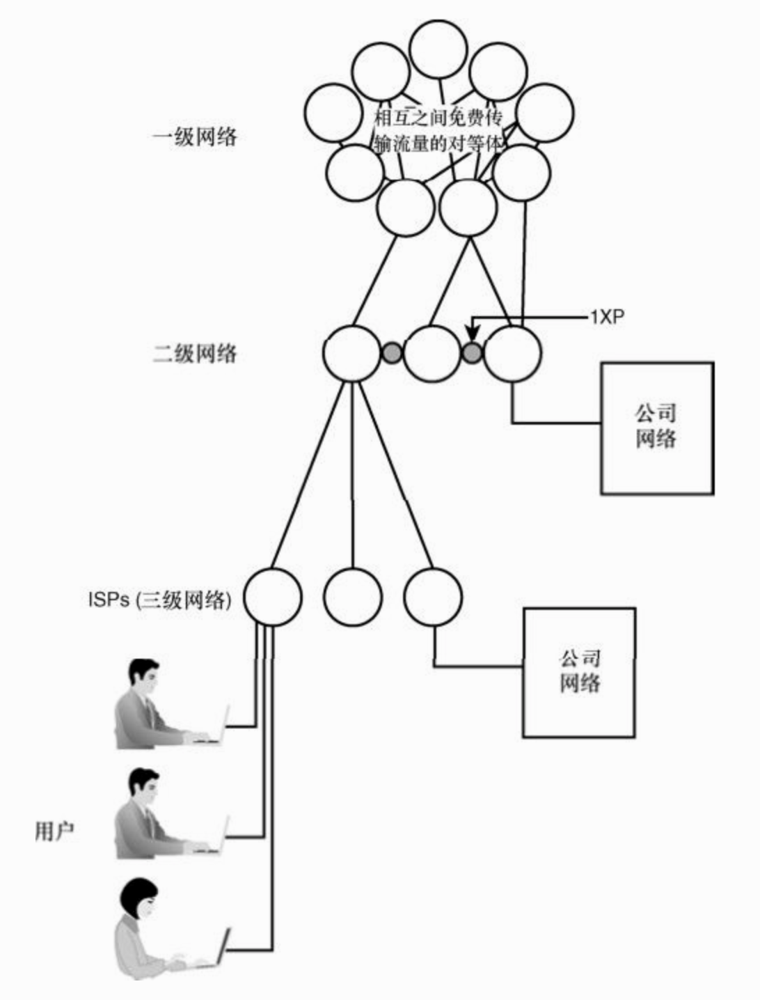
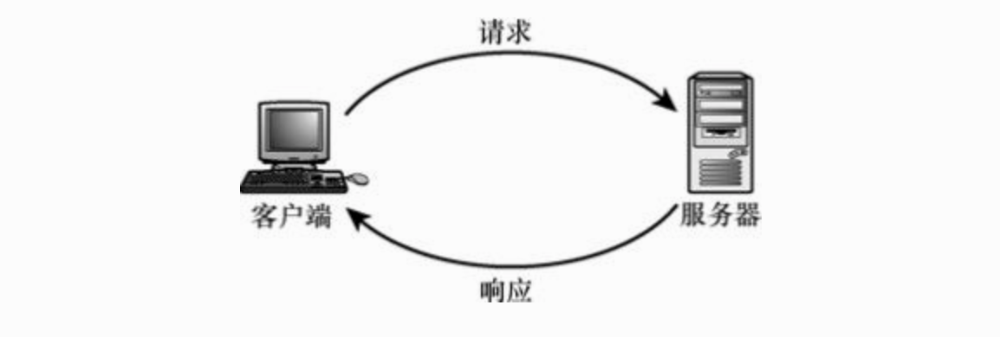

# 第十七章 近距离观看Internet

## 17.1 Internet是什么样子的

Internet是一个单一的实体，并不是因为它的物理连通性，而是因为：

* 它有一组通用的规则
* 它由一群公共的组织机构来进行管理和维护
* 它的语言是统一的

**如今的Internet是由公共网络和私有网络组合而成的多层系统** 

## 17.2 Internet上发生了什么？

**在Internet上，计算机通常充当客户端或服务器** 

**Internet是一个从地球上任何位置均可以访问的浩瀚的服务之海** 

## 17.3 URI和URL

Internet用户最熟悉的请求格式，就是**统一资源定位符（Uniform Resource Locator，URL）** ，URL因为那经典的web地址格式而人所共知：http://www.mercurial.org URL现在是如此的普及，以至于不需要对它们进行任何解释，所谓URL就是一种被称为“统一资源定位符”（Uniform Resource Identifier，URI）的更一般格式的一个特例，这两个首字母缩写词有时可以交替使用，但是它们的差别也很重要，最近的Internet文档已经设法汇聚这两个术语，未来的文档应该使用URI这个更通用的术语来代理URL，通常情况下，标识符这个术语要比定位符好，因为每一个请求并不实际指向某个位置

**URI模式** 

## 17.4 小结

Internet由世界各处请求和提供服务的计算机组成，组成Internet的网络分为三种基本的类别：一级网络和一级网络之间存在的是可以自由传输流量的对等关系；二级网络之间也存在对等的关系，但是需要向一级网络购买IP传输安排（arrangement）；三级网络（比如典型的ISP服务商）从其上游提供商购买Internet连通性，然后再将Internet访问权限出售给商业用户和个人用户

URI格式为表示和定位那些资源提供了一种标准方法，不过，所有这些协议均不同，而且通信的细节随服务而变

## 17.5 问与答

问：为什么Internet当局想取代常见的术语URL呢？

**答：** 统一资源定位符（URL）是通用术语“统一资源识别服（URI）”的一个特例，专家之所以喜欢更通用术语URI，是因为识别服（identifier）有时并不说明一个位置，而是可能会包含额外的信息

问：为什么有一些亚洲和东欧国家，提出针对URI格式，启动它们自己的独立方案？

**答：** 对于使用非拉丁字符语言交谈的用户来说，拉丁字符集的约束因素会使其丧失直觉

## 17.6 测验

### 17.6.1 问题

1. 一级网络和二级网络之间的区别是什么？

   **答：** 一级网络只对一级网络免费共享流量，二级网络可能也有一些对等安排，但是需要购买访问其他网络的权限，当然二级网络对二级网络也是免费共享流量的

2. scheme在URI中的作用是什么？

   **答：** 指定读取URI的格式，通常与一个协议或者服务有关

3. scheme位于URI的哪个位置？

   **答：** Scheme位于字符串开头的冒号双斜线的前面

4. Internet中常用的4个scheme是什么？

   **答：** http，https，ftp，ldap，file，mailto，pop

5. 在URI的目的目录中，如果删除了文件名，则大多数web服务器在默认情况下会发送什么文件？

   **答：** index.html

### 17.6.2 练习

略

## 17.7 关键术语

复习下列关键术语：

* Authority：URL的一部分，标识主机，用户和端口
* Internet交换电（IXP）：提供Internet访问的一种设施
* 对等（peering）：在一对Internet服务商网络之间的一种自由传输布局，参与网络同意在连接之中免费共享流量
* 入网点（POP）：ISP出租的连向Internet的附着点
* 模式（scheme）：URI的一部分，表示用来解释URI其他部分的协议或者系统
* 一级网络：位于Internet中心的几个大型网络之一，它参与到相互对等布局的系统中
* 二级网络：Internet基础设置之中的一个中间级网络，它可能将从其他网络处购买到Internet访问权限出售给另外的网络，并且与其他二级网络形成对等关系
* 三级网络：将Internet访问权出售给商业用户和终端用户的零售级别的Internet网络，它是从其上游提供商处（通常是二级网络）购买的Internet访问权限，许多本地的ISP就是三级网络
* 统一资源标识符（URI）：用来表示Internet资源的一种字母数字字符串
* 统一资源定位符（URL）：一种定位资源的URI，Web地址是一种常见的URL形式