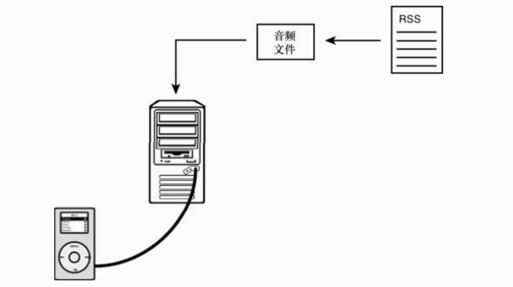

# 第二十二章 流与播

## 22.1 流问题

略

## 22.2 多媒体环境

略

## 22.3 实时传输协议（RTP）

针对及时，可靠的交付问题，已经出现了几种解决方案，但是对于Internet流这一难题，最重要的解决方案可能就是实时传输协议（RTP），RTP为在TCP/IP上传输音视频定义了一种包格式和一种标准的方法，RTP的名称预示着它时一种传输协议，但是事实上要稍微复杂一些，RTP并不替代原有的传输协议，相反，它构建在UDP之上，并且使用UDP端口以到达Internet

**RTP利用UDP来提供网络流传输** 

考虑到与UDP传输相关的可靠性问题，你可能正觉得奇怪，RTP时如何侥幸成功使用UDP的呢？就RTP来说，有一种称为实时控制协议（Real-Time Control Protocol，RTCP）的伴随协议，为RTP会话监视服务质量，这允许应用程序对流进行调节，即通过改变流速率或者可能切换至一种较低资源密集型格式或图形分辨率，这种方法并没有完全消除这里的问题，但是它确实为监视数据报的流动提供了额外的选项

**RTP报头格式** 

该报头中包含如下字段：

* 填充：示意当前数据包是否包含一个或更多填充性八位字节
* 扩展：示意报头扩展的存在
* CSRC记数：固定报头之后的CSRC标识符数
* 标记符：标记帧边界以及数据包流中其他重要的点
* 载荷类型：载荷的格式
* 序列号：一个代表当前会话中位置的数字，每个数据包递增1，这个参数可以被用来检测丢失的包
* 时间戳：载荷中第一个八位字节的采样时刻
* SSRC：识别一个同步源
* CSRC：为数据包载荷识别贡献源

一个可选择的RTP扩展报头，允许不同的应用程序开发人员进行修改实验，以改进性能和服务质量，一些厂商已经开发出他们自己的RTP版本

使用RTP（或者是其他任何流协议）的音频应用程序，必须提供某种形式的缓冲，以确保稳定的音频或视频输出流，缓冲区是用来在数据被接收时临时存储它们的一块内存，缓冲使得应用程序能够以一个稳定的速率来处理输入，即使其到达的速率可能不同，只要缓冲区没有完全空或者是完全满，接收数据的应用程序即可恒速处理输入

RT协议簇中还提供有另一种协议，称为实时流传输协议（Real-Time Streaming Protocol，RTSP），RTSP发送命令，允许远程用户控制流，你可以把RESP看作类似电视遥控器之内的东西，RTSP并不参与实际的流传输，但是它允许用户向服务器应用程序发送像，暂停，播放和录制这样的命令

一个典型的流传输场景如图所示，在这里，语音输入通过一个音频接口进行接收，然后传输给某个计算机应用程序，在那里，它被转换为某种数字格式，流传输软件把流分为离散的数据包，通过RTP和TCP/IP协议栈，向某个流客户端传输，数据在那里被接收进一个缓冲区，然后被某个音乐播放器应用程序连续地从缓冲器中读出，该程序再把声音输出至一对立体声喇叭，期间，RTCP协议向参与会话的应用程序提供服务质量信息，而且，如果这是一段预先录制的视频或音频文件，而不是一名真实的歌手在现场演唱，那么客户端上的用户就可以在客户端应用程序中选择选项，通过RTSP向服务器发送开始或停止命令

**一个流传输的场景** 

## 22.4 传输选项

尽管在UDP之上使用RTP来传输音频和视频流的方法得到了广泛应用，但是专家们依然在研究传输层的可选项，以解决TCP或者UDP不适用于流传输的问题

流控制传输协议（Stream Control Transmission Protocol，SCTP），SCTP是一种面向连接的传输协议，但是与UDP一样，SCTP更面向消息，SCTP还提供单个单个连接同时维持若干消息流的能力

数据包拥塞控制协议（Datagram Congestion Control Protocol，DCCP），它也借鉴了TCP和UDP中的特性，DCCP是面向连接的（类似TCP），交付速度快，但不可靠（类似UDP）

SCTP和DCCP都执行某种称为拥塞控制的功能，从其名称中可以看到，DCCP提供了一种拥塞控制机制，拥塞控制是减少与TCP有关的各种重传问题以及提供更有效带宽利用的一种方法，DCCP协议所使用的算法会调整数据流的特征，以优化吞吐量和减少重发数据包的数量

## 22.5 多媒体链接

常见的视频文件格式如下：

* AVI（音视频交错）：Microsoft公司开发的一种音/视频格式
* MPEG（动画专家工作组）：一种流行的高质量数字视频格式
* SWF：屏幕动画和Flash视频使用的一种格式
* MOV（QuickTime）：apple公司最初为Mac系统开发的格式，但是现在QuickTime可以广泛用于其他系统

## 22.6 播客（Podcasting）

Podcast订阅通过RSS feed交付多媒体（通常是音频）内容，RSS最初用来向用户提供或发送新闻，有一点像是通过Internet投递早报，用户订阅某个RSS新闻服务，然后内容将会自动交付到用户的桌面，这里的要点是，用户不必出门或者在某个网站上查找新闻，在相应的订阅建立之后，新内容就会被自动“推”到读者面前

**Podcasting通过一个RSS服务交付多媒体文件** 

Podcast现象的目标是，利用RSS工具，直接把媒体文件交付给查看程序，实际情况是，RSS提供了一种方法，将某个文件附加到新闻消息，那种附加特性后来成了Podcasting的传播媒介

Podcast客户端应用程序管理Podcast文件，并提供更新通知，Itunes用户可以轻松的接收Podcasr，而其他音乐播放器也提供该特性，iPodder是一种开源的Podcast客户端，可以与Windows，Mac，Linux和BSD系统一起使用

Podcast的整个目的就是定期接收更新，那意味着无论是谁正在服务器端上生成那些Podcast，都需要提供某种正在进行的节目安排，普通大众的Podcast已经在世界各地广为流行，通过RSS的神奇功能，向订阅者播放常规访谈，how-to讨论，音乐电视和喜剧节目

## 22.7 VoIP

Internet电话通信现在许多地方都十分常见，与传统的电话服务相比，TCP/IP电话服务通常比较便宜，而且更加通用，在许多方面，Internet电话只是另一种形式的语音流，因此对于RTP是用来传输VoIP通信的最i鲈形的协议，应该不会感到惊讶，但是，交谈的过程只是难题的一部分，找到某个用户，打电话，建立会话以及得体的结束会话，这些事都需要新的工具和协议

如果你期望自己的IP电话服务与传统的电话网络相连，你还将面对这样一个问题：提供一个控制系统，它能兼容（或者至少能够通过接口连接）传统电话系统上使用的等效控件

IP电话通信可以通过一种实际的硬件电话设备进行，也可以通过一种被称为软件电话的计算机应用程序进行，那种程序可以提供电话的功能，从麦克风设备接受音频输入，向扬声器或头戴式耳机发送音频输出，并且通过所在计算机上的TCP/IP联网软件与世界相连，在这两种情况下，相应的电话都通过网络发送必须被通话另一端的电话所接收和解释的信号

有几种协议可用来发起和管理VoIP电话通话，国际电信联盟的H.323协议系统是一个大型的协议簇，用来管理VoIP，电话会议和其他通信任何，许多VoIP系统都是针对H.323而设计的

另一种比较新的协议更加简单，即通常所说的会话初始协议（Session Initiation Protocol，SIP）

SIP是一种应用层协议，用来开始，停止和管理某个通信对话，SIP向远程用户发送一个邀请，在VoIP环境中，该邀请就相当于打电话，除了发起和终止通话外，SIP还具备像召开会议，呼叫转移和会话参数协商这样的特性

在建立通话之后，实际的语音流通信使用像RTP这样的一种协议进行

IP 电话通信的另一个复杂情况是，成功地与使用老式陆上线路的打电话者建立联系。一个VoIP网关设备充当从Internet到该电话网络的接口，VoIP呼叫者无需网关，即可直接通过Internet相互交谈，但是当他们呼叫传统电话网络上的某个号码时，相应的呼叫就会被路由至某个VoIP网关设备，Internet电话通信用户可以预定一个VoIP网关服务，以便能够访问某个网关，这种可选择的功能一般也是VoIP电话合同的一部分，但是通过网关进行连接的费用，通常要远高于通过端对端Internet通话技术呼叫某个用户的费用。对于按月预付费的用户来说，通过Internet通往世界各地的端对端通话，通常都是免费的（或者是接近免费）

**一个VoIP网关充当到传统电话网络的接口** 

## 22.8 小结

本章介绍了一些在Internet上提供多媒体流传输的技术，你学到了有关RTP，RTSP和RTCP的知识，本章还介绍了SCTP和DCCP传输协议，并且讨论了多媒体链接是如何通过一次鼠标单击来播放音乐和视频的，还学习了播客以及本章最后介绍的VoIP

## 22.9 问与答

问：为什么主要的传输层协议都不数和流传输

**答：** UDP比较快，但不可靠，而TCP比较可靠，但是用来确保交付的那些控制使得它比较慢，而且容易重发数据包

问：RTP两个姊妹协议（RTCP和RTSP）的用途是什么？

**答：** 当RTP提供流传输时，RTCP监视和报告服务质量，RTSP用于开始或停止相应流的控制命令

问：为什么YouTube要把所提交的视频转换成Flash格式？

**答：** Flash是一种高效且可靠的视频格式，而且Flash播放器很容易得到

## 22.10 测验

### 22.10.1 问题

1. 缓冲在RTP中的作用是什么？

   **答：** 缓冲使得应用程序可以使用恒定的速率，将声音/视频发送给用户，从而保证了声音和视频的流畅性和自然性

2. 什么是RSTP，它的用途是什么？

   **答：** RSTP是一种实时流传输协议，可以让终端用户将命令发送到流传输服务器，就像远程控制

3. SCTP和DCCP是面向连接的还是无连接的协议?

   **答：** 两者都是面向连接的

4. Podcast使用什么系统来交付

   **答：** RSS

5. 什么是SIP，它的用途是什么？

   **答：** SIP是会话初始协议，它用于开始，停止，和管理一个通信会话

## 22.10.2 练习

略

## 22.11 关键术语

* 数据报拥塞控制协议（DCCP）：一种可选的传输层协议，用于流传输应用程序
* 会话参数协商：应用程序或设备之间的一种协商，为当前连接达成一组共同的特性
* 播客（Podcasting）：一种用来通过RSS feed交付多媒体文件的技术
* 实时控制协议（RTCP）：一种为RTP提供服务质量监控的协议
* 实时流传输协议（RSTP）：一种为RTP提供控制命令的协议
* 实时传输协议（RTP）：一种流行的流传输协议
* 会话初始协议（SIP）：一种用来管理VoIP通信的协议
* 流控制传输协议（SCTP）：一种可选的传输层协议，用于流传输应用程序
* VoIP：在TCP/IP网络上进行的电话通信服务