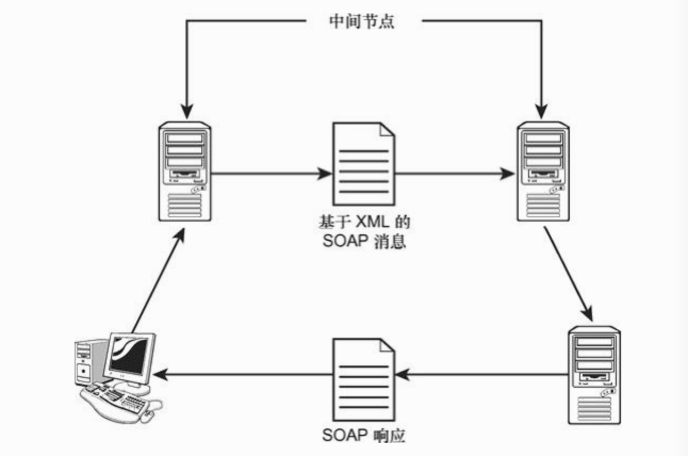
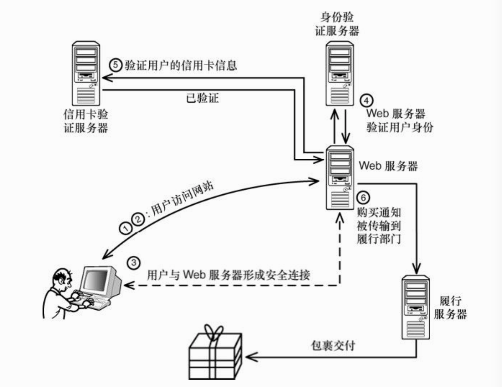

# 第二十章 Web服务

## 20.1 理解Web服务

Web服务架构的理念是，Web浏览器、Web服务器和TCP/IP协议栈处理连网的细节，从而程序员就可以专注于应用程序的细节。最近几年，这项技术已经发展到远不再是Web作为全球性Internet一种表现形式的最初版本了，这一Web服务架构现在已被当作构建各类网络应用程序的一种方法，而不管相应的应用程序是否实际连接到Internet，大型实力派软件厂商已经在构建组件基础结构来支持这一Web服务方面投入了大量的资源

**Web服务程序设计模型** 


在前端，程序员可以利用预先存在的Web基础设施，处理数据传输，并通过客户端计算机上的Web浏览器应用程序提供用户界面，在后端，程序员依靠预先存在的数据存储系统（由一个SQL数据库提供），这样，程序员就可以专注于图的中间部分，而现成的Web服务平台组件可以更进一步简化程序设计任务

数据以一种标准的标记格式（通常是XML）在Web服务系统的各个组件之间传输。但是，现在其他替代技术（比如 JavaScript对象表示法[JavaScript Object Notation，JSON]）也开始逐渐流行起来

XML是一种高效且通用的方法，用于为属性赋值，强大的Web服务范例已经带来了很多创新和发展，专家们很快就认识到，如果系统可以使用 XML 格式在网络上实际调用服务或生成响应，那么它们将会表现得更好，简单对象访问协议（Simple Object Access Protocol， SOAP）提供了一种标准的方法，用于在Web服务进程之间传输基于XML的数据，SOAP同时还描述如何利用 XML 和 HTTP 来调用远程过程

## 20.2 XML

HTML 数据的含义和上下层关系被限制在你可以使用一组预定义的 HTML标记所能表示的范围内。如果数据被封装在<H1>标记内，则被认为是一个标题。如果数据被封装在<A>标记内，则被认为是一个链接，而 XML则从另一个角度出发，允许用户定义他们自己的元素，数据可以表示你希望它表示的任何意思，而且你可以创造出准备用来标识数据的标记，例如，你喜欢关注赛马，则可以利用有关你所喜欢的马匹的信息，创建一个XML文件，该文件包含这样的条目：

```xml
<horses>
<horse_name="winky" breed+"Thoroughbred">
<sex="male" />
<age="3" />
</horse>
<horse_name="Goddess" breed="Arabian">
<sex="female" />
<age="3" />
</horse>
<horse_name="Gecko" breed="Uncertain">
<sex="male" />
<age="14" />
</horse>
</horses>
```

XML格式看上去与HTML优点相像，但是它不是HTML，在XML中，你可以使用希望使用的任何标记，因为你并不像Web浏览器那样为某些严格预定义的特定应用程序准备数据，数据就是数据，这里的理念是，不管是谁创建了当前文件的结构，它稍后会来创建一个应用程序或央视表读取该文件，并理解其中数据的含义

一个独立的文档包含XML模式（schema）模式文档的出现使得人们可以轻松得验证XML数据的有效性，而且还可以轻松创建能够分析和处理XML数据的新的客户端应用程序

“XML是一种功能非常强大的工具，用于在应用程序之间传递数据，脚本或自编应用程序很容易创建 XML 作为输出，或者是把 XML 作为输入进行读入，尽管浏览器不能直接阅读XML，但是XML在Web上的应用仍然十分广泛，在某些情况下，XML数据在服务器端生成，然后在传输给浏览器之前转换为便于显示的HTML，另一种技巧是提供一个称为层叠式样式表（Cascading Style Sheet，CSS）的附带文件，告知如何解释和显示XML数据。然而，XML并不限于Web应用，程序员们正将XML用于要求一种简便格式来为属性赋值的其他语境

XML现在已远不止于作为一种普通的 Web格式用来存储和传输数据，只要编写 XML数据的应用程序和读取相应数据的应用程序在元素的含义方面达成一致，数据就可以借助XML奇迹般的特性，在这两个应用程序之间轻松并且经济地传递了

**注意：** 模式

术语“模式”有时会与用来提供XML架构的大量模式语言一并使用，W3C也提供了一份称为XML模式语言的正式规范，它可以用来创建兼容W3C的XML模式文档（XML Schema Document，XSD）模式文件，该文件的扩展名为.xsd

## 20.3 SOAP

XML定义了一种用来交换应用程序数据的通用格式，然而，这种通用的XML规范尚不足以单独为开发人员提供创建易于使用的一流Web服务所需的基础结构，尽管XML为读写程序数据提供了一种高效的格式，但是它本身并没有为构建和解释相应的数据提供标准格式，SOAP规范则充当了这个角色。它是一种标准协议，用来交换在Web服务客户端和服务器之间传递的基于XML的消息

SOAP用来支持所谓的SOAP节点之间的通信（SOAP节点主要是支持SOAP的计算机或者是应用程序），SOAP规范定义了从SOAP发送者传递到SOAP接收者的消息结构，沿途，该消息可能会经过以某种方式处理其中信息的中间节点，中间节点可能会提供日志记录功能，也可能会在所传递的消息一路到达其最终目的地的过程中以某种方式修改它

从概念上来讲，来自客户端的一条 SOAP 消息会说：“这是某种输入，处理这个，并将输出发送给我“，应用程序的功能衍生自一连串这种基于XML的SOAP消息，发送端和接收端在其中发送信息和接收响应，SOAP 消息的正规结构使得软件开发人员能够轻松创建基于SOAP的客户端应用程序，与服务器进行相互。例如，一家通过基于Web的服务器应用程序提供汽车租赁预约的租赁公司，可以轻松地为开发人员提供规范，以便编写一个自定义的客户端应用程序，能够连接到服务器并预约汽车

SOAP 消息的结构由一个可选的报头和消息主体组成，报头包含标注、定义以及将被消息沿途任意节点使用的元消息，消息主体包括打算供该消息接收者所使用的数据，例如，在前面的汽车预约服务中，消息主体就可能包含来自客户端的数据，描述客户想要租借的汽车，以及该车必须可以使用的日期

**SOAP消息从发送者传递到接收者可能会经过中间节点** 



## 20.4 WSDL

Web服务描述语言（Web Services Description Language，WDSL）提供一种XML格式，用于描述与Web服务应用程序相关的服务，根据W3C的WSDL规范，“WSDL是一种用于描述网络服务的XML格式，它将网络服务描述为一组能对包含面向文档信息或面向过程信息的消息进行操作的端点（endpoint）”WSDL是一种用来定义通过SOAP消息交换消息的服务的格式

WSDL文档主要是一组定义，文档中的那些定义指定了有关被传输数据和与该数据相关的操作的信息，以及与相应服务和服务位置相关的其他数据

WSDL并不限于SOAP，也可以和其他Web服务通信协议一同食用，在某些情况下，WSDL直接与HTTP一同使用，以便简化设计，并在HTTP和新出将动作限定为更加基础的GET和POST样式操作

## 20.5 Web服务协议栈

有了XML、SOAP、WSDL以及TCP/IP和Web服务框架的基础组件，开发人员就可以轻松地创建出大小适度且简单易懂的客户端和服务器应用程序，通过Web界面进行通信。类似TCP/IP本身，Web服务环境也是由一堆组件组成，主要软件厂商都有他们自己的Web服务协议栈，供客户使用，完整的系统包括服务器软件、开发人员工具甚至提供给客户的计算机硬件，连同咨询服务以及有时包括的定制应用程序一起

Linux厂商和开发人员经常言论LAMP协议栈，那是一个开源组件集，可以轻松地针对Web服务环境进行修改，LAMP，则个著名的首字母缩写词，清楚得说明了该协议栈的主要组成部分

* Linux：一种支持服务器应用程序在服务器系统上运行的操作系统
* Apache：一种提供基于XML的SOAP消息的Web服务器
* mysql：一种提供对后端数据服务访问的数据库系统
* PHP：一种用于Web程序设计语言，用来编码自定义Web服务应用程序的细节

所有的Web服务基础结构均提供相似的特性，Java程序设计语言经常与Web一起痛使用，不只是Oracle/Sun公司如此，IBM公司的WebSphere和其他系统中也经常这样，Microsoft公司通过.NET框架的工具提供与Java相当的功能

## 20.6 REST

REST实际上是在HTTP1.1的时代开发出来的，REST的概念于2000年由Roy Fielding在他的博士论文”架构风格与基于网络的软件架构“中首次定义，近年来，REST日渐流行，现在已经称为在几百万个本地Web应用程序和几千个世界级的大流量网站中使用的主导原则

与SOAP不同，REST自身并不是一种协议，他是一种用来创建简单，整洁和可移植的基于Web的应用程序的设计理念，REST系统将通信过程归结为下面几个基本的元素：

* 资源：请求的目标（客户端想要的东西），他可以是一个网页，一个数据库记录，也可以是其他编程对象
* 资源标识符：一个对资源命令的URL
* 表示：来自服务器的响应，用于传输精巧的（finished）格式中的资源，注意，资源没有必要存储到要发送给客户端的表属性表格（representational form）中，对象可以在服务器端动态的组装到发送给客户端的表述性表格中

**注意：** 元数据

除了主要的REST元素（资源，资源标识符和表示）之外，还有很多形式的资源和表述性元数据可以与消息一起传输，以阐明数据的性质

REST系统的重要组成部分是，客户端不会告诉服务器去做什么，而是告诉服务器它想要什么，REST摒弃了传统意义上的API（即客户端调用服务器上的进程），相反，客户端只是以URI的形式发送一个资源标识符，以指明它像要添加。查看，或者修改的资源，并在URI的主体内提供必要的信息来完成该请求

通过一个基本的REST请求来指定的唯一行为是一个标准的HTTP方法：

* GET：从服务器获取资源
* PUT：直接创建或者修改资源
* POST：向服务器提交数据，以修改资源
* HEAD：获取与资源相关的元数据

POST 和 PUT 命令之间的区别值得我们进行思考，PUT 将替换整个资源内容，而 PUT只是将信息提交给服务器，以用于更新资源，而且不会假定更新发生的方式，PUT通常被称之为等幂的，也就是说，无论该命令执行多少次，相同的行为必定为产生相同的结果，而 POST 则无法保证这样的结果。例如，POST 命令可能会在一个文档的末尾添加一行文本，当时多次执行该命令时，其输出每次都不相同，因为你每执行一次该命令，就会添加一行文本。REST设计原则强调尽可能地使用等幂的方法，但是在必要的情况下，也会使用 POST 方法。这种对等幂操作的强调是 REST系统的一个定义的特性，例如，基于SOAP的系统往往会广泛使用非等幂的POST操作，就最小化数据传输和网络带宽而言，这种操作方式的效率很高。出于简洁性和清晰度考虑，REST进行了权威性的生命，但是这样会以偶尔牺牲掉边际性能优势为代价

**HTTP的PUT方法更新整个资源，而POST方法只提供更新所需要的信息，其中可能包括添加文本或修改现有的资源** 


尽管REST服务有时支持JSON和普通的HTML，但是传输到服务器的数据通常是XML格式的，理想情况下，从服务器返回的数据位于表述性表单中，该表单通常是HTML格式或WEB浏览器可以轻易处理的其他格式

REST系统中主要关注的是URI的结构，URI是分层次的，而且指向的是对象（资源），当然，URI的中间层可以指向一组对象，此时，REST URI的结构看起来通常与目录路径的结构相似，都是遍历一系列更精细（ever-more granular）的容器或集合，到达位于字符串末尾的记录ID，该方法似乎是显而易见的（因为URI最初的目的就是沿着一条目录路径向下，最终指向一个文件），但是这种回归本源的方法却与Web服务模型中的其他发展形成鲜明对比，在后者中，URI中包含复杂的命令字符串，并将该字符串发送给服务器，以获得执行

除了提供简洁性和可移植性之外，REST模型还提供了更好的统一安全措施，因为它屏蔽了服务器中的所有服务器操作，并让该操作远离了接口，另外一种通过URI将命令传输给服务器的技术，在Web服务的早期很常见，它属于入侵技术的一种，但是不容易穿透安全而且设计号的REST系统，因此，高流量的站点使用REST设计原则也就不奇怪了

**注意：** REST风格

围绕着REST范例设计的网站，服务或开发框架都是具有REST风格（RESUful）的

## 20.7 电子商务

**典型的Web交易场景** 



1. 一台 Web 服务器提供一个可以从 Web 访问的在线产品目录，一名用户通过 Internet从一个远程位置浏览这些产品信息
2. 该用户决定购买一个产品，并单击了相应网页上的“购买此产品”链接
3. 服务器和浏览器建立一个安全的连接，在这时，浏览器有时会显示一则消息，内容类似“你现在正进入一个安全区域……”，不同浏览器有不同的方法来表示这是一个安全连接
4. 在上述连接建立之后，紧接着通常会是某种形式的身份验证。在绝大多数交易站点上，购物者会与供货商确立某种形式的用户账户。这一方面是出于安全考虑，一方面是为了方便（那样用户就可以跟踪购买的状态了），用户账户信息同时使得供货商能够跟踪用户的行为，并将用户的个人信息与购买历史联系在一起。这个登录步骤要求Web服务器联系某种后端数据库服务器，建立一个新的账户或者是检查提交的证明信息以登录某个现有账户，最近另外一种方法逐渐流行开来，它可以在不需要登录的情况下，直接在会话内提供信用信息
5. 在用户登录之后，服务器（或者是在服务器后端工作的某个应用程序）必须核实信用卡信息，并且与某一信用卡权力机构登记相应的交易。通常，这里所说的信用卡权力机构就是隶属于信用卡公司的一个商业服务机构
6. 如果该交易被认可，购买和投递信息的通知就会被传输到供货商的履行部门，而交易应用程序则会管理用户确认的此次购买的最终详细资料，并更新该用户的账户资料

请注意，图中在交易基础结构内省略了防火墙的作用，大型商业网络可能会在 Web服务器之后包括一个防火墙，保护其网络，并在Web服务器之前放置另一个防火墙，阻止某些流量，但让服务器接受 Web 请求，而且，在高容量网站上，你很可能会发现有一组 Web服务器在分担负载，而不只是一台服务器

从Web服务器到后端服务器的连接，可以穿过一个受保护的内部网络，此外，到后端的连接，也可以通过一条与主网络分开的专用线路，信用卡验证服务器，通常是由另外一家公司提供的一项远距离服务，需要通过一个安全的Internet连接进行访问

## 20.8 小结

Web工具为许多种应用程序开发提供了一个北京，除了简单的网页和Web表单外，开发人员正在把安排预约，跟踪库存和处理购货订单的复杂应用装配在一起，本章描述了Web服务范例核心处的一些技术，本章还讨论了3个重要的Web服务组件：XML，SOAP和WSDL，并讲解了REST Web服务架构，最后还简要介绍了Web交易的结构

## 20.9 问与答

问：与传统的客户端/服务器程序设计相比，Web服务模型有何优点？

**答：** Web服务模型用来集成绝大多数网络上已有的标准组件（例如Web服务器和Web浏览器应用程序）

问：为什么Web服务模型基于XML，而不是HTML？

**答：** HTML是一组预先定义的标记，是一种专门用于网页的标记语言，而XML几乎能够毫无限制的定义新元素和变量赋值

问：既然无数厂商都有它们自己的语言和组件来支持Web服务，那么像SOAP和WSDL这样的统一标准有什么益处呢？

**答：** 像SOAP和WSDL这样的标准可以提供一种通用格式，从而使得针对不同厂商环境编写的组件可以轻松的相互作用

## 20.10 测验

### 20.10.1 问题

1. 什么是XML模式？

   **答：** 一种自定义的配置文件，用于配置某些新的变量

2. HTTP PUT和POST方法的区别是什么？

   **答：** PUT方法会更新整个资源，而POST方法只提供更新所需要的信息，其中可能包括添加文本或修改现有的资源

3. 为什么REST格外看重PUT？

   **答：** PUT操作通常被称之为等幂，也就是说，无论该命令执行多少次，相同的行为比定产生相同的结果，POST执行的结果就不一定了

4. 为什么很多专家觉得REST要比其他类似的Web服务架构更安全呢？

   **答：** 由于REST将所有的服务器操作隐藏在服务器之内，远离了接口，因此它可以提供更好的而且可预见的安全性

## 20.11 关键术语

复习下列关键术语：

* LAMP：一种开源的Web服务协议栈，由Linux操作系统，Apache Web服务器，MySQL数据库系统和三种P打头的程序设计语言之一（php，perl，或者python）组成
* 表述性状态转移（REST）：一种用于构建简单和可移植的Web应用程序的设计理念
* SOAP：一种针对Web应用程序的消息交换协议
* Web服务架构：一个用来围绕Web组件构建自定义网络应用程序的范例
* WSDL（Web服务描述语言）：用来描述网络服务的一种基于XML格式
* XML（可扩展标记语言）：一种用来在Web服务应用程序中定义和传输程序数据的标记语言