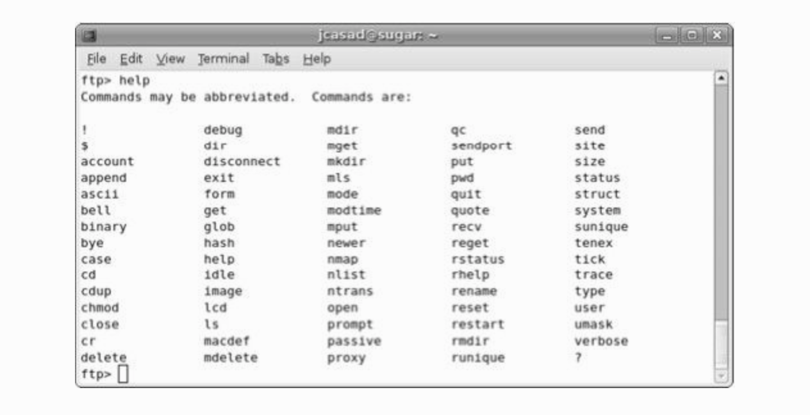
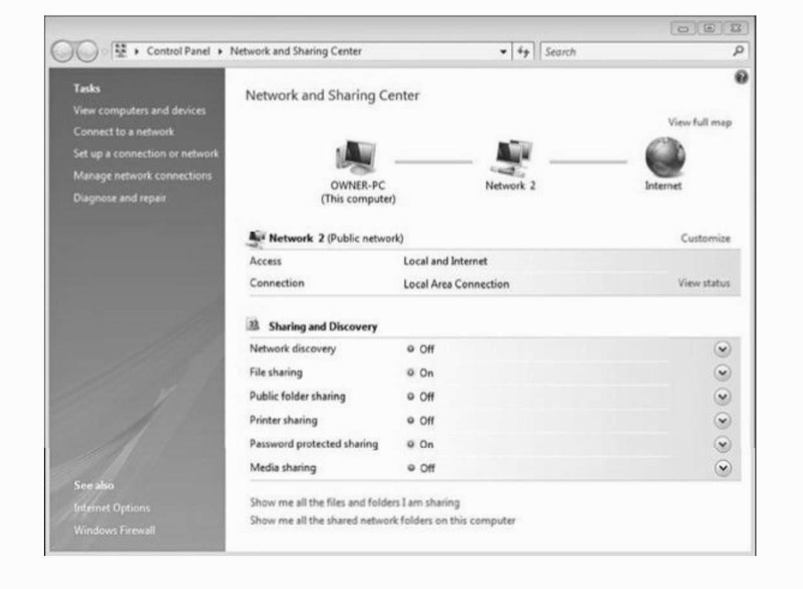

# 第十六章 经典的服务

## 16.1 HTTP

略

## 16.2 E-mail

略

## 16.3 FTP

FTP广泛应用于万维网中，而且FTP协议也已经集成进大多数Web浏览器中，有时，当你通过Web浏览器下载文件时，你可能已经注意到，地址栏中的URL是ftp://打头的

FTP使用TCP协议，因此它是通过客户端计算机和服务器计算机之间的面向连接的可靠会话进行操作的，标准的FTP daemon（在服务器端）在TCP的21端口监听来自客户端的请求，当客户端发起一个请求后，它就会发起一个TCP连接，此时远程用户就会被FTP服务器进行验证，然后开始会话，经典的基于文本的FTP会话需要远程用户利用命令行界面与服务器进行交互，典型的命令语句可以开始或者停止FTP会话，浏览远程目录结构，以及上载和下载文件等，较新的基于图形界面的FTP客户端提供一个图形界面，来浏览目的和移动文件

**注意：** daemon和服务

在UNIX中，daemon是一个在后台执行的进程，当对某一个服务发出请求时，该进程将执行所请求的服务，在Windows中，daemon被称为服务

下面列出一些常用的FTP命令语句以及对它们的解释

* FTP：FTP命令用于启动一个FTP客户端程序，可直接输入ftp，或输入ftp加一个IP地址或域名，在下图中，我们通过输入ftp rs.internic.net命令启动了一个与rs.internic.net的FTP会话

  **启动一个FTP会话** 

  

* user：在当前会话中，可以使用user命令来更改用户身份名称和密码信息，这条命令提示你输入新的用户身份名称和密码，就如同使用ftp命令一样，user命令等效于推出当前ftp会话然后以新用户身份进行登录

* help：help命令列出FTP客户端支持的所有ftp命令

  **在FTP提示符下输入help，以获得所有的FTP命令** 

  

* ls或dir：UNIX/linux系统下的ls或者ls -l 命令，或者是Windows下的dir命令，都会列出某个目的的内容，这些命令执行后，会返回FTP服务器上当前工作目录内的文件名和目录名，在两条系统信息（150和226之后的行）之间，即为实际的目录列表，包含有当前工作目录内的所有文件和子目录，ls -l 命令和ls命令类似，但是会列出更多细节信息，例如允许用户读写的权限和文件创建日期等

* pwd：使用pwd命令显示当前工作目录的名称，这里指的是远程服务器上的目录，而非本地计算机的目录

* cd：使用cd命令改变FTP服务器上的当前工作目录

* mkdir：在UNIX/Linux系统下，使用mkdir命令在FTP服务器上的当前工作目录下创建一个目录，次命令在匿名FTP会话中通常不允许使用

* binary：使用binary命令将FTP客户端默认的ASCII码传输方式改为二进制方式，在二进制方式下，通过使用get，put，mget和mput命令，可以高效传递如程序或图片等二进制文件

* ascii：使用ascii命令将FTP客户端的传输方式改为ASCII码方式

* type：使用type命令显示当前文件传输方式（ASCII码或二进制方法）

* status：该命令用于显示FTP客户端的各种设置信息，包括客户端设置的传输方式（ASCII码方式或二进制方式）和在客户端是否显示详细的系统信息

* get：使用get命令从ftp客户端向ftp客户端下载文件，执行get后边跟一个文件名的命令时，会将这个文件从服务器端复制至客户端的当前工作目录中，执行get后边跟两个文件名的命令时，在客户端创建的心文件的名称由第二个文件名制定

* mget：该命令类似于get命令，但使用mget命令可以一次下载多个文件

* put：使用该命令可以从FTP客户端向FTP客户端上传文件，put命令后边跟一个文件名时，将这个文件从客户端复制到服务器端，put命令后边跟两个文件名时，在服务器端创建的心文件的名称由第二个文件名指定

* mput：该命令类似于put命令，但使用mput可以一次上传多个文件

* open：使用open命令可以和FTP服务器建立一个心的对话，open命令等效于立即退出当前FTP会话并重新登录，open命令可用于登录一个安全不同的ftp服务器或者重新登录当前服务器

* close：使用close命令结束当前与FTP服务器的对话，FTP客户端程序此时依然运行，可以使用open命令同FTP服务器建立心的对话

* bye或quit：使用bye或quit命令，将关闭当前FTP会话并结束FTP客户端程序

以上介绍的命令涵盖了大部分FTP会话中使用到的命令

如果你需要比普通FTP更为安全的工具，可以考虑使用SSH工具包，它包含了scp和sftp文件传输工具

## 16.4 简单文件传输协议

略

## 16.5 文件和打印服务

之前讲到集成网络文件访问的部分功能要求客户端计算机上有一个重定向器（或者请求程序），以截获资源请求，并把雨网络相关的请求路由给当前网络，这种解决方案的另一部分就是一种通用的文件访问协议，通过构建一个完整的协议层，来使得基于GUI的用户界面工具和其他应用程序可以访问网络，对于本地网络来说，这种文件访问方法是现在的首选方法，接下来讲介绍一对提供集成网络文件访问的协议：

* 网络文件系统（Network File System，NFS）：在UNIX和Linux系统中使用的协议
* 通用Internet文件系统/服务器消息块（Common Internet File System /Server MessageBlock ，CIFS/SMB）：用于为Windows客户端提供远程文件访问的协议

这些协议展示了TCP/IP应用层的能力，以及围绕良好定义的协议栈建立了一个网络系统可以获得的收益，在这个系统中，底层协议为上层多种专用的协议构建了基础

### 16.5.1 网络文件系统

网络文件系统（NFS）最初由SUN公司开发，现在被UNIX、Linux和其他众多操作系统支持，NFS允许用户像在本地一样访问远程计算机的目录和文件，执行包括读、写、建立和删除等操作，由于 NFS 被设计为在本地文件系统和远程计算机文件系统之间提供透明接口，而且它是在这两台计算机的操作系统内部实现的，因此不需要对应用程序做任何改动，通过NFS，应用程序能够同时访问本地和远程计算机上的文件和目录，不需要做任何重新编译或其他改动。对用户而言，所有的文件和目录就好像都存在于本地计算机上一样

NFS最初使用UDP协议进行数据传输并运行于局域网之中，在最近的版本里，NFS开始允许使用TCP协议。TCP附加的可靠性赋予NFS更多的能力，使其现在可以在广域网上运行

NFS被设计成独立于操作系统、传输协议和物理网络架构之外的系统，这使得NFS客户端可以与任何NFS服务器进行交互。这种独立性是通过在客户端和服务器计算机之间使用远程过程调用（Remote Procedure Call，RPC）来实现的，RFC允许在本地允许的程序调用于其他计算机上程序的内部代码段，RFC已经流传了多年被多种操作系统支持，在NFS中，由客户端操作系统并发起对服务端操作系统的远程过程调用

NFS系统中，在远程文件和目的被使用之前，它们必须首先经历名为安装（mounting）的过程，在安装之后，远程文件和目的就可以像在本地文件系统中一样显示和使用

### 16.5.2 服务消息块和通用的Internet文件系统

服务器消息块（SMB）是一个支持Windows用户界面的网络集成工具的协议，这些工具包括资源管理器，网上邻居和网络驱动器映射等，SMB被设计为运行与各种不同协议系统之上，这些系统包括IPX/SPX（传统的NetWare协议栈）、NetBEUL（一种过时的PC LAN协议）和TCP/IP

如同其他网络协议一样，SMB围绕客户端（请求服务的计算机）和服务器（提供服务的计算机）的概念而设计，每次会话都始于一次信息的初步交换，包括对SMB语法的协商，对客户端的认证和登录服务器，认证过程的细节因操作系统和配置的不同而不同，不过就SMB而言，登陆时封装在sesssetupX SMB中的（SMB协议些的协议传输被简单的称为一个SMB）

如果登陆成功，客户端会发送一个SMB，用于指定要访问的网络共享名称，如果共享访问成功，客户端就可以开始对网络资源执行各种操作，包括打开，关闭，读取或者写入，而服务器会发送必要数据来完成这些请求

SMB通常被认为是一个Windows协议，的确是这样，SMB的重要性体现在它与Windows客户端用户界面的紧密集成，SMB是一个开放标准版本被称为Internet文件系统（CIFS），开发人员和支持服务器与Windows客户端进行SMB连接的擦欧总系统，都很了解SMB和CIFS协议的细节，一种名为Samba的流行开源服务器为UNIX/Linux系统提供SMB文件服务

当在Windows中配置文件共享时，实质上是将计算机配置为一个CIFS服务器，当从另外一个系统连接一个共享资源时，这个系统会将资源识别为Windows Network，然后使用内置的SMB/CIFS客户端软件进行连接

**当在Windows中配置文件共享时，实际上是将其配置为使用SMB/CiFS协议** 

SMB/CIFS凭借其通用性得到了广泛的支持，因此当网络中混杂了不同类型的操作系统时，会考虑使用SMB/CIFS，SMB除了得到windows客户端的支持外，还得到了Linux和Mac客户端的支持，因此它称为小型网络的一个理性选择，在服务器端，面得疯Samba服务器已经成为一款复杂的工作，它运行良好，并且能够与MIcrosoft自带的连网组件很好的集成，Linux服务器管理员即使在需要与Windows进行交互操作时，也会倾向于选择SMB/CIFS

## 16.6 轻型目录访问协议

LDAP运行与TCP/IP应用程，并在熟知的TCP端口389上监听请求，LDAP协议，数据格式，以及语法都在一系列RFC文档中有介绍，LDAP v3在RFC4510～4519中有介绍

LDAP提供的这种网络信息的通用结构，使得它可以在TCP/IP网络中很轻易的运行，最有名的基于LDAP的系统或者应该是Microsoft的活动目录，在开源世界中，OpenLDAP也同样很受欢迎

LDAP目录的结构定义在一个模式（schema）中，该模式中包含一组属性，这些属性定义了将要存放在目录中的数据，例如，一个员工记录的目录可能包含员工姓名，地址和usrid等属性，目录中独立的条目为这些属性赋值

LDAP目录是层次化结构组织的，这与文件目录结构相同，其中每一个条目都有一个唯一甄别名（DIstinguished Name，DN）它定义了该条目在树中的位置，唯一甄别名包含一个相对甄别名（Relative Distinguished Name，RDN），它唯一地定义了其容器内的条目，此外，唯一甄别名中还包含一系列组件，这些组件定义了条目所在的容器层次结构

**LDAP DN包含了一个定义容器内条目的RDN，还包含定义了容器层次结构的一系列组件** 

一个DN看起来可能会像是这样：dn : cn = Ellen Johnson, ou = employees ,dc = pearson , dc = com 

注意:在等号左边由两个字母组成的属性类型与名称的值相关，LDAP预先定义了一些标准的属性类型，它们可以用来定义为宜的甄别名，这些类型属性如下所示：

* 域组件（domain component，dc）：嵌套容器链中定义了目录层次结构的一个条目，在上面的例子中，dc条目指向了一个DNS域名（person.com）以为宜甄别名为基础，同时结合一个域名，是现在网络中常用的一个方法，但这并不是必须的。
* 组织单元（organizational unit，ou）：对条目进行编组以方便管理的一个容器，一个ou可能定义了多个逻辑组，比如一个部分，而一个dc更可能反映的是网络自身的结构
* 规范名称（canonical name，cn）：对容器而言唯一，对用户来说便于识别的一个对象名称

## 16.7 小结

运行于应用层的网络服务器创造了丰富而充满活力的用户环境（也就是Internet）本章讲解了一些重要的网络服务，其中包括ftp、nfs、smb和CIFS，以及LDAP，此外，本章还简要介绍了HTTP和E-mail

## 16.8 问与答

问：ftp默认的传输类型是什么？

**答：** ASCII

问：当用户使用匿名账户连接ftp时，通常不允许使用什么命令？

**答：** 匿名用户通常只有只读访问权限，因此用户无法对FTP服务器执行写文件的命令，以及更改目录结构的命令，这些命令包括put，mkdir，rmdir和mput

问：在绝大多数的现代网络中，LDAP的主要职责是什么？

**答：** LDAP维护一个网络和用户信息的目录，该目录可以通过TCP/IP轻易访问

## 16.9 测验

### 16.9.1问题

1. FTP的put命令和mput命令的区别是什么？

   **答：** put命令是上传单个文件到服务器，而mput是一次可以上传多个文件到服务器

2. 能否使用TFTP列出目录中的文件？

   **答：** TFTP只能传输文件，不能列出目录中的额文件

3. UNIX/Linux Samba文件服务器中使用的文件服务是什么？

   **答：** Samba最初是为了促进与Windows系统的相互操作而设计的，在Microsoft使用的SMB文件服务协议中，它充当了一个开源的服务器和客户端，CIFS是SMB的一个开放标准版本，Samba支持CIFS，尽管属于SMB仍然在Samba社区广泛使用

## 16.9.2 练习

略

## 16.10 关键术语

复习下列关键术语：

通用Internet文件系统（CIFS）：SMB文件服务协议的开放标准版本，最初由Microsoft进行推广，现在用于所有常见的操作系统中

目录服务：在多个网络中使用的一种信息服务，它以树状的层次化结构来组织和管理用户和资源信息

唯一甄别名（DN）：唯一定义的LDAP数据中一个对象的名称，它包含一个相对甄别名和一串标识符，这些标识符用来描述对象所在的容器的层次

文件传输协议（FTP）：一个客户端/服务器工具和协议，用来在两台计算机之间传输文件，除了传输文件之外，FTP工具还可以创建和移除目录，并显示目录中的内容

轻型目录访问协议（LDAP）：用来轻松访问TCP/IP上的目录服务的一个协议

LDAP数据交换格式（LDIF）：用来显示LDAP数据的一种便于阅读的格式

网络文系统（NFS）：NFS允许用户通过一台NFS客户端计算机来透明的访问位于远程NFS服务器计算机上的文件

相对甄别名（RDN）：LDAP对象定义中红的一个属性，它唯一地识别了其容器内的一个LDAP对象，尽管其他具有唯一值的属性也可以用作RDN，但是通常使用的是规范名称

服务器消息块（SMB）：SMB是一个应用层协议，它允许Windows客户端访问诸如文件和打印机这样的网络资源

简单文件传输协议（TFTP）：一款基于UDP的客户端/服务的工具和协议，用于简单的文件传输操作