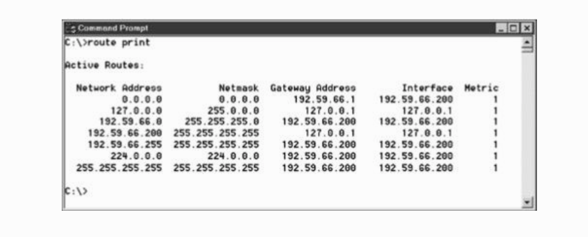

# 第十四章 TCP/IP工具

## 14.1 连通性问题

最常见的网络连接问题通常属于下列4种之一

* 协议功能障碍或配置错误：协议软件不工作（任何原因）或者配置不正确
* 线路问题：某段电缆没插上或者有故障，某个HUB，路由器或者交换机不工作
* 名称解析有误：DNS或NetBIOS名称无法被解析，资源可以通过IP地址访问，但无法通过主机名或者DNS名称访问
* 线路堵塞：网络似乎还在工作，但运行缓慢

## 14.2 协议功能障碍和配置错误

TCP/IP协议簇提供了如下所示的大量实用工具，可以帮助你检测TCP/IP是否运作正常或配置是否正确

* ping：这是个及其有用的诊断工具，通过发起一个简单的网络连通性测试，报告其他计算机的回应情况
* 配置信息工具：每个操作系统厂商都会提供一些工具用于显示TCP/IP的配置信息，并帮助你检查IP地址、子网掩码、DNS服务器和其他参数是否配置正确
* arp：该功能可以用来查看和配置ARP缓存的内容，这些内容可以将IP地址和物理地址关联起来

### 14.2.1 ping

Ping 名字起源于声纳技术，该技术帮助潜艇或监听定位其他物理，单词ping是数据报Internet查询工具（Packet Internet Groper）的缩写

ping命令的基本形式如下：ping ip地址 ，当发送方计算机收到回复时，它会输出一条信息，说明ping成功了

成功执行完ping命令，说明接收方和发送方计算都在网络上且可以相互通信，但是请注意，ping只是最低限度的网络应用，它仅要求TCP/IP栈底部两层（即OSI栈的底部三层）可以使用，你的问题可能出现在TCP、UDP或者较高的两层中的应用中，但此时ping仍然会成功，如果ping运行正确，就基本上能排出问题出现在**网络访问层、网络适配层、电缆** 甚至路由器上了

ping提供的一系列选项使它在网络故障方面特别有用，可以用如下方式使用ping

* 使用一个被环回地址（127.0.0.1）的特殊地址来ping本地IP软件，如果ping127.0.0.1执行成功，说明TCP/IP软件协议运行正常
* ping你自己IP自己（就是ping自己），如果能ping通分配给你的网络适配器的IP地址，则说明该适配器配置正确，并且可以与TCP/IP软件交互
* ping主机名，绝大多数系统允许在ping命令中使用主机名来替代响应的IP地址，如果使用IP地址可以ping通某台计算机，却无法通过其主机名ping通，则可以推断问题一定和名称解析有关

### 14.2.2 配置信息工具

Linux和Unix下使用ifconfig命令来配置和查看网络显示情况，例如

ifconfig eth0 则是现实eth0的网络情况

禁用或者启动某个网卡则直接使用 ifconfig eth0 up ，ifconfig eth0 down

Windows则可以使用ipconfig来查看当前网络状态，或者加上一些参数，比如：ifconfig /all 则是输出当前所有网卡的全部信息，release和renew则是释放或者重新租用一个适配器地址，命令如下：ifconfig /release

### 14.2.3 地址解析协议

使用arp命令可以查看缓存条目，如：arp -a则可以输出当前记录的所有arp值

arp -a IP地址：如果有多个网络适配器，则可以通过执行arp -a 加这个网络接口的IP地址方式，只查看某个网络接口的arp缓存条目，例如arp -a 192.168.66.200

arp -s：可以向ARP缓存手动添加一个永久性的静态条目，就算计算机重新启动，该条目都一直有效，而且如果在应用手动配置的物理地址时发生错误，该内容会自动内更，例如：要想手动为IP地址192.59.66.250和物理地址0080CE7E07EC5的服务器添加一个条目，可输入arp -s 192.59.66.250 0080CE7E07EC5

arp -d IP地址：这个用来用于手动删除山东输入的一个静态条目，例如： arp -d 192.59.66.250

## 14.3 线路问题

略

## 14.4 名称解析问题

常见名称解析问题原因如下：

* 主机文件丢失或不正确
* 名称服务器离线
* 在客户端配置中，名称服务器没有被正确饮用
* 设法连接的主机在名称服务器中没有记录
* 命令中使用的主机名不正确

## 14.5 网络性能问题

TCP/IP协议提供了大量用于查看数据包流向和现实网络性能统计的工具

### 14.5.1 traceroute

traceroute工具用于追踪数据报的传输路径：当数据报从一台计算机传向另外一台计算机时，会经过多重的网关，通过traceroute工具跟踪到的传输路径只是这两台计算机之间众多通路中的一条，所以不能肯定或者假设数据报回永远只走着一条通路，如果你的计算机使用的是DNS，你还会经常从返回结果中辨认出城市，地区和运营商的名称，raceroute是一条缓慢的命令，因为每经过一台路由器都要花去10～15秒（实际上不用，～

该命令在Windows下是tracert ，此命令利用ICMP协议定位你的客户端计算机和目的计算机之间的所有路由器，TTL值可以反映数据包经过的路由器或网关的数量，通过操作原始的ICMP Echo消息中使用的TTL值，traceroute命令能够找到数据包传输路径上的所有路由器，其过程如下

1. 将传递到目的IP地址的ICMP Echo消息的TTL值被设置为1，该消息报经过第一个路由器时，其TTL值减去1名此时新产生的TTL值为0
2. 由于TTL值被置为0，路由器判断此时不应该尝试继续转发数据报，而是直接抛弃该数据报，由于数据报的生命周期（TTL值）已经到期，这个路由器会发送过一个ICMP时间超时，即TTL值过期信息返回到客户端计算机
3. 此时发出traceroute命令的客户端计算机将显示该路由器的名称，之后可以再发送一个ICMP Echo消息并把TTL值设置为2
4. 第一个路由器仍然对这个TTL值减1，然后，如果可能的话，将这个数据报转发到传输路径上的下一跳，当数据报抵达第二个路由器，TTL值会再被减去1，成为0值
5. 第二个路由器会像第一个路由器一样，抛弃掉这个数据包，并像第一个路由器那样返回一个ICMP消息
6. 该过程会一直持续，traceroute命令不停递增TTL值，而传输路径上的路由器不断递减该值，知道数据报最终抵达预期的目的地
7. 当目的计算机接收到ICMP Echo消息时，会回传一个ICMP Echo Reply消息

除了能定位传输信息穿越过的路由器或网关之外，traceroute命令还能记录数据报抵达每个路由器的往返时间，根据实际情况，traceroute命令实际上可能会给每个路由器发送多个单独的Echo消息，在Windows上运行的trancert中会给路由器发送两个额外的Echo消息，这样可以更准确的判断数据报往返时间

但是不能根据往返时间精准判断网络性能，因为许多路由器会分配更多的时间处理更重要的数据报，对ICMP流量只给予较低的处理优先权

traceroute语法：traceroute google.com （类unix）tracert google.com（Windows），命令后跟IP地址或者域名都可以

### 14.5.2 route

route命令在TCP/IP网络中有很多用途：在数据包没有有效传递的情况下，可以利用route命令显示路由表，如果traceroute命令揭示出一条异常或低效率的传输路径，则可以使用route命令来确认为何选择该路径，而且可以配置一个更有效的路由

route命令也可以被用来手动添加，删除，和修改路由表中的条目，其选项如下所示：

* route print：route命令这个形式会显示路由表中的当前条目，下图显示的是route print命令的输入实例，可以看到，一些条目涉及了不同网络，比如0.0.0.0 ～127.00.0.0～192.56.66.0 一些条目用于广播255～和192.～还有一些条目用于广播，还有一些用于多播，作为网络适配器IP地址的结果，所有这些条目都是被自动添加的

  **route print命令显示路由表中的当前信息** （实际上显示的信息远比这个多，而且系统与系统之间显示也不同

  

* route add：使用这个形式可以向路由表添加一个新的路由条目，例如，要想指定一个趣网5个路由器跳数之外的目的网络207.34.17.0的路由，而且首先会经过一台在本地网络上的IP地址为192.59.66.5和子网掩码为255.255.255.224的路由器，那么可以输入如下命令：route add 207.34.17.0 mask 255.255.255.224 192.59.66.5 metric 5

  **注意：** 只是临时路由

  这种方式添加的路由信息只是暂时的，一旦计算机或路由器重新启动，这些信息就会消失，通常在启动脚本中会有一系列的route add命令，这样每次计算机或路由器启动时响应的信息就会被再次应用

* route change：可以使用这个语法在路由表中修改条目，下面的示例是将数据的传输路径修改到另一台路由器，该路由器到目的距离有三跳：

  route change 207.34.17.0 mask 255.255.255.224 192.559.66.7 metric 3

* route delete：使用这个命令语法可以在路由表中删除一个条目：route delete 207.34.17.0

### 14.5.3 netstat

下面介绍netstat命令的各种选项

* netstat -s：这个选项能够按照各个协议分别显示统计信息，如果用户应用程序（比如web浏览器）看起来异常缓慢或者无法显示网页之类的数据，那么你可能会使用这个选项来查看所显示的信息，可以查看冲击信息行，寻找error，discard或者failure这样的单词，如果这些行中的技术明显与接收的IP数据包邮关，则需要展开进一步的检测
* netstat -e：这个选项查看关于以太网的统计数据，其中列出的条目包括总字节数，错误数，抛弃数，定向数据报的数量和广播数量等，这些统计数据即有发送到额数据报数量，又有接收到的数据报数量
* netstat -r：这个选项用于显示路由表信息，其显示类似于我们之前学到过的routeprint命令，除了显示活动过的路由器外，还可以显示当前活动的连接
* netstat -a：这个选项用于查看所有活动连接，包括已经建立的那些正在监听连接请求的连接

下列3个选项可以提供netstat -a 命令输出结果的子集信息

* netstat -n：这个选项显示所有已经建立的活动连接
* netstat -p TCP：这个选项显示已经建立的TCP连接
* netstat -p UDP：这个选项显示已经建立的UDP连接

**netstat命令显示哥哥协议的统计信息** 

### 14.5.4 nbtstat

nbtstat工具用于查看在TCP/IP协议之上运行NetBIOS服务的统计信息，并可以查看本地或远程计算机上的NetBIOS名称列表，下面介绍的命令选项用于本地计算机

* nbtstat -r：该命令可以清除并重载NetBIOS名称缓存，这样做是为了载入LMHosts文件中最近添加的记录
* nbstat -n：该命令显示在本地计算机上注册的名称和服务
* nbtstat -c：该命令显示NetBIOS名称缓存中的内容，NetBIOS名称缓存储存着当前正在与之通信的计算机的NetBIOS名称与IP地址对
* nbtstat -r：该命令显示其他计算机在本地注册和解析名称的数量，以及是否通过广播或名称服务器进行过注册和解析
* nbstat -A IP地址：显示该IP地址饮用的计算机的名称列表（其中包含该计算机的物理地址）
* nbtstat -a netBIOS名称：显示该NetBIOS名称饮用的计算机名称列表
* nbtstat -S IP地址：显示该IP地址饮用的计算机的NetBIOS连接列表
* nbtstat -s NetBIOS名称：显示该NetBIOS名称饮用的计算机的NetBIOS会话列表

**nbtstat命令以及响应** 

### 14.5.5 协议分析器

略～ 大约就是一些抓包工具，例如wireshark和tcpdump什么的。

## 14.6 小结

TCP/IP的连通性工具组可以帮助用户配置和对网络连接进行排错，每种工具只显示了少量信息，但是，知道如何应用这些工具的用户可以快速查找到问题源点，并预防潜在的问题，本章还讲解了由路由故障和错误配置，链路问题，名称解析故障，以及过量的流量引起连通性问题，并讨论了如何使用ping，ifconfig，ipconfig，arp这些工具来解决问题，本章还讲解了一些用来对网络性能问题进行诊断的工具，其中包括traceroute，tracert，route，netstat，nbtstat和协议分析器

## 14.4 问与答

问：哪个工具可以显示数据报的传输路径？

**答：** traceroute工具，在Windows系统中被称为tracert

问：当我在上网时感觉到网速很慢，我想看一下是否是因为网络流量太高而导致的丢包现象，我应该使用哪个工具呢？

**答：** netstat

问：我想看一下是否能连接到地址为：192.168.1.18的主机上，我应该使用哪个工具？

**答：** ping

问：命令tractroute显示了一条去往远程计算机的抵消路径，我想查看一下路由表中的条目，以确定是否存在问题，我应该使用哪个工具？

**答：** route

## 14.8 测验

### 14.8.1 问题

1. 当你在上网时，突然页面停止载入，你应该考虑使用哪一个排错工具呢？

   **答：** ping

2. 可以使用哪个命令来查看ARP缓存中的内容？
   **答：** arp -a

3. 如何查看通过TCP连接的主机？

   **答：** netstat -p 获得当前TCP连接列表

4. route命令的一些版本没有用于输出路由表的选择，你可以使用那些工具来完成该功能？

   **答：** netstat -r来查看路由表

5. 网络监视器，tcpdump和wireshark属于哪种类型的工具？

   **答：** 协议分析器

### 14.8.2 练习

略

## 14.9 关键术语

复习下列关键术语：

* arp：用于配置和显示地址解析协议（ARP）表中内容的工具
* 广播风暴：由网络适配器运行故障所引发的过量流量
* hostname：用于显示本地主机名的工具
* ifconfig：类unix系统中显示TCP/IP配置信息
* ipconfig：Windows系统中显示TCP/IP配置信息的工具
* nbtstat：TCP/IP协议中提供统计信息和其他NetBIOS诊断信息的工具
* netstat：TCP/IP协议中提供统计信息和其他诊断信息的工具
* ping：一种用于检测与其他主机连接状况的诊断程序
* 协议分析器（或数据报嗅探器）：可以捕获和显示网络数据包内容的一类诊断应用程序或硬件设备
* route：用于配置和显示路由表的工具
* traceroute：用于显示从源计算机到目的计算机之间的数据报传输路径的工具
* tracert：windows系统中使用的工具，功能与traceroute一致